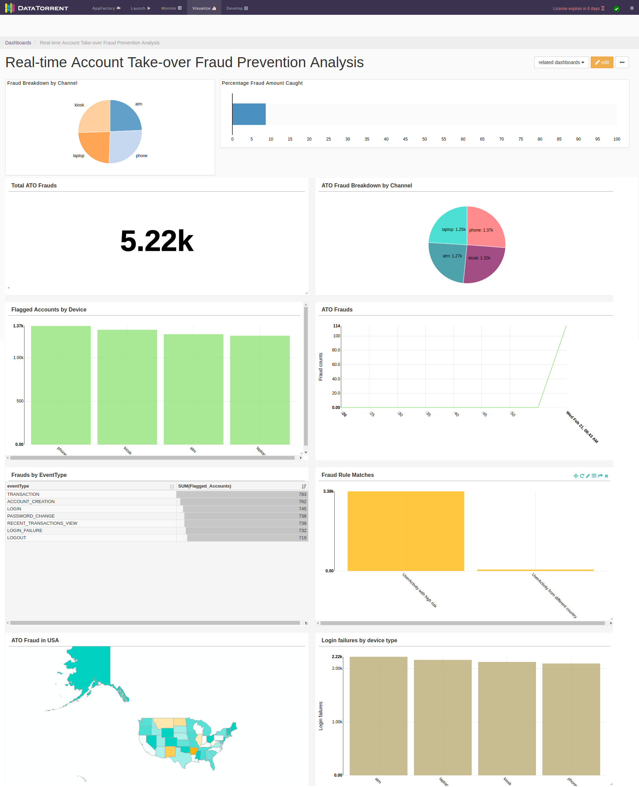
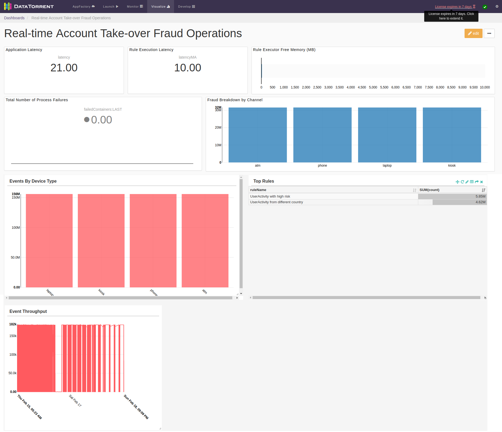

Account Takeover (ATO) application is a pre-built application that can be used to detect and prevent attempts of account takeover in various industries such as finance, telecom, and subscription-based offerings. ATO application is designed to ingest, transform, analyze incoming data, and provide account takeover alerts in real-time before such an activity occurs. It also provides visualizations of incoming as well as processed data.

Using this application, you can process, enrich, analyze and act in real-time upon multiple streams of account event information which can prevent account-take over and fraud.

ATO application is built over DataTorrent RTS platform and can be run on commodity hardware. The platform provides real time insights and a fault tolerant and scalable method for processing data. The application can be further customized by writing rules as per your business needs and implementing custom data types.

In addition, ATO has the capability to store and replay the incoming data from Kafka input operators and then replay the stored data with a different set of rules to visualize the outcome.  You can also integrate the application backplane, to share the fraud outcomes of ATO with other fraud detection-based applications and thereby reducing the chance of fraud. 
The following services come preinstalled with an ATO application. You can run these services for analytics, visualizing the analytic outcomes, and for creating customized rules.

- [Online Analytics Service](oas.md)
- [OAS Dashboards](oas_dashboards.md)
- [CEP Workbench](cep_workbench.md)

ATO application is available with **DT Premium license**.

## Quick Launch Account Takeover Application
 For details about quickly launching the application, refer to [Quick Start Guide - Account Takeover Prevention Application](quickstartlaunchato.md).  
 
# Workflow

The following image depicts the workflow in the ATO application.

 
# Setting the Application

Before you run the  **ATO**  application, you must ensure to fulfill the prerequisites and to configure the operators in the DAG.

## Prerequisites

The following should be installed on the cluster before setting up the application:

| **Product** | **Version** | **Description** |
| --- | --- | --- |
| Apache Hadoop | 2.6.0 and Above | Apache Hadoop is an open-source software framework that is used for distributed storage and processing of dataset of big data using the MapReduce programming model. |
| DataTorrent RTS | 3.10.0 | DataTorrent RTS, which is built on Apache Apex, provides a high-performing, fault-tolerant, scalable, easy to use data processing platform for both batch and streaming workloads. DataTorrent RTS includes advanced management, monitoring, development, visualization, data ingestion, and distribution features. |
| Apache Kafka | 0.9 | Apache Kafka is an open-source stream processing platform that provides a unified, high-throughput, low-latency platform for handling real-time data feeds. |

## Operators / Modules

The following operators/modules are included for the ATO application.

| **Operator / Module** | **Description** |
| --- | --- |
| User Activity Receiver | This Kafka input operator receives current user activity from Syslogs or any other logs. It forwards these logs to downstream operator. |
| User Activity Parser | This JSON parser operator parses the incoming messages and converts them into plain java objects hereafter referred as tuple for further processing. |
| User Profile Enricher | This operator gets the relevant JAVA applicable user details corresponding to a unique ID and enriches the tuple. User details can be extracted from JDBC database store or json file on HDFS.  You can configure the operator based on the enrichment data source you choose.Using this operator is optional in an ATO application. |
| Geo Data Enricher | The application identifies the geolocation of the transaction by performing a lookup of the transaction IP against the external database like Maxmind database.  Using this operator is optional in an ATO application. |
| Rules Executor | This operator is the Drools Operator. It applies the pre-defined rules to the incoming tuples and takes a suitable action depending on the outcome of the rules applied to a tuple. 
| Output Module | Output module consists of two operators:**Avro Serializer** serializes the output of the Rules Executor (Drools operator) to send to Kafka Output operator. **Kafka Output Operator** sends these events to the specified Kafka topic for consumption by other applications. This publishes the information which can be consumed by Omni-Channel Fraud prevention application. 
| HDFS Output Operator | This output operator writes messages coming from the Rules Executor to the specified HDFS file path. Using this operator is optional in an ATO application. |
| OAS Operator | This operator writes messages to a Kafka topic that are consumed by Online Analytics Service (OAS). |

## Configuring Rules

The application package contains sample rules. However, you can add rules based on your business requirements. These can be configured in Drools supported formats such as . **drl** , **xls etc**. Refer  [Authoring Rule Assets](https://docs.jboss.org/drools/release/7.2.0.Final/drools-docs/html_single/#drools.AuthoringAssets) in Drools documentation.

For the Rules Executor, you can configure the rules either from the CEP Workbench or from HDFS.

### CEP Work Bench

To configure rules from CEP Workbench,  you must configure the kieBaseName and kieSessionName properties to the application configuration where you are implementing the rules that you have created using CEP Workbench. Refer to [CEP Workbench](cep_workbench.md)

### HDFS

To configure rules from HDFS, do the following:

1. Create the rules file in one of the format that is supported by Drools and save the **output rule** file onto your local machine.
2. Copy this rule file into the HDFS folder.
3. In the Droolsoperator, configure the folder path in the following operator property, to point to HDFS folder containing rules.

| **Property Name** | **Description** |
| --- | --- |
| rulesDir | The path to HDFS from where you can load the rules. If this path is set to null, then operator loads the rules from the classpath. |
 
 4. Restart the application after updating the rules.

**Note:** When the folder path is not provided to the Drools operator, the packaged rules are uploaded by default.

## Configuring Properties

The properties for the following items must be set for running ATO application:

- [Kafka](#kafka)
- [Parser](#parser)
- [User Profile Enricher](#userprofile)
- [Geo Data Enricher](#geodata)
- [Rules Executor](#rulesexecutor)
- [Avro Serializer](#avro)
- [HDFS Output Operator](#hdfsoutputoperator)
- [AOO Operator](#aoo)

### <a name="kafka"></a>Kafka

**User Activity Receiver** operator and **Kafka**** Output** operator are the respective entry and exit points of the application. These operators read from the Kafka topics and write to the Kafka topics. Therefore, you must ensure that the kafka setup in the system is up and running.

Configure the kafka setup details in the application properties file.  The following required properties must be configured:

| **Property** | **Description** | **Type** | **Example** | **Required** |
| --- | --- | --- | --- | --- |
| kafkaBrokerList | Comma separated list of kafka-brokers | String | node1.company.com:9098, node2.company.com:9098, node3.company.com:9098 | Yes |
| UserActivityReceiverTopic | Topics to read from Kafka | String | transactions | Yes |
| ProcessedTransactionsOutputTopic | Topics to write processed transactions to kafka | String | processed-transactions | Yes |
| initialOffset | Initial offset to read from Kafka | String | EARLIESTLATESTAPPLICATION\_OR\_EARLIESTAPPLICATION\_OR\_LATEST |   |
| key.serializer | Serializer class | String | org.apache.kafka.common.serialization.StringSerializer |   |
| value.serializer | Serializer class | String | org.apache.kafka.common.serialization.StringSerializer |   |
| dt.operator.TransactionDataPublisher.prop.properties(key.serializer) | Serializer class | String | org.apache.kafka.common.serialization.StringSerializer |   |
| dt.operator.TransactionDataPublisher.prop.properties(value.serializer) | Serializer class | String | org.apache.kafka.common.serialization.StringSerializer |   |
| archivePath | Path of archive directory where you can store data for replaying with different rules. [Refer [Store and Replay](storeandreplay.md) | String |  |   |
| archiveType | Archive information | Enum | ARCHIVE\_TYPE\_KAFKA |   |
| enableArchive |  to enable / disable archiving for replaying data.   | Boolean | |   |
| enableReplay | Value to enable or disable replay. enableReplay is mutually exclusive with enableArchive, both can be false.   | Boolean |  |   |
| whenReplaySetT0 | When enable Replay is true, this can be set. Set the start time from when to replay. Format is **yyyy-MM-dd&#39;T&#39;HH:mm:ss** | String | 2017-09-17T01:01:01 |   |
| whenReplaySetT1 | When enable Replay is true, this can be set. Set the start time to replay. Format is **yyyy-MM-dd&#39;T&#39;HH:mm:ss** | String | 2017-09-17T03:01:01 |   |

### <a name="parser"></a>Parser

Parser parses JSON input from kafka and generates plain JAVA object for further processing.

Configure the JAVA class of the plain JAVA object to be generated by parser. The following properties must be set for the parser:

| **Property** | **Description** | **Type** | **Example** |
| --- | --- | --- | --- |
| **TUPLE\_CLASS schema attribute** | pojo class name of object to be generated by parser | String | com.datatorrent.ato.schema.UserActivity |

### <a name="userprofile"></a>User Profile Enricher

Missing fields from your incoming records can be enriched by referring to your lookup data in enrichment phase. By default, the configuration for enrichment is stored in **enrichments.json** that is bundled in the application package. You can also write your own configuration in a file and store that file on HDFS. You can configure existing enrichments or add / remove as per your business needs. The enrichment properties file path should be provided in the **properties.xml** file.

Following properties should be set for configuration file path:

| **Property** | **Description** | **Type** | **Example** |
| --- | --- | --- | --- |
| dt.atoapp.enrichments.configFilePath | Path of configuration file for enrichments | string | enrichments.json |

### <a name="geodata"></a>Geo Data Enricher

GeoData Enrichment operator refers to the **maxmind** database that fetch geo information when you provide the IP address of the transaction location. To run the GeoData Enrichment operator, you must copy the maxmind city database (GeoLite2 City) to HDFS. You can remove this enrichment as well as update properties (e.g. maxmind db path) by configuring enrichment properties. &lt;Please mention again as per previous para how to write and set enrichments.json&gt;

**Note:** Extract **GeoLite2-City.mmdb** file to HDFS. Do not copy the ZIP file directly.

Following properties should be set for the **User Profile Enricher** operator as well as the **Geo Data Enricher** operator in the **enrichments.json** file.

| **Property** | **Description** | **Type** | **Example** |
| --- | --- | --- | --- |
| storeType | Type of data storage | string | json\_file, geo\_mmdb, jdbc |
| storeFields | Json array of Name of fields in input objectsa | string | [{ &quot;name&quot; : &quot;userId&quot;, &quot;type&quot; : &quot;string&quot; },  { &quot;name&quot;: &quot;customerType&quot;, &quot;type&quot; : &quot;string&quot; }] |
| inputType | Type of input object | string | com.datatorrent.ato.schema.UserActivity |
| outputType | Type of output object | string | com.datatorrent.ato.schema.UserActivity |
| reuseObject | Specify if object can be reused | boolean | true |
| file | Path of the user data file | string | ato\_lookupdata/customers.json |
| refreshInterval | Time interval after which cache should be refreshed | integer | 5000 |
| lookupFields | Main field / key based on which the user data is queried. | JSON | userId |
| includeFields | comma seperated Mapping of fields from user data to the fields in JAVA object. | JSON | &quot;customer.userId&quot;:&quot;userId&quot;,&quot;customer.customerType&quot;:&quot;customerType&quot; |

#### Example of enrichment.json file

Following is an example of the **enrichment.json** file. You can refer to this example to create the **enrichment.json** file.
```
[
  {
	"name": "UserProfileEnricher",
	"storeType" : "json_file",
	"storeFields" : [
  	{ "name" : "userId", "type" : "string" },
  	{ "name": "customerType", "type" : "string" },
  	{ "name" : "customerAvgSpending", "type" : "double" },
  	{ "name" : "customerRiskScore", "type" : "double" },
  	{ "name" : "custGender", "type" : "string" },
  	{ "name": "custMaritalStatus", "type" : "string" },
  	{ "name" : "custIncomeLevel", "type" : "string" },
  	{ "name" : "custStreet1", "type" : "string" },
  	{ "name" : "custStreet2", "type" : "string" },
  	{ "name" : "custCity", "type" : "string" },
  	{ "name" : "custState", "type" : "string" },
  	{ "name" : "custCountry", "type" : "string" },
  	{ "name" : "custPoBox", "type" : "string" },
  	{ "name" : "custPostalCode", "type" : "string" },
  	{ "name" : "custPostalCodeType", "type" : "string" },
  	{ "name" : "lat", "type" : "double" },
  	{ "name" : "lon", "type" : "double" }
	],
	"inputType" : "com.datatorrent.ato.schema.UserActivity",
	"outputType" : "com.datatorrent.ato.schema.UserActivity",
	"reuseObject" : true,
	"properties": {
  	"file" : "ato_lookupdata/customers.json",
  	"refreshInterval" : 5000
	},
	"lookupFields" : {
  	"userId" : "userId"
	},
	"includeFields" : {
  	"customer.userId":"userId",
  	"customer.customerType":"customerType",
  	"customer.customerAvgSpending":"customerAvgSpending",
  	"customer.customerRiskScore":"customerRiskScore",
  	"customer.custGender":"custGender",
  	"customer.custMaritalStatus":"custMaritalStatus",
  	"customer.custIncomeLevel":"custIncomeLevel",
  	"customer.custStreet1":"custStreet1",
  	"customer.custStreet2":"custStreet2",
  	"customer.custCity":"custCity",
  	"customer.custState":"custState",
  	"customer.custCountry":"custCountry",
  	"customer.custPoBox":"custPoBox",
  	"customer.custPostalCode":"custPostalCode",
  	"customer.custPostalCodeType": "custPostalCodeType"
	}
  },
  {
	"name": "GeoDataEnricher",
	"passThroughOnError" : true,
	"storeType": "geo_mmdb",
	"storeFields": [
  	{ "name" : "IP", "type" : "string" },
  	{ "name": "CITY", "type": "string" },
  	{ "name" : "SUBDIVISION_ISO", "type" : "string" },
  	{ "name": "ZIPCODE", "type": "string" },
  	{ "name": "COUNTRY_ISO", "type": "string" },
  	{ "name" : "LATITUDE", "type" : "double" },
  	{ "name" : "LONGITUDE", "type" : "double" }
	],
	"inputType": "com.datatorrent.ato.schema.UserActivity",
	"outputType": "com.datatorrent.ato.schema.UserActivity",
	"reuseObject": true,
	"properties": {
  	"dbpath": "city.mmdb",
  	"refreshInterval": 5000
	},
	"lookupFields": {
  	"IP": "deviceIP"
	},
	"includeFields": {
  	"geoIp.city" : "CITY",
  	"geoIp.state" : "SUBDIVISION_ISO",
  	"geoIp.zipcode" : "ZIPCODE",
  	"geoIp.country" : "COUNTRY_ISO",
  	"geoIp.latitude" : "LATITUDE",
  	"geoIp.longitude" : "LONGITUDE"
	}
  }
]
```
### <a name="rulesexecutor"></a>Rules Executor

The Rules Executor that is the Drools operator provides a method to load rules from:

- CEP Workbench
- HDFS

If rules are loaded from files on HDFS, you must configure the following property:

| **Property** | **Description** | **Type** |
| --- | --- | --- |
| rulesDir | Path to HDFS from where to load the rules. If this path is set to null, then the operator loads the rules from the classpath. | string |

If rules are to be loaded from CEP Workbench, you must specify following properties. Also Refer [CEP Workbench](cep_workbench.md)

| **Property** | **Description** | **Type** | **Example** |
| --- | --- | --- | --- |
| kieSessionName | If rules are to be loaded from application classpath, then specify the name of the session to use. This is created using CEP Worknbench. | string | UserActivity-rules-session |
| kiebaseName | If rules are to be loaded from application classpath, then specify the name of the kie base (rule) to use . This is created using CEP Workbench. | string | ato-rules |

**Note:** If rules are to be loaded from application classpath, the knowledge jar (KJAR) should be in the classpath.  Refer to [Application Configurations](application_configurations.md)

### <a name="avro"></a>Avro Serializer

The following properties should be set for the Avro Serializer operator that is part of the Output module:

| **Property** | **Description** | **Type** | **Example** |
| --- | --- | --- | --- |
| dt.atoapp.schemaName | Set schema for the data. | string | UserActivity |
| topic | Set the kafka topic name | string | ATO\_analyseddata |

### <a name="hdfsoutputoperator"></a>HDFS Output Operator

There are two output operators to write to HDFS:

- **ProcessedActivityDataWriter**
This operator writes all the transactions processed by the application to HDFS.
- **FlaggedActivityFileWriter**
This operator writes only the fraud user activities to the HDFS.

For details of other properties of FileOutput Operator, please refer the [documentation](http://docs.datatorrent.com/operators/file_output/).

| **Property** | **Description** | **Type** | **Example** |
| --- | --- | --- | --- |
| dt.atoapp.enableOutputOperators | This flag should be set to true if messages are to be written to HDFS | boolean |   |
| filePath | Path of the directory where the output files must be created. | string | /user/dtuser/processeddata |
| outFileName | Name of the file on HDFS in which the messages should be written. | string | ProcessedUserActivity |

### <a name="aoo"></a>AOO Operator

This operator writes messages to a Kafka topic that are consumed by the OAS (Online Analytics Service). The following properties should be set:

| **Property** | **Description** | **Type** | **Example** |
| --- | --- | --- | --- |
| schema | Schema / metadata of the data to be sent to OAS.By default we package &quot;analyticsschema.json&quot; schema to change schema copy your schema file to hdfs and configure, &quot;dt.atoapp.analytics.resourceFileName&quot; with your schema file path. | string | analyticsschema.json |
| serializerClass | Provides information about serializing incoming messages in the form of JAVA objects to send to Kafka | string | com.datatorrent.cep.common.ToStringAnalyticsPojoSerializer |
| disablePartialWindowCheck | Set whether to disable partition window check or not.   **Note**: By disabling the partition window check duplicate data can be sent to Kafka thereby overriding exactly once guarantees. | boolean | &lt;example&gt; |

# Scaling the Application

To handle higher data loads, you can add more partitions of the processing units i.e. operators.

Update the following properties as per your input load. The following properties must be set for scaling the application:

| **Property** | **Description** | **Type** | **Example** |
| --- | --- | --- | --- |
| UserActivityReceiver.initialPartitionCount | Partition count of Kafka data receiver. | Integer | 1 |
| RulesExecutor.attr.PARTITIONER | Partition count of Rule execution operator. | Integer | 1 |
| FlaggedActivityFileWriter.partitionedFileNameformat | File name format for transaction writer partition. | String | %s-%04d |
| ProcessedActivityDataWriter.partitionedFileNameformat | File name format for fraud writer partition. | String | %s-%04d |
| RulesExecutor.port.factsInput.attr.STREAM\_CODEC | Ensure that all related tuples should go to same partition so that tuples can be co-related across time to do complex event processing.
Set STREAM\_CODEC property of factsInput port of RulesExecutor to make sure related tuples go to same partition | String | com.datatorrent.cep.common.codec.ConfigurableStreamCodec:userId |

# Launching the Application

The Account Takeover application can be launched from the DataTorrent RTS interface.

To launch the application, do the following:

1. Go to the **Develop** page and upload the application package.
2. Specify the configuration as per the **Application Configuration** section. [Application Configurations](application_configurations.md)
3. Launch the application. 
During the launch process, you can name the configuration and save it for future references. After you launch, you can track the details of the processed data in the application from the **Monitor** tab.

## Generate Sample Input

For a test run, you may want to generate sample data.

To generate sample data, do the following:

1. Run the **dt-ato-datagen-1.4.0.apa** application from the DataTorrent RTS interface.
2. Specify kafka server details and topic name which must be the same as configured for User Activity Receiver.

# Storing and Replaying Data

A service is available for the ATO application to store and replay events. You can record and replay data from a point in time to evaluate the effectiveness of builds, models, rules, and scenarios before they are put into production. Refer [Store and Replay](storeandreplay.md)

# Syncing with the Application Backplane

Application Backplane enables multiple applications to be integrated to share insights and actions. ATO application is combined with Fraud Prevention application in real-time. Both these applications remain independent and yet benefit from a network-effect. For more details refer to [Application Backplane](appbackplane.md)

# Dashboards

The ATO Prevention application includes the following dashboards:

- Real-time Account Take-over Analysis
- Real-time Account Take-over Operations

## Real-time Account Take-over Analysis


The analysis dashboard provides a granular set of metrics for analysis of the account activity in ATO application. The following metrics are shown in this dashboard:


- Account Takeover Fraud Prevention Analysis
- Account Hacking Breakdown by Channel
- Total ATO Frauds
- ATO Fraud Breakdown by Channel
- Fraud Instances by Device
- ATO Frauds
- Frauds by EventType
- Fraud Rule Matches
- ATO Fraud in the USA (easily customizable for other countries)
- Login failures by device type

## Real-time Account Take-over Operations



The operations dashboard provides an operational overview of the application.  The following operational metrics can be viewed from this dashboard:

- Application Latency
- Rule Latency
- Rule Executor Free Memory
- Total Number of Process Failures
- Fraud Breakdown by Channel
- Event Throughput
- Top Rules
- Events by Device Type

You can use the OAS dashboards service that is specific to ATO application to visualize various metrics over the dashboards. [OAS Dashboards](oas_dashboards.md)

For importing and viewing the dashboards, refer to [dtDashboard](dtdashboard.md)
