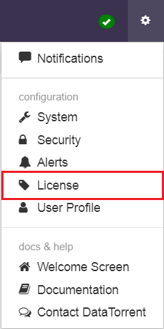
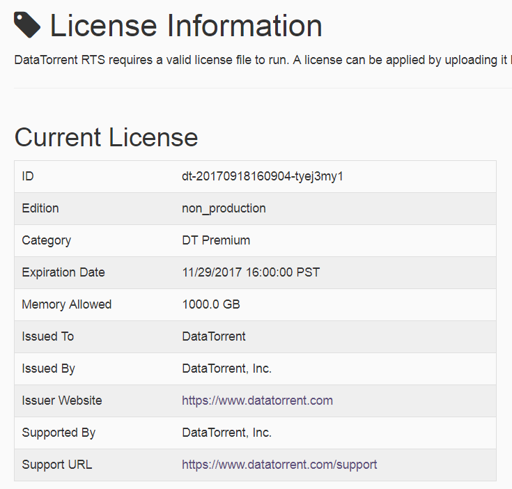

# DataTorrent Licensing

DataTorrent offers three types of licenses for subscription:

- **Free**
- **DataTorrent -Service Plus** 
- **DataTorrent Premium Suite** 

Each of the license type is a combination of the allocated **License Category**, **Memory Capacity**, and **Term**. You can request for a new license as well as upload the license file from the **License Information page** on the DataTorrent RTS UI.
**Note:** Existing customers must obtain a new license to upgrade to 3.9. Refer to Backward Compatibility for more details. 

After the obtained license file is uploaded from the RTS UI, it gets stored in hadoop at the following location:
**/user/&lt;hadoop user&gt;/datatorrent/licenses.** For example: **/user/hduser/datatorrent/licenses**.

The details of the license capacity as well as the capabilities offered for your subscription are also displayed on the **License Information page** as shown in these images:

  

The following table provides the details of the license offerings for each of the license types:

| **License Parameters** | **Free Trial** | **DataTorrent - Service Plus ®****   **|** DataTorrent - Premium Suite ® **** ** |
| --- | --- | --- | --- |
| Memory Limit | 40 GB | Based on memory requirements | Based on memory requirements |
| Subscription Term | 90 Days | Yearly | Yearly |
| Environment Type | Non-Production Only | Production and Non-Production (Test, QA, Staging) | Production and Non-Production (Test, QA, Staging) |
| Technical Support SLA | DT Community Forum | Production and Non-Production SLAs available | Production and Non-Production SLAs available |
| License Category (Access to premium applications) | No | No | Yes |

The **Free Trial** license can be directly obtained from the [DataTorrent website](https://www.datatorrent.com/license-upgrade/). For **DataTorrent - Service Plus ®** and **DataTorrent - Premium Suite ®** licenses, you must contact the DataTorrent Sales Team.

## License Category

The license category determines the type of access that you can have for premium applications and operators that are available in DataTorrent&#39;s AppFactory.  Based on your business requirements, you can subscribe to any of the following license category:

- **Free**
- **DT Plus**
- **DT Premium**

With **Free**, you can download limited non-premium applications based on the allocated memory capacity.

With **DT Plus**, you can download only non-premium applications and operators that can be used for data ingestion. Premium applications, although visible on the AppFactory, can be downloaded only if you subscribe to DataTorrent - Premium Suite ®. Customers who are interested in developing their own streaming applications using DataTorrent RTS can subscribe to this category.

With **DT Premium**, you can access and download pre-built stream applications and operators such as the Omni-Channel Fraud Prevention application and operators such as Drools-based rule engine for complex event processing.

## Memory Limit

Memory is the capacity allotted to you, based on your license subscription, that can be used to launch the RTS applications.  The sum total memory consumed by all the running RTS applications defines the memory limit. For example, in a free trial version 40 GB memory limit is allotted and a minimum number of applications can be launched within this  limit.  To launch more applications in the same limit, you must terminate a running application.

In case your memory exceeds beyond the subscribed capacity, the **Launch**, **Visualize**, and **Develop** functions get disabled. The streaming applications keep running in the background but you cannot launch any more applications unless the license violation is corrected.

You will receive a warning **30 minutes** before these functions gets disabled. To increase the memory limit, you must renew or upgrade the license.

## Term

The stipulated period agreed in the subscription is the license term allotted to you. You will be notified with an alert **30 days prior** to your license term expiry.  This alert notification is displayed as a banner on top of the RTS UI.

When the license term expires, the   **Launch**, **Visualize**, and **Develop** functions get disabled.  Although the streaming applications keeps running in the background, you cannot launch new applications unless the license is renewed. To increase the license term, you must renew or upgrade the license.

## Backward Compatibility

DataTorrent has updated the software licensing mechanism from RTS 3.9 version. Therefore, to integrate this mechanism, you must obtain a new software license file from DataTorrent or upgrade to version 3.9. Existing customers must contact DataTorrent to obtain an updated license for 3.9.

RTS versions 3.9 or later is not backward compatible with previous RTS versions due to older gateway. Therefore, you must reinstall DT RTS before installing the new license. If the gateway is not compatible, the following license error message is displayed: The License File is Corrupted.
