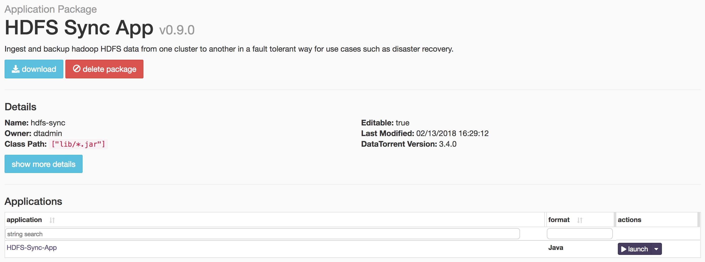
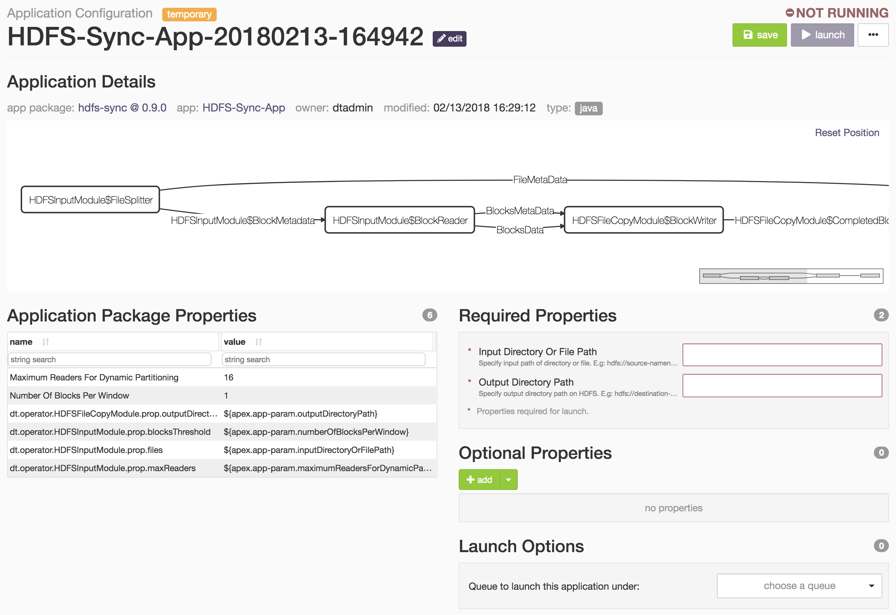

# HDFS Sync App

## Summary

Ingest and backup hadoop HDFS data from one cluster to another in a fault tolerant way for use cases such as disaster recovery. This application copies files from the configured source path to the destination file path. The source code is available at: [https://github.com/DataTorrent/app-templates/tree/master/hdfs-sync](https://github.com/DataTorrent/app-templates/tree/master/hdfs-sync).

Please send feedback or feature requests to: [feedback@datatorrent.com](mailto:feedback@datatorrent.com)

This document has a step-by-step guide to configure, customize, and launch this application.

## Steps to launch application<a name="steps_to_launch"></a>

1. Click on the AppFactory tab from the top navigation bar.
  
  Page listing the applications available on AppFactory is displayed.
1. Search for HDFS to see all applications related to HDFS.
1. Click on import button for `HDFS Sync App`. Notification is displayed on the top right corner after application package is imported successfully

    

1. Search for HDFS to see all applications related to HDFS.
1. Click on the link in the notification which navigates to the page for this application package.

    

    Detailed information about the application package like version, last modified time, and short description is available on this page. Click on launch button for `HDFS-Sync-App`
    application. In the confirmation modal, click the Configure button. The <a name="launch-dialogue"></a>`HDFS-Sync-App` application configuration is displayed. The Required Properties section must be completed before the application can be launched.

    

    <a name="property-editor"></a>
    For example, suppose we wish to copy all files in `/user/appuser/input` from `remote-cluster` to `/user/appuser/archive` on the host cluster (on which app is running). Properties should be set as follows:

    |name|value|
    |---|---|
    |Input Directory Or File Path |hdfs://remote-cluster/user/appuser/input|
    |Output Directory Path |/user/appuser/archive|

    This application is tuned for better performance if reading data from remote cluster to host cluster.
    Details about configuration options are available in [Configuration options](#configuration_options) section.

1. When you are finished inputting application configuration properties, click on the `save` button on the top right corner of the page to save the configuration.

1. Click on the `launch` button at the top right corner of the page to launch the application.
   A notification will be displayed on the top right corner after the application is launched successfully and includes the Application ID which can be used to monitor this instance and find its logs.
   

1. Click on the `Monitor` tab from the top navigation bar.

1. A page listing all running applications is displayed. Search for current application based on name or application id or any other relevant field. Click on the application name or id to navigate to application instance details page.
   

1. Application instance details page shows key metrics for monitoring the application status. The `logical` tab shows application DAG, Stram events, operator status based on logical operators, stream status, and a chart with key metrics.
   

1. Click on the `physical` tab to look at the status of physical instances of the operator, containers etc.
   

## <a name="configuration_options"></a>Configuration options

### Mandatory properties
End user must specify the values for these properties (these properties are all strings and
are HDFS paths: the first is the destination and the second the source).

|Property|Example|
|---|---|
|dt.operator.HDFSFileCopyModule.prop.outputDirectoryPath|<ul><li>/user/appuser/output/dir1</li><li>hdfs://node1.corp1.com/user/appuser/output</li></ul>|
|dt.operator.HDFSInputModule.prop.files|<ul><li>/user/appuser/input/dir1</li><li>/user/appuser/input/dir2/file1.log</li><li>hdfs://node1.corp1.com/user/appuser/input</li></ul>|

### Advanced properties
There are pre-saved configurations based on the application environment. Recommended settings for [datatorrent sandbox](https://www.datatorrent.com/download/datatorrent-rts-sandbox-edition-download/) are in `sandbox-memory-conf.xml` and for a cluster environment in `cluster-memory-conf.xml`.

|Property|Description|Type|Default for <br/>cluster-<br/>memory- <br/>conf.xml|Default for  <br/>sandbox-<br/>memory<br/> -conf.xml
|---|---|---|---|---|
|dt.operator.HDFSInputModule.prop.maxReaders|Maximum number of BlockReader partitions for parallel reading.|int|16|1|
|dt.operator.HDFSInputModule.prop.blocksThreshold|Rate at which block metadata is emitted per second|int|16|1|

You can override default values for advanced properties by specifying custom values for these properties in the step [specify custom property](#property-editor) step mentioned in [steps](#steps_to_launch) to launch an application.

## Steps to customize the application

1. Make sure you have following utilities installed on your machine and available on `PATH` in environment variables
    - [Java](https://www.java.com/en/download/manual.jsp) : 1.7.x
    - [maven](http://maven.apache.org/download.cgi) : 3.0 +
    - [git](https://git-scm.com/book/en/v2/Getting-Started-Installing-Git) : 1.7 +
    - [Hadoop]( http://www.michael-noll.com/tutorials/running-hadoop-on-ubuntu-linux-single-node-cluster/) (Apache-2.2)+

1. Use following command to clone the examples repository:

    ```
    git clone git@github.com:DataTorrent/app-templates.git
    ```

1. Change directory to `examples/tutorials/hdfs-sync`:

    ```
    cd examples/tutorials/hdfs-sync
    ```

1. Import this maven project in your favorite IDE (e.g. eclipse).

1. Change the source code as per your requirements. This application is for copying files from source to destination. Thus, `Application.java` does not involve any processing operator in between.

1. Make respective changes in the test case and `properties.xml` based on your environment.

1. Compile this project using maven:

    ```
    mvn clean package
    ```

    This will generate the application package with `.apa` extension inside the `target` directory.

1. Go to DataTorrent UI Management console on web browser. Click on the `Develop` tab from the top navigation bar.

1. Click on `Application Packages` from the list.

1. Click on `upload package` button and upload the generated `.apa` file.
    

1. Application package page is shown with the listing of all packages. Click on the `Launch` button for the uploaded application package. Follow the [steps](#launch-dialogue) for launching an application.
