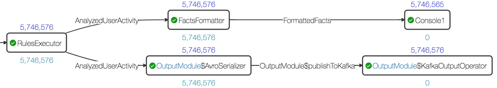
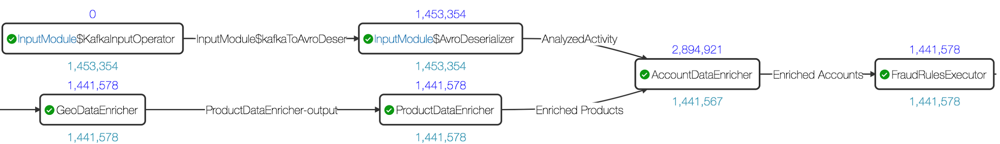

# Application Backplane

Application backplane is a mechanism that enables communication between applications. Using this communication channel, the fraud prevention or detection outcomes can be shared across multiple applications so that fraud prevention in one application can signal fraud prevention in another application and further reduce the chance of fraud.

 The fraud applications can function independently and still benefit from a network-effect of fraud reduction.

## Setting the Application Backplane

Application backplane is created based on the following modules that are included in the DAG of the fraud applications.

- **Output Module**
This module is in the application that must send outcomes to the application backplane.
- **Input Module**
This module is in the application that must listen to an application backplane.

## Output Module

The output module has the following operators:

| **Operators** | **Description** |
| --- | --- |
| Avro serialization | This operator does the serialization based on the schema set on the module. |
| Kafka output operator | This operator emits the serialized byte array to Kafka topic whose properties are set on the module. |

## Input Module

The input module has the following operators:

| **Operators** | **Description** |
| --- | --- |
| Kafka input operator | This operator emits the byte array from Kafka topic whose properties are set on the module. These properties must be the same ones set on the corresponding output module whose messages are subscribed. You can also indicate which offset to start reading messages from kafka. |
| Avro deserialization | This operator does the deserialization based on  the schema set on the module. The schema must be the same one set on corresponding output module whose messages are subscribed. The deserialized class should be in classpath. This will be achieved by querying schema repository to include the jar of the class. |

## Sample of Application Backplane Setup

The following image depicts how **Account Takeover** application (ATO) uses the output module as a connector to send the data outcome to a configured Kafka topic.

This outcome can be used by **Omni Channel Fraud Prevention** application (**FP application**), to obtain enhanced insights.

This is achieved with _AccountDataEnricher_ operator which is added in the DAG of the **FP application**. This operator has the following two input ports:

- **ATO input** : The stream coming from the input module _AnalyzedActivity_ is connected to this port. The properties set on this module correspond to those used in output module in the **ATO** application. 
- **FP input** : The resultant stream after product-based enrichment on the transactions, _Enriched Products_ is connected to this port.

The enricher maintains a set of users whose accounts have been taken over. This data structure gets updated with fresh activities in _AnalyzedActivity_ stream. Upon receiving a product enriched payment card transaction on the fraud input port, the enricher checks if the customer's account is taken over, by querying on the membership of the customer's UserID. If it is true, an _isAccountFlagged_ variable of payment card transaction is set to _true_.

## Configuring Application Backplane for FPA and ATO

To configure application backplane for FP application and ATO application, do the following:

1. Create an application configuration for the ATO application. Refer to, [Creating Application Configuration](application_configurations.md)
2. Open this configuration and under **Required Properties** > **Facts Output Topic** specify the Kafka topic for the output module.
3. Specify all the other required properties and then save and launch the application configuration.
4. Create an application configuration for the FP application.
5. Open this configuration and under **Required Properties** > **Ato Facts Output Topic** specify the same Kafka topic for the input module.
6. Specify all the other required properties and then save and launch the application configuration.  The flagged outcomes can be received in the kafka topic.
