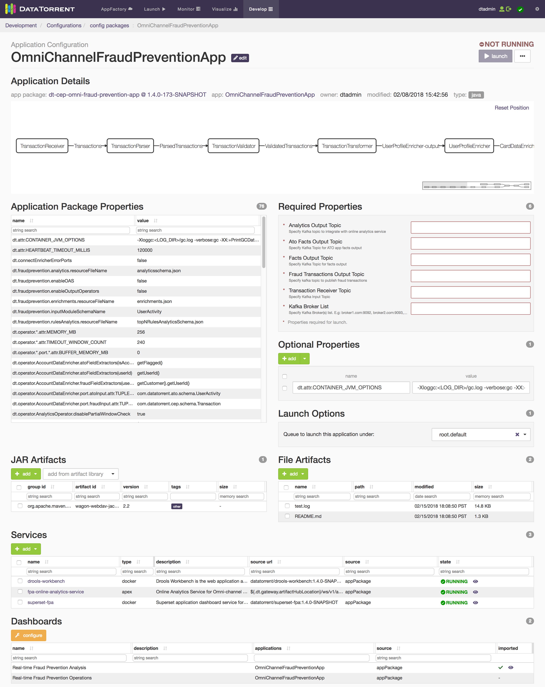
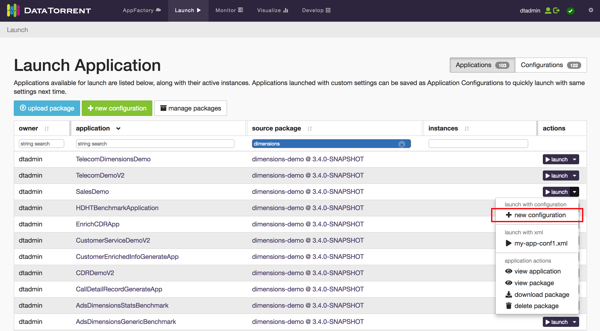
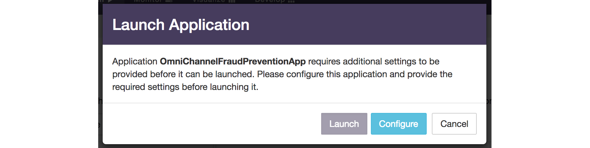
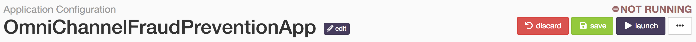
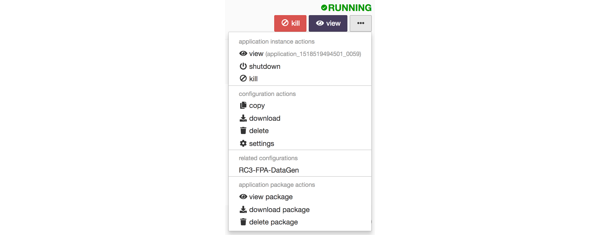
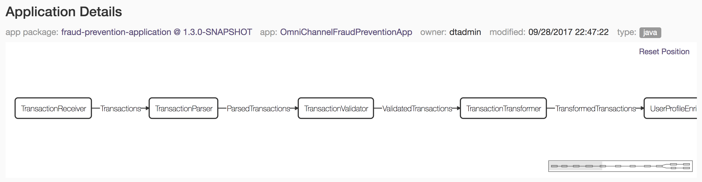
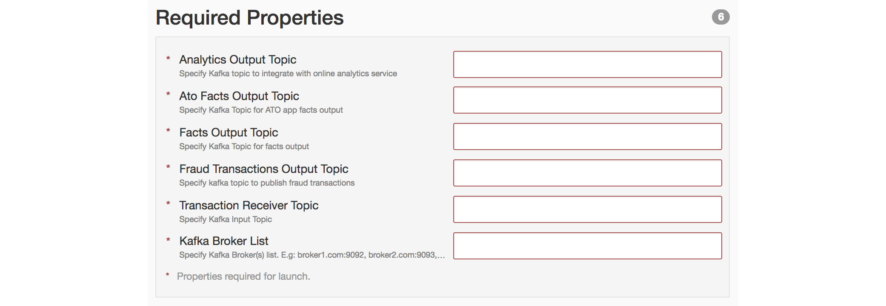
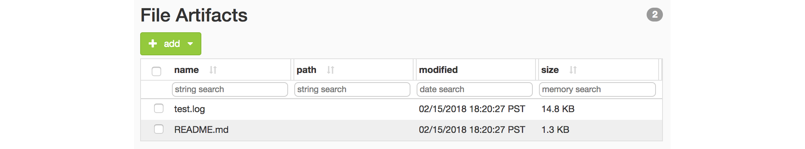
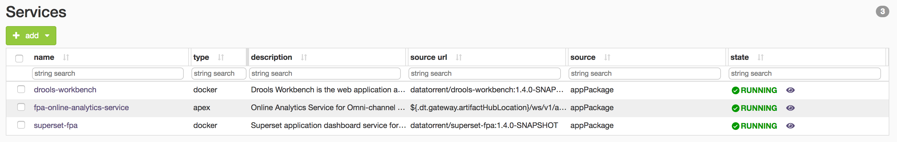
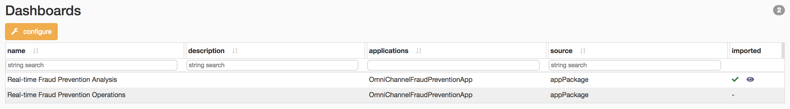

Application Configurations
==========================

An application configuration is a collection of custom settings applied to an application.
These settings may include properties, launch options, artifacts, services, and dashboards.
Application Configurations can be thought of as wrappers for Applications, which allow for clean separation between 
application sources and application runtime configurations.  Configurations are based on [Configuration Packages](configuration_packages) and can be created, modified, and deleted without affecting the source application packages.  And once created they can be downloaded, shared, and uploaded, enabling convenient storage and transportation of application settings across multiple environments.

Creating an Application Configuration
=====================================

Application configurations are created from an existing source application. Multiple
application configurations can target the same source application, but each application
configuration must have a unique name.

To create an application configuration:

  1. Navigate to the **Launch** page and click on the *Applications* tab.
  2. Find the application you want to configure from the list, and click on the dropdown next to the launch button.
  3. From the dropdown, select **new configuration**.

    
  
  4. In the **New Application Configuration** modal, confirm the *Source Application* is correct and name your configuration.
  5. Click **create**. You will be navigated to the newly created configuration's page.

There are additional ways to create application configurations:

  * In the **Launch** page, using the **new configuration** button above the Applications and Configurations table.
  * In the **Develop > Application Packages** page, using the dropdown next to an application's launch button, select **new configuration**.
  * In the **Develop > Application Configurations** page, using the **create new** button above the Configurations table.

#### Launching Quickly With Temporary Configurations

If you want to quickly launch an application without saving an application configuration,
you can just use the **launch** button in the **Launch** page. However, applications with
*Required Properties* must be configured, so a temporary configuration can be used.

Working with temporary configurations is the same as working with a saved configuration, except
temporary configurations will be discarded once you navigate away. Temporary
configurations can be converted to regular application configurations by saving them.

Working With Application Configurations
=======================================

  * [Header](#header)
  * [Application Details](#application-details)
  * [Properties](#properties)
  * [Launch Options](#launch-options)
  * [JAR Artifacts](#jar-artifacts)
  * [File Artifacts](#file-artifacts)
  * [Services](#services)
  * [Dashboards](#dashboards)

Header
------

The header contains all of the main configuration actions. This is where you can **launch**, **save**, **discard**, and more.

The configuration status is displayed on the top right of the header. The status changes as instances of the configuration are detected. The header displays additional instance-related actions conditionally, like **kill** and **view** when it finds a *RUNNING* instance.

### Actions Menu

The actions (ellipsis) menu contains additional actions like **copy**, **download**, **delete**, and **settings**, as well as some **application package actions**. If the configuration has a *RUNNING* instance, the **application instance actions** section will appear and allow managing the instance.

#### Settings

Selecting **settings** in the actions menu opens the settings modal, which allows you to edit the **Configuration Name**
and retarget the **Source Application**.

Retargeting allows you to carry over your configuration settings to another source application. This is useful when working with multiple versions of an application; you can **copy** the configuration, then retarget the source application in the copied configuration.

When an application configuration's source application is deleted, it becomes orphaned. You can reupload the source application or retarget the configuration to restore functionality.

The settings modal can also be accessed by clicking the **edit** button next to the configuration name in the header.

Application Details
-------------------

The application details section gives an overview of the source application and the package it belongs to. The **app package**
and **app** links are useful for quick access to source details. The application DAG can be inspected by clicking-and-dragging to pan the diagram.

In the case where a configuration becomes orphaned (source application not found), the **app package** link will be highlighted red. Clicking it will reveal the Settings modal which you can use to retarget the source application. See more about this in the [Settings](#settings) section above.

Properties
----------

#### Application Package Properties

A list of properties from the source application package. These properties can be overridden in *Optional Properties* by using the same property name.

*Note*: Package Properties with names or values that are too long to display are cut off. Hover over the table cell to see
the rest. To select the entire string including the cut off content, double-click the text in the table cell.

#### Required Properties

A list of properties that must have defined values before the application configuration can be launched.
This section only appears if the application has defined required properties.

#### Optional Properties

Use this section to provide additional properties, or to override properties listed
in **Application Package Properties**.

The entire list of **Application Package Properties** can be added to this section by
selecting **default properties** in the **add** dropdown.

Garbage collection (GC) logging can be enabled by selecting **enable gc logging** in the
**add** dropdown. This will add an optional property 

Launch Options
--------------

The launch options section contains environment-specific options, as opposed to application-specific options
like [Properties](#properties). These options are generated by platform settings (e.g. Hadoop YARN settings)
and are not meant to be portable.

The **Queue to launch this application under** option allows you to choose a Hadoop YARN queue. See the
[Hadoop YARN Capacity Scheduler documentation](https://hadoop.apache.org/docs/stable/hadoop-yarn/hadoop-yarn-site/CapacityScheduler.html)
for more details.

JAR Artifacts
-------------

JAR artifacts can be added to the application configuration by uploading or adding from the artifact library. New AVRO schemas can also be created. JAR artifacts will be added to the application's classpath.

To add non-JAR files to the configuration, see [File Artifacts](#file-artifacts).

#### Adding From Artifact Library

Artifacts can be added to the configuration as a reference to a JAR in the artifact library. As a result, these artifacts are not copied directly into the configuration (.apc).

To add an artifact from the artifact library, click on the **add from artifact library** dropdown and select an artifact.

#### Creating a New Schema

New AVRO schemas can be created and added to the configuration as a reference. Schemas created within application configurations will be stored in the artifact library.

To create a new schema, click on the **add** dropdown under the *JAR Artifacts* header and select **new schema**. The Group ID, Artifact ID, Version, and Schema Content fields must be completed.

#### Uploading JAR Artifacts

To upload a JAR artifact, click on the **add** dropdown under the *JAR Artifacts* header and select **upload JAR**.

The entirety of the uploaded JAR artifacts are stored inside the configuration (.apc), and will not be added to the artifact library. Unlike the references stored in the configuration by [Adding From Artifact Library](#adding-from-artifact-library) or [Creating a New Schema](#creating-a-new-schema), these JARs travel along with the configuration when downloaded and shared.

*Note*: Make sure you save the configuration after uploading your JAR artifacts. If you decide not to save the configuration, recently uploaded JARs will still be accessible for a limited time in the **add** dropdown's **recent uploads** section.

File Artifacts
--------------

Files can be uploaded and added to the application configuration. This is useful for uploading configuration specific datasets.

To add JAR files to the configuration, see [JAR Artifacts](#jar-artifacts).

#### Uploading File Artifacts

To upload a file, click on the **add** dropdown under the *File Artifacts* header and select **upload**.

Like uploaded JAR artifacts, file artifacts are stored inside the configuration. As a result, these files can be found inside the .apc when downloaded, and are still accessible when the .apc is reuploaded.

Services
--------

See the main [Services](services) page for an in-depth explanation of services.

By default, services are pulled in from the source application package. Services can also be added to application configurations. Services in application configurations will be started (or installed first, then started) when the configuration is launched. Some applications have predefined services and will appear in the services list when the configuration is created. Custom services can also be added to the configuration.

#### Adding a Service

To add a new service to the configuration, click on the **add** dropdown under the *Services* header and select **new service**.

Otherwise, you can add services defined within app packages by selecting **from app packages** or any existing installed services by selecting **from installed services**.

Once an application configuration service is installed, it will appear in the *Services* page, which can be accessed by using the cog button on the main navigation bar and selecting **Services**.

Dashboards
----------

Dashboards are automatically imported (if they have not already been) when the application configuration is launched. These dashboards are pulled in from the source application package and have predefined target applications for each widget data source.

See the [Packaged Dashboard](dtdashboard.md#packaged-dashboards) section in the dtDashboard page for more details.

#### Configuring a Packaged Dashboard

To configure a packaged dashboard, click the **configure** button. In the modal, you can change the dashboard name and target applications. Target applications can be either the current application configuration, or other running applications that have data sources.

