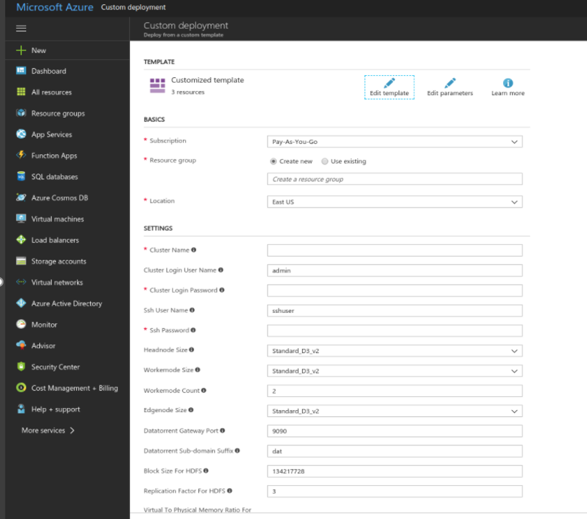

# About Azure Deployment

DataTorrent RTS supports seamless deployment in the cloud environment such as Microsoft Azure. It also supports built-in connectors for reading and writing data to popular data sources and stores that are supported by Azure such as Azure event hub and Azure blob storage.

DT RTS also provides ready-made applications to demonstrate capabilities of the platform which can be customized to suit your requirement. This allows quick and easy development of streaming analytics application leveraging capabilities of Azure cloud platform.

## Azure Operators

Datatorrent RTS provides rich library of operators for building streaming applications. It also includes the following operators which are specifically developed for Microsoft azure eco-system. These can be used for reading and writing data to azure data sources or data stores.

### Azure Blob Storage Output Operator

Azure Blob storage is a service for storing large amounts of unstructured object data, such as text or binary data, that can be accessed from anywhere in the world through HTTP or HTTPS. Blob storage can be used to expose data publicly to the world or to store application data privately.

### Azure Event Hub Input Operator

Event Hub input operator receives events from Azure Event Hub in the form of raw byte arrays. It processes them and converts into byte array tuples. These tuples are then processed by downstream operators.

### Azure Event Hub Output Operator

Event Hub Output operator receives events from upstream operator(s) in the form of byte array or string tuples. It converts them into raw byte array format. These tuples are then emitted to Event Hub in Azure cloud.

For more details about including these operators in an application, refer to [Azure Blob Output Storage Operator Guide](azure_blob.md) , [Event Hub Input Operator Guide](eventhubinput.md), and [Event Hub Output Operator Guide](eventhuboutput.md).

# Deploying DT RTS on Azure

DataTorrent RTS can be deployed on Azure either from the web interface or from the CLI.

## Prerequisites

For deploying DataTorrent RTS on Azure, you must have the following:

- Active Azure account
- Active Azure subscription
- Azure CLI (For CLI Deployment)

## Deploying DT RTS from Website

From the **DT website** > **Download** page, you can connect to the Azure Resource Manager page wherein you can use a template to create a Linux based HDinsight cluster and install DataTorrent RTS on the edge node.

To deploy DT RTS from Azure Website, do the following:

1. From the DT Website for [downloads](https://www.datatorrent.com/download/), Access the Azure login page.
**Note:** You can proceed only if you have the DT RTS license. In case you do not have the license, you are directed to the **Details** page for obtaining the license for DT RTS.
2. On the Azure login page, enter the Azure user credentials. The **Template** page is displayed.

3. Under **Basics** &gt; **Resource**** group **, either select** Create new **to create a new resource group or select** Use existing** and choose an existing resource group.
4. Select the location.
5. Under **Settings** , enter the following details based on your requirements:

| **Items** | **Description** |
| --- | --- |
| Cluster Name | Enter a name for a cluster. |
| Cluster Login User Name | Enter a user name that can used to submit jobs to the cluster and to log into cluster dashboards. |
| Cluster Login Password | Enter a password. This password must be at least 10 characters in length and must contain at least one digit, one non-alphanumeric character, and one upper or lower-case letter. |
| SsH User Name | Enter the SsH user name which can be used to remotely access the cluster and the edge node virtual machine. |
| SsH Password | Enter the SsH password. This password must be at least 10 characters in length and must contain at least one digit, one non-alphanumeric character, and one upper or lower-case letter. |
| Headnode Size | Specify the VM size of the head nodes. |
| Workernode Size | Specify the VM size of the workernodes. |
| Workernode Count | Specify number of nodes in the cluster. |
| Edgenode Size | Specify the size of the edgenode. |
| Datatorrent Gateway Port | Specify the port where you want to run DataTorrent RTS. |
| Datatorrent sub-domain suffix | Specify the suffix of the DataTorrent sub-domain. This becomes the part of the cluster URL after DT RTS is deployed on Azure. |
| Block size for HDFS | Specify the block size for HDFS. Maintain the default value,  if you are not sure about fine-tuning this value. |
| Replication Factor for HDFS | For example, if the replication factor was set to 3 (default value in HDFS) there would be one original block and two replicas. |
| Virtual to Physical Memory Ratio for YARN | Specify the virtual to physical memory ration for YARN.  Maintain the default value, if you are not sure about fine-tuning this value. |

1. Accept the terms and conditions and click **Purchase**. This spawns the Hadoop cluster with HDInsight.  The deployment process begins which may take about 20-30 minutes to complete. The notification of _Successful Deployment_ is shown on the Azure portal. After the successful deployment, the HDInsight cluster is also displayed under **Resources**.
2. Click the HDInsight cluster name link and then click **Applications**.
The DataTorrent RTS is listed under the installed applications.

### Verifying and completing the deployment

1. In the browser, enter the URL in the following format:
_https://&lt;clustername&gt;-dat.apps.azurehdinsight.net_.
**&lt;clustername&gt;** is the name of the cluster that you had specified while creating the HDInsight cluster.
2. Enter the credentials that was specified for the cluster.
The welcome screen for DT RTS is displayed.
3. Install DataTorrent RTS using the Installation wizard.

## Deploying DT RTS from CLI

DT RTS can be deployed on Azure from the CLI. For this you must download the ZIP file from the DT Website. This ZIP file contains the JSON file template which can be edited to configure the parameters. The path of this JSON file is provided in the Azure CLI commands which deploys DT RTS.

The Azure CLI must be downloaded before the deployment.

To deploy DT RTS from CLI, do the following:

1. Download Azure CLI. Refer [Download](https://docs.microsoft.com/en-us/cli/azure/install-azure-cli?view=azure-cli-latest).
2. Download and extract the ZIP file from DT website.
This ZIP file contains the JSON file template which can be edited to configure the parameters.
3. Edit the JSON file template to configure the following parameters:

| **Items** | **Description** |
| --- | --- |
| clusterName | Enter a name for a cluster. |
| clusterLoginUserName | Enter a user name that can used to submit jobs to the cluster and to log into cluster dashboards. |
| clusterLoginPassword | Enter a password. This password must be at least 10 characters in length and must contain at least one digit, one non-alphanumeric character, and one upper or lower-case letter. |
| sshUserName | Enter the SsH user name which can be used to remotely access the cluster and the edge node virtual machine. |
|  sshPassword | Enter the SsH password. This password must be at least 10 characters in length and must contain at least one digit, one non-alphanumeric character, and one upper or lower-case letter. |
| headnodeSize | Specify the VM size of the head nodes. |
| workernodeSize | Specify the VM size of the workernodes. |
| workernodeCount | Specify number of nodes in the cluster. |
| edgenodeSize | Specify the size of the edgenode. |
| datatorrentGatewayPort | Specify the port where you want to run DataTorrent RTS. |
| datatorrentSub-domainSuffix | Specify the suffix of the DataTorrent sub-domain. This becomes the part of the cluster URL after DT RTS is deployed on Azure. |
| blockSizeForHDFS | Specify the block size for HDFS. Maintain the default value, if you are not sure about fine-tuning this value. |
| replicationFactorForHDFS | For example, if the replication factor was set to 3 (default value in HDFS) there would be one original block and two replicas. |
| virtualToPhysicalMemoryRatioForYARN | Specify the virtual to physical memory ration for YARN.  Maintain the default value, if you are not sure about fine-tuning this value. |

1. From the command prompt, login to Microsoft Azure using the following command:
```
az login
```
The URL and the authentication code is provided.

2. In a web browser, enter this URL and the authentication code and then click **Continue**.

3. On the Microsoft Azure Login page, enter your Microsoft Azure account credentials and login.

4. Go to Azure CLI and enter the following command:

```
az login

az group deployment create \
    --name <Name for the deployment> \
    --resource-group <name for the resource group> \
    --template-uri https://raw.githubusercontent.com/Datatorrent/moodI/master/utils/azure/hdinsight-with-Datatorrent-RTS/azuredeploy.json \
    --parameters @/<path to extracted ZIP file>/azuredeploy.parameters.json
 ```

**Note** : Change the highlighted value within <> to actual values.

A notification is displayed when the deployment is completed. The DataTorrent RTS is deployed on Azure. You can verify and complete the installation using the steps at Verifying and completing the deployment.
