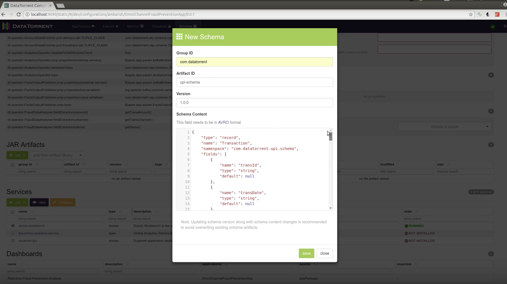
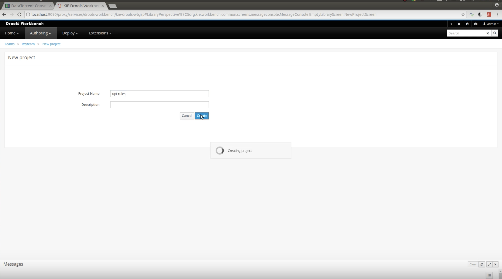
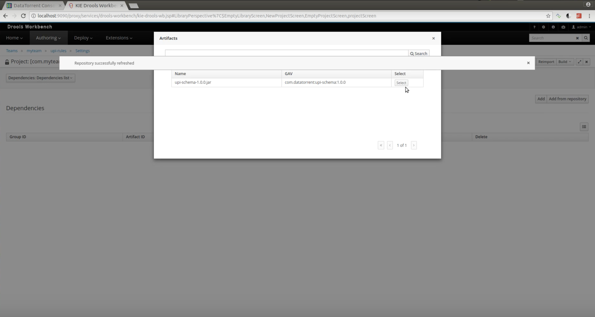
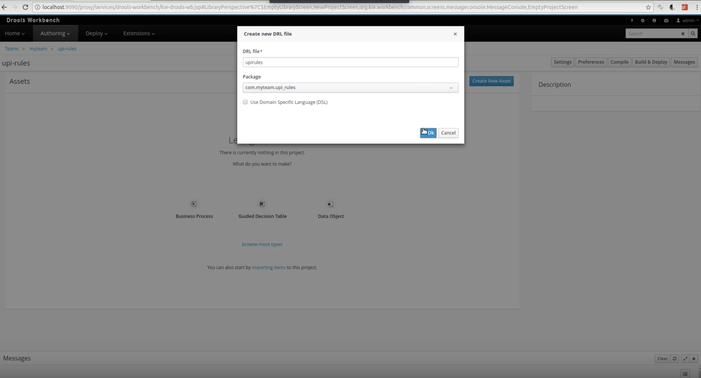
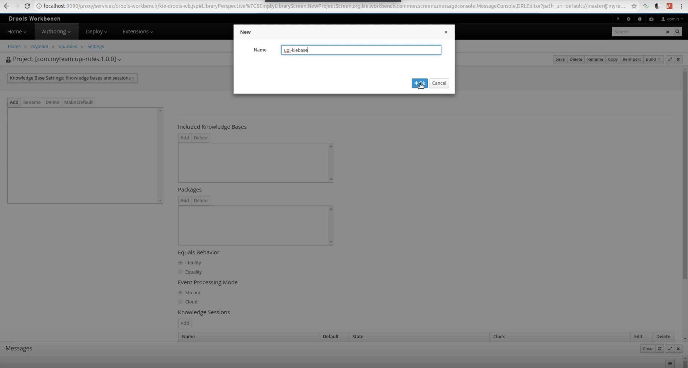
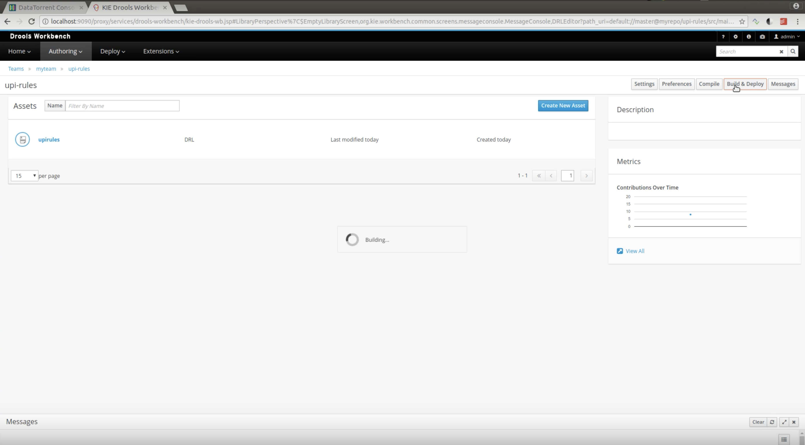
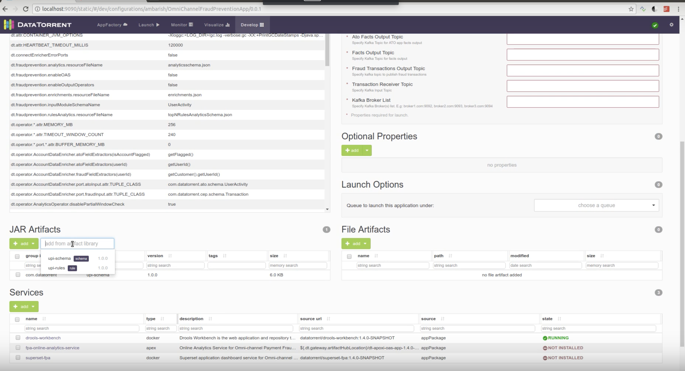

# Introduction

CEP Workbench is a [DataTorrent RTS Service](services/#overview) that is a customized Drools Workbench implementation. The service provides you with the capability to change the functionality of CEP applications using drools-based rules.

The CEP Workbench service is pre-packaged with applications such as Omni-channel Fraud Prevention and Account Takeover Prevention.  From the DT RTS console, you can access the CEP Workbench service, create customized rules, and then apply these rules to the application configuration to change the application behavior.

# Pre-requisites

Install Docker (Version 1.9.1 or greater) and provide the docker host setting by running the installation wizard in cases where Docker is installed on a machine other than the Gateway.  Please note that for automatic artifacts synchronization the Docker container with CEP Workbench and Gateway need to share the same physical host.  For more details, please refer to [Docker Configuration](services/#configuring-docker)

# Accessing CEP Workbench

When the CEP Workbench service is imported and in a running state, you can access it via a proxy URL from either the application configuration page or from the Service Management page.

Steps to access service via Application Configuration page:

1. In an application configuration, from the Services section, select the 'drools-workbench' service. The Service Details page is displayed.
2. Under Proxy URL, click the Web URL. The CEP Workbench service login page is displayed.
3. To login into the service, use username **admin** and password **admin**.

Steps to access service via the Service Management page:

1. Click the Settings icon  located on the upper most right section of the page.
2. Select Services option. The Services page is displayed with the list of services.
3. Click on the 'drools-workbench' service link. The Service Details page is displayed.
4. Under Proxy URL, click the Web URL. The CEP Workbench service login page is displayed.
5. To login into the service, use username **admin** and password **admin**.

# Configuring Rules in CEP Workbench

To configure rules within the CEP Workbench, you must complete the following steps:

1. **Create a schema in the Application Configuration**:
	
	1. Create an application configuration for an application.
	2. In the application configuration, create and save a schema. This adds schema in the configuration of the application that you want to launch with the customized rules. [Creating Schema](jar_artifacts.md)
	
	
	
2. **Create a project in Drools**:

	1. Access the Drools UI, through proxy URL on the **drools-workbench** service details page.
	2. Log in to Drools UI using the default login credentials.
	3. Click the **Authoring** tab and select **Project Authoring**.
	4. In the Welcome page, click **New Project**.
	5. In the New Project page, enter a project name and description and click **Create**. The new project gets listed under **Project Authoring**. For more details, see [Add Project](https://docs.jboss.org/drools/release/7.2.0.Final/drools-docs/html_single/#_wb.quickstartaddproject).
	
	

3. **Add Schema dependency**:

	1. Inside Drools, go to **Authoring > Project Authoring** and click the name link of the project.
	2. In the Project page, click **Settings**.
	3. Click the **Project Settings** button on the left and select **Dependencies**. The Dependencies page is displayed.
	4. Click **Add from Repository button**. The Artifacts page is displayed and the schema that was created in DT RTS for the application configuration is listed there. The schema is now added as a dependency for the project.
	
	
	
	**Note**: For automatic artifacts synchronization the Docker container with CEP Workbench and Gateway need to share the same physical host and file system.

4. **Add Rules file**:

	1. Go to your Drools project and click **Create New Asset**, select **DRL file** from dropdown . A file is created which gets listed in the project.
	2. Open this file, add the rules, and click **Save**. For more details, refer to [Creating Rules](https://docs.jboss.org/drools/release/7.2.0.Final/drools-docs/html_single/#_welcome).
	
	

5. **Add KieBase and KieSessionName to kmodule.xml**:
	
	1. Inside Drools, go to **Project page > Settings**.
	2. Click the **Project Settings** button on the left and select Knowledge Bases and Sessions.
	3. Add the KieBase and Kie Session name to kmodule.xml from here.
	4. Click **Save**.
	
	
	
	

6. **Build and Deploy Project**:
	
	1. Inside Drools, go to **Authoring > Project Authoring** and select your project.
	2. On the upper right side, click **Build & Deploy** button. The Rules Jar is created which becomes automatically available in the application configuration in DT RTS.
	
	

7.  **Add Rules Jar to Application Configuration**:

	1. Go to DT RTS and open the corresponding application configuration wherein you want to add the Rules JAR artifact.
	2. Under **JAR artifacts**, click **add from artifact library**.
	3. Select the rule jar that was created in Drools Workbench. The Rules Jar that was created in Drools becomes automatically available in the application configuration in DT RTS.
	
	

8.  **Specify Optional Properties**:

	1. In the same application configuration, add the following properties in the **Optional Properties** section.
	
		| **Property** |**Description** |**Example**|
		| --- | --- | --- |
		| dt.operator.FraudRulesExecutor.prop.kieSessionName |If rules are to be loaded from application classpath, then specify the name of the session to use. This is created using CEP Worknbench. |UserActivity-rules-session|
		| dt.operator.FraudRulesExecutor.prop.kiebaseName |If rules are to be loaded from application classpath, then specify the name of the kie base (rule) to use . This is created using CEP Workbench. |ato-rules|
	
	
	2. Click **Save** and launch the application.

