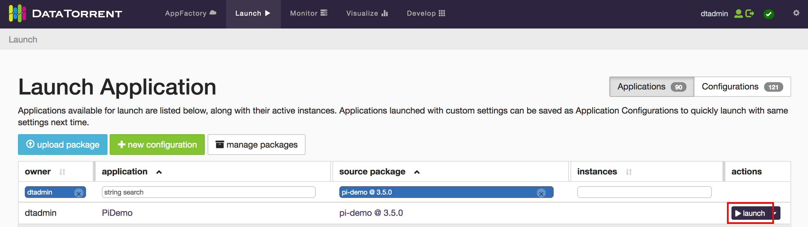
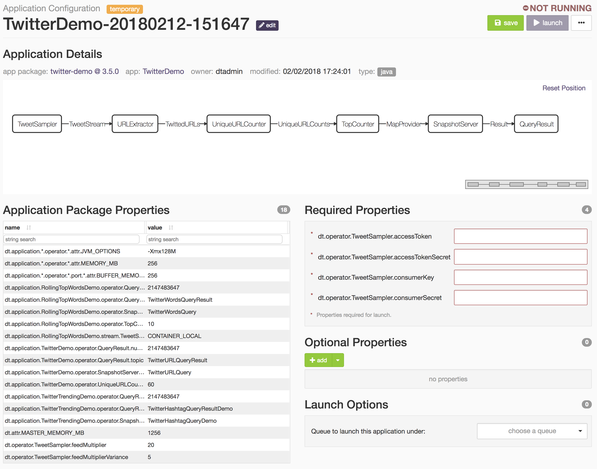

Running Demo Applications
=================================

DataTorrent RTS includes a number of demo applications and they are available for import from the **AppFactory** section of the DataTorrent management console.

Importing Demo Applications
--------------------------------------------------------------------------------

1.  Navigate to **AppFactory** section of the DataTorrent console.
2.  Select the list view in the top right corner of the page, choose one of the available packages such as *Pi Demo* and click the *Import* button.
3.  Imported application packages and included applications will be listed under **Develop > Application Packages** page.

Launching Demo Applications
--------------------------------------------------------------------------------

Once imported, applications can be launched with a single click.  *Note*: Ensure Hadoop YARN and HDFS services are active and ready by checking for errors in the DataTorrent console before launching demo applications.

1.  Navigate to **Launch**, and select one of the imported demo packages.  In this example, we will be using the **PiDemo** application package.

2.  From the list of available applications, locate PiDemo and click the launch button.

    

3.  Click **Launch** on the confirmation modal.

    

4.  Once launched, view the running application by following the link provided in the notification, or by navigating to the **Monitor** page and selecting the launched application.

    

More information about using DataTorrent console is available in [dtManage Guide](dtmanage.md)

Configuring Launch Parameters
--------------------------------------------------------------------------------

Some applications may require additional configuration changes prior to launching.  Configuration changes can be made on the launch screen or manually applied to `~/.dt/dt-site.xml` configuration file.  These typically include adding Twitter API keys for Twitter Demo, or changing performance settings for larger applications.

1.  Navigate to **AppFactory** in DataTorrent console.  In this example, we will use the **Twitter Demo** application package. Click the *Import* button. 

2.  Retrieve Twitter API access information by registering for a <a href="https://dev.twitter.com/" target="\_blank">Twitter Developer</a> account, creating a new <a href="https://apps.twitter.com/app/new" target="\_blank">Twitter Application</a>, and navigating to the *Keys and Access Tokens* tab.  The Twitter Demo application requires the following to be specified by the user:

    * dt.operator.TweetSampler.accessToken
    * dt.operator.TweetSampler.accessTokenSecret
    * dt.operator.TweetSampler.consumerKey
    * dt.operator.TweetSampler.consumerSecret

3.  Navigate to **Launch** (or **Develop > Application Packages**). From the list of Applications, select *TwitterDemo* and press the corresponding **launch** button. When the launch modal appears, press the **Configure** button.

    

4.  Input the Twitter keys and access tokens in the Required Properties section, then press the **save** button. The keys and access tokens are now saved within a new application configuration. 

    

    *Note*: Application configurations can be found in the **Launch** page in the *Configurations* tab, or in **Develop > Application Configurations**.

5.  Press the **launch** button to launch the Application Configuration.

6.  Once launched, view the running application by following the link provided in the launch confirmation dialog, or by navigating to the **Monitor** section of the console and selecting the launched application.

7.  View the top 10 tweeted hashtags in real time by generating and viewing the [dashboard](dtdashboard.md).

Stopping Applications
--------------------------------------------------------------------------------

Applications can be shut down or killed from the Monitor section of [dtManage](dtmanage.md) by selecting application from the list and clicking `shutdown` or `kill` buttons.
