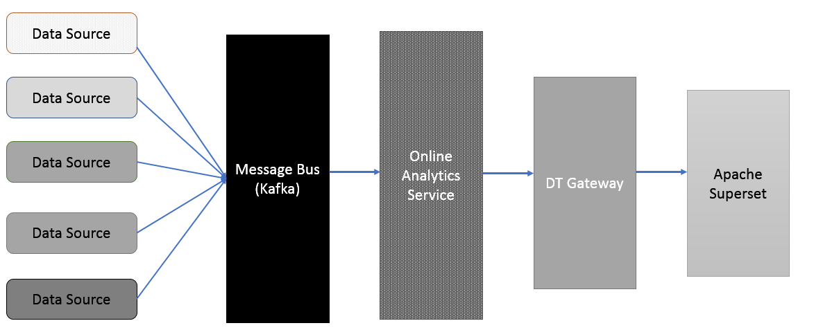

# Online Analytics Service (OAS)

Online Analytics Service (OAS) is an Apex application that is delivered as a service in some of the DataTorrent RTS applications. An example of one such application is [Omni Channel Fraud Prevention Application](omni_channel_fraud_app.md).  OAS is a [Druid](http://druid.io/) based application that supports querying in real-time on data streams that are populated by a source application such as [Omni Channel Fraud Prevention Application](omni_channel_fraud_app.md).

OAS is integrated with the [OAS Dashboards Service](oas_dashboards.md) which is a DataTorrent RTS Service that has been built using [Apache Superset](https://superset.incubator.apache.org/). The OAS provides the powerful query engine in the backend for the [OAS Dashboards Service](oas_dashboards.md) which enables impressive visualization on the front-end for any application on the DataTorrent RTS platform. Both OAS and [OAS Dashboards](oas_dashboards.md) are components of a complete end-to-end Data Analytics solution for actionable insights into real-time data flowing through a DataTorrent RTS application pipeline.

OAS is available only with the [_DT Premium_ license](Licensing.md).

# Workflow of OAS

The following image depicts the workflow of OAS.

- OAS is enabled to stream-in data from Apache Kafka. Any datasource can send the applicable data for analysis into a Kafka topic.
- The Online Analytics Service takes this real-time data-feed from Apache Kafka, computes and aggregates to generate derived data, and makes it ready for querying.
- OAS Dashboards service performs queries on OAS in real time using REST APIs via the DT gateway.

OAS can be specified as a required service for an application and managed from the [Services](services.md) page.

# Packaging OAS

Refer to [Packaging Services](services.md) for more details.

# Managing OAS Service

Refer to [Managing Services](services.md) for more details.
