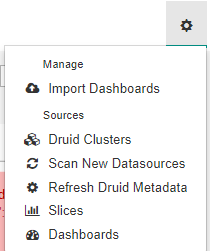
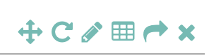

# Introduction

OAS Dashboards service is a [DataTorrent RTS Service](services/#overview) that is a customized implementation of Apache Superset. This service packages application-specific OAS dashboards with a rich set of data visualizations and an easy-to-use interface for exploring and visualizing the application data.  The [OAS](oas/#overview) provides the neccesary backend infrastructure for OAS Dashboards Service to query for application data used in the dashboard visualizations.

The OAS Dashboards service helps you to visualize real time outcomes, historical trends, real time and historical KPIs, real time operational metrics, etc. for the following DataTorrent RTS applications:

 - Omni-Channel Fraud Prevention Application
 - Account Take Over Prevention Application

# Pre-requisites

Install Docker (Version 1.9.1 or greater) and provide the docker host setting by running the installation wizard in cases where Docker is installed on a machine other than the Gateway.  For more details, please refer to [Docker Configuration](services/#configuring-docker)

# Accessing OAS Dashboards service

The OAS Dashboards service is installed and launched automatically for some RTS applications.  Once installed and running, you can access the OAS dashboards as embedded IFrame widgets inside the application dashboards, or directly via the proxy URL displayed on the service details page.

Steps to view service details via application dashboards -

1. Click the **Monitor** tab and open an application.
2. Click the **visualize** drop-down and select one of the available dashboards.  Dashboard will render the IFrame widget with visualizations coming directly from OAS Dashboards service.

Steps to view the service details via Service Management Page -

1. Click the Settings icon  located on the upper most right section of the page. 
2. Click on the **Services** option.
3. Click an OAS Dashboards service from the list of services. The Service Details page is displayed.

# Managing OAS Dashboards

The OAS Dashboards proxy URL redirects you to the list of OAS dashboards which is imported for the related application. The following menu items are provided to browse through the dashboards and widgets/slices and OAS cluster connection.

| menu item  | action |
|--|--|
| Import dashboards | Allows you to import dashboard files (in .pickle format) into the running Superset service |
| Druid Clusters | Lists all Druid clusters connected to the Superset instance. By default, a connection is OAS is already created |
| Scan New DataSources | Scans new datasources in the Druid clusters and lists them |
| Refresh Druid MetaData | Refreshes the metadata and datasource list of Druid cluster connections |
| Slices | Lists the widgets/charts that have been created in the Superset service. You can add/edit/delete any widget from this list |
| Dashboards | Lists the dashboards created/imported within the Superset service. You can edit/delete/export dashboards from this list |

## Dashboard Controls

There are specific actions that can be performed on the Dashboard. A more descriptive list of these actions can be found below:

| action | description|
|--|--|
| Force refresh the whole dashboard | This action would force a refresh on all widgets on the dashboard |
| Add a new slice to the dashboard | This action enables you to directly add any of the existing slices/widgets to the currently viewed dashboard |
| Set refresh interval | This action allows you to set a pre-defined refresh frequency that would force refresh of all slices on the dashboard after the selcted interval |
| Active Dashboard filters | This action enables you to apply filters on all slices present inside the dashboard |
| Add CSS | This action allows you to add cutom CSS for the dashboard and save it in a template or use the pre-existing CSS templates |
| Mail Dashboard | This action enables you to email the Dashboard |
| Edit Dashboard properties | This action lets you edit dashboard properties, eg. slices inside dashboard, height, width, etc. |
| Save dashboard | This action will save any temporary changes made to the dashboard |

## Widget Controls

There are specific actions that can be performed on each widget/slice on the dashboard. A more descriptive list of these actions can be found below:

| action | description |
|--|--|
| Move chart | This action allows you to move around the widget and set their position |
| Force refresh data | This action allows you to force refresh the data being displayed inside the slice/widget |
| Edit chart | This action allows you to edit the slice properties like vidualization type, dashboard and different parameters |
| Export CSV | This action allows you to export the chart data in CSV format |
| Explore chart | This action allows you to view/modify the slice query. For more details, pelase refer to [exploring your data](https://superset.incubator.apache.org/tutorial.html#exploring-your-data) |
| Remove | This action removes the slice/widget from the current dashboard view |
