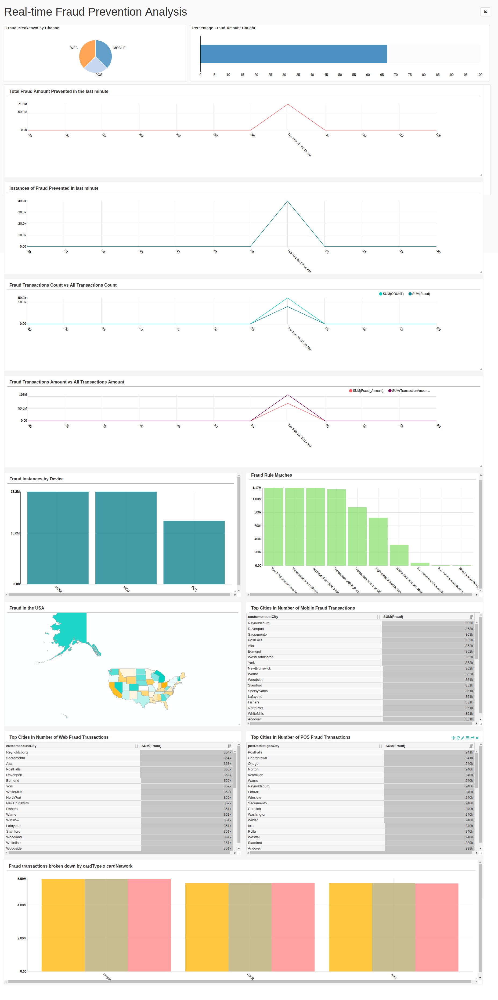
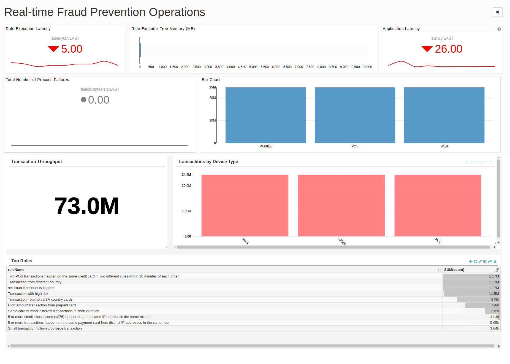

Omni Channel Fraud Prevention Application User Guide
====================================================
# Overview

Omni Channel Fraud Prevention application is a pre-built application which is used to identify frauds in financial transactions. This application is designed to ingest, transform, analyze, act, and visualize data as soon as it is generated thereby preventing fraud transactions in real time that is before it happens.

It is built over DataTorrent RTS platform and can be run on commodity hardware. The platform gives real time insights while providing fault tolerant and scalable way of processing. The fraud identification can be further customized by writing rules as per your business needs. Support is provided for editing rules using CEP Workbench.

This application is integrated with Online Analytical Service (OAS) for OLAP historical and real-time trend analysis. Real-time analytics are provided for continuous KPI visualizations along with integrated alert capabilities for user-defined thresholds.

The application dashboards are based on Apache SuperSet with enhanced ability to visualize and analyze trends.

The following services come preinstalled with the application. You can run these services for analytics, visualizing the analytic outcomes, and for creating customized rules.

- [Online Analytics Service](oas.md)
- [OAS Dashboards](oas_dashboards.md)
- [CEP Workbench](cep_workbench.md)

You can also integrate the application backplane to share the fraud alerts with other fraud-based applications thereby reducing the chance of fraud.

In addition to this, you can evaluate what-if scenarios on the incoming data which can be stored and visualized over different rules and business logic.
Omni Channel Fraud Prevention application is available only with **DT Premium license**.

## Quick Launch Omni-Channel Fraud Prevention Application
For details about quickly launching the application, refer to [Quick Start Guide - Omni-Channel Fraud Prevention Application](quickstartlaunchfpa.md).  

## Workflow

The following image presents the workflow of the application.


The following table lists the various processing phases of the incoming data tuples/event in **Omni Channel Fraud Prevention** application:

| **Phase** | **Process** | **Description** |
| --- | --- | --- |
| 1. | Transaction Ingestion | Data from all your input sources is pushed onto a message bus such as Apache kafka. The application leverages platform capabilities to ingest data from Kafka message bus to rest of its pipeline. Data tuples are filtered and transformed. The following operators are involved during Transaction ingestion: Kafka Input Operator, Filter Operator and Transformation Operator |
| 2 | Transaction Enrichment | Data is enriched with the lookup information such as user profile data, card data, geo data, store profile data etc.The following operators are involved in the transaction enrichment phase: Enricher, Geo Data, Customer Data, Card Data, and Product Data.  By default, these are the enrichment operators, you can modify, add, or remove these operators by launching the application with a different application configuration. Refer to [Enriching Data](#enrichdata) |
| 3 | Fraud Rule Execution | Fraud detection rules can be applied to the enriched data using the CEP Workbench. The following operator are involved in the Fraud Rule Execution phase: Fraud Rule Executor  |
| 4 | Analytics | OAS and Metrics |
| 5 | Fraud Triggers and Alerts | Triggers are activated based on the output of the upstream processing. The processed transactions are written onto HDFS to run any historical analysis in future. Also, transactions are published on message bus such as kafka to take real time actions. The application is also integrated with alerting systems that send real time alerts to applicable users.  Email alerts are sent by default. The following operator is involved in the Fraud Triggers and Alerts phase: Alert Mail, Data Writer, and Kafka Output operator|

## Operators / Modules

The following operators/modules are included for the Fraud Prevention application.

| **Operator / Module** | **Description** |
| --- | --- |
| Transaction Receiver | This Kafka input operator receives the transactions.s. It forwards these transactions to downstream operator. |
| Transaction Parser | This JSON parser operator parses the incoming transaction messages  and converts them into plain java objects hereafter referred as tuple for further processing. |
| TransactionTransformer | Transforms tuple fields as per given configuration e.g. fetch deviceIp from mobile details or web details based on transaction source |
| TransactionValidator | Validates tuples based on configuration e.g. all transactions with transaction amount more than 100$ |
| User Profile Enricher | This operator gets the relevant JAVA applicable user details corresponding to a unique ID and enriches the tuple. Using this operator is optional in an FPA application. Refer [User Data Enricher](#userdata) |
| Geo Data Enricher | The application identifies the geolocation of the transaction by performing a lookup of the transaction IP against the external database like Maxmind database.  Using this operator is optional in an FPA application. Refer [Geo Data Enricher](#geodata)|
| CardDataEnricher | This operator gets relevant card details and enriches tuple. Using this operator is optional in an FPA application. Refer [Card Data Enricher](#carddata)  |
| ProductDataEnricher | This operator gets relevant product details and enriches tuple.Using this operator is optional in an FPA application. Refer [Product Data Enricher](#productdata) |
| Input Module | Input module consists of two operators: **Kafka Input Operator**- This operator emits the byte array from Kafka topic whose properties are set on the module. These properties must be the same ones set on the corresponding output module whose messages are subscribed. You can also indicate which offset to start reading messages from kafka. **Avro Deserializer** - This operator does the deserialization of the schema set on the module. The schema must be the same one set on corresponding output module whose messages are subscribed.The deserialized class should be in classpath. This will be achieved by querying schema repository to include the jar of the class. Omni-Channel Fraud prevention application. Refer [Application Backplane](appbackplane.md)  |
| AccountDataEnricher | This operator gets relevant user account security information from Account takeover prevention application using application backplane. |appbackplane.md)
| Fraud Rules Executor | This operator is the Drools Operator. It applies the pre-defined rules to the incoming tuples and takes a suitable action depending on the outcome of the rules applied to a tuple. |
| HDFS Output Operator | This output operator writes messages coming from the Rules Executor to the specified HDFS file path. Using this operator is optional in an FPA application. |
| AOO Operator | This operator writes messages to a Kafka topic that are consumed by Online Analytics Service (OAS). |

# Setting the Application

Before you run the **Omni Channel Fraud Prevention** application, you must ensure to fulfill the prerequisites and to configure the enrichment.

## Prerequisites

The following should be installed on the computer before setting up the application:

| **Product** | **Version** | **Description** |
| --- | --- | --- |
| Apache Hadoop | 2.6.0 and Above | Apache Hadoop is an open-source software framework that is used for distributed storage and processing of dataset of big data using the MapReduce programming model. |
| DataTorrent RTS | 3.10 | DataTorrent RTS, which is built on Apache Apex, provides a high-performing, fault-tolerant, scalable, easy to use data processing platform for both batch and streaming workloads. DataTorrent RTS includes advanced management, monitoring, development, visualization, data ingestion, and distribution features. |
| Apache Kafka | 0.9 | Apache Kafka is an open-source stream processing platform that provides a unified, high-throughput, low-latency platform for handling real-time data feeds. |
| Maxmind |   | If you are using Geo data enrichment, ensure to copy the maxmind city database on HDFS and configure the operator with the location. For more details, refer to [Configuring the Properties](#configproperties) section. |

## <a name="enrichdata"></a>Enriching Data

Missing fields from your incoming records can be enriched with the lookup data. Enricher operators can be used to enrich the incoming data. You can add custom enricher operators or edit the existing default operators from the **enrichments.json** file on the HDFS. The path of the **enrichments.json** file must be set before you launch the application. This can be done by adding the **dt.fraudprevention.enrichments.configFilePath** property to the application configuration and setting its value to the **enrichments.json** file path.

By default, the Fraud Prevention application has the following enrichers:

- [User Data Enricher](#userdata)
- [Geo Data Enricher](#geodata)
- [Card Data Enricher](#carddata)
- [Product Data Enricher](#productdata)

# <a name="configproperties"></a>Configuring the Properties

Before launching the Fraud Prevention application, you can set the application configurations as per your requirement. The properties of the following items can be added to an application configuration during launch.

- [Application Properties](#appproperties)
- [Kafka Input](#kafka)
- [Parser](#parser)
- [Transformer](#transformer)
- [Validator](#validator)
- [Enrichment Operators](#enrich)
- [Output Module](#outputmodule)
- [Fraud Rules Executor](#rulesexecutor)
- [AOO Operator](#aoooperator)
- [Data Writer](#datawriter)
- [Alert Mail](#alertmail)

## <a name="appproperties"></a>Application Properties

| **Property** | **Description** | **Type** | **Example** |
| --- | --- | --- | --- |
| dt.fraudprevention.enableOutputOperators | Should write output to Kafka and HDFS | boolean | FALSE |

## <a name="kafka"></a>Kafka

The **Omni Channel Fraud Prevention** application reads input data from kafka and sends output result to kafka. Therefore, you must ensure that your kafka setup is up and running.

Configure your kafka setup details in application properties file.  The following properties must be set:

| **Property** | **Description** | **Type** | **Example** | **Required** |
| --- | --- | --- | --- | --- |
| **apex.app-param.kafkaBrokerList** | Comma separated list of kafka-brokers. | String | node1.company.com:9098, node2.company.com:9098, node3.company.com:9098 | Yes |
| **apex.app-param.TransactionReceiverTopic** | Topics to read from Kafka. | String | transactions | Yes |
| **apex.app-param.FraudTransactionsOutputTopic** | Topics to write fraud transactions to Kafka. | String | fraud-transactions | Yes |
| **dt.operator.TransactionReceiver.prop.initialOffset** | Initial offset to read from Kafka. | String |- EARLIEST, LATEST, APPLICATION\_OR\_EARLIEST, APPLICATION\_OR\_LATEST
 |   |
| **dt.operator.FraudResultPublisher.prop.properties(key.serializer)** | Serializer class | String | org.apache.kafka.common.serialization.StringSerializer |   |
| **dt.operator.FraudResultPublisher.prop.properties(value.serializer)** | Serializer class | String | org.apache.kafka.common.serialization.StringSerializer |   |

## <a name="parser"></a>Parser

Parser parses json input from kafka and generates plain java object for further processing.

Configure the java class which of plain java object to be generated by parser. The following properties must be set for parser:

| **Property** | **Description** | **Type** | **Example** |
| --- | --- | --- | --- |
| **dt.operator.TransactionParser.port.out.attr.TUPLE\_CLASS** | Fully qualified class name for the tuple class POJO (Plain old java objects) output to generate by parser | String | com.datatorrent.cep.schema.Transaction |

## <a name="transformer"></a>Transformer

The Transformer operator transforms the input fields as per requirements. The following properties must be set for transformer:

| **Property** | **Description** | **Type** | **Example** |
| --- | --- | --- | --- |
| **dt.operator.TransactionTransformer.port.input.attr.TUPLE\_CLASS** | Fully qualified class name for the tuple class POJO (Plain old java objects) input by transformer. | String | com.datatorrent.cep.schema.Transaction |
| **dt.operator.TransactionTransformer.port.output.attr.TUPLE\_CLASS** | Fully qualified class name for the tuple class POJO(Plain old java objects) output by transformer. | String | com.datatorrent.cep.schema.Transaction |
| **dt.operator.TransactionTransformer.expressionMap(deviceIP)** | Transform expression. **Note** : This property should be left blank, when you use custom schema. | Condition Expression | {$.mobileDetails} != null? {$.mobileDetails.deviceIP} : {$.webDetails} != null? {$.webDetails.deviceIP} : &quot;&quot; |
| **dt.operator.TransactionTransformer.expressionMap(processingStartTime)** | Transform expression. **Note** : This property should be left blank, when you use custom schema. | Condition Expression | {System.currentTimeMillis()} |

##<a name="validator"></a> Validator / Filter

Validator operator filters records as per the given condition. Following properties need to be set for validator:

| **Property** | **Description** | **Type** | **Example** |
| --- | --- | --- | --- |
| **dt.operator.TransactionValidator.port.input.attr.TUPLE\_CLASS** | Fully qualified class name for the tuple class POJO (Plain old java objects) input by validator | String | com.datatorrent.cep.schema.Transaction |
| **dt.operator.TransactionValidator.prop.condition** | Filter condition | Condition Expression | ({$}.getTransAmount() &gt;= 1000) |

## <a name="enrich"></a>Enriching Operators

Following are the enrichment operators for Fraud Prevention application.

### User Data Enricher <a name="userdata"></a>

User details are important to evaluate transactions for potential frauds.

For example, customer home address, spending patterns, risk score, and so on can be used to decide if a specific transaction is fraud. Jdbc store or json file is supported for lookup of customer data.

If you do not have a database, you can use file input source. Put your json input file on HDFS and configure it accordingly.

You can add the properties that are shown in the following json format into the **enrichment.json** file.
```
 {
    "name": "UserProfileEnricher",
    "storeType" : "json_file",
    "storeFields" : [
      { "name" : "cardNumber", "type" : "long" },
      { "name": "customerType", "type" : "string" },
      { "name" : "customerAvgSpending", "type" : "double" },
      { "name" : "customerRiskScore", "type" : "double" },
      { "name" : "custGender", "type" : "string" },
      { "name": "custMaritalStatus", "type" : "string" },
      { "name" : "custIncomeLevel", "type" : "string" },
      { "name" : "custStreet1", "type" : "string" },
      { "name" : "custStreet2", "type" : "string" },
      { "name" : "custCity", "type" : "string" },
      { "name" : "custState", "type" : "string" },
      { "name" : "custCountry", "type" : "string" },
      { "name" : "custPoBox", "type" : "long" },
      { "name" : "custPostalCode", "type" : "long" },
      { "name" : "custPostalCodeType", "type" : "string" },
      { "name" : "lat", "type" : "double" },
      { "name" : "lon", "type" : "double" },
      { "name" : "userId", "type" : "string" }
    ],
    "inputType" : "com.datatorrent.cep.schema.Transaction",
    "outputType" : "com.datatorrent.cep.schema.Transaction",
    "reuseObject" : true,
    "properties": {
      "file" : "lookupdata/customers.json",
      "refreshInterval" : 5000
    },
    "lookupFields" : {
      "cardNumber" : "cardNumber"
    },
    "includeFields" : {
      "customer.cardNumber" : "cardNumber",
      "customer.customerType" : "customerType",
      "customer.customerAvgSpending" : "customerAvgSpending",
      "customer.customerRiskScore" : "customerRiskScore",
      "customer.custStreet1" : "custStreet1",
      "customer.custStreet2" : "custStreet2",
      "customer.custCity" : "custCity",
      "customer.custState" : "custState",
      "customer.custCountry" : "custCountry",
      "customer.custPoBox" : "custPoBox",
      "customer.custPostalCode" : "custPostalCode",
      "customer.custPostalCodeType" : "custPostalCodeType",
      "customer.userId" : "userId"
    }
  }
```

**Note:** Ensure that the database connection driver jar, if any, is in classpath. The driver jar can be added in classpath using config package.

### <a name="geodata"></a>Geo Data Enricher

GeoData Enrichment operator refers maxmind database to fetch geo information provided ip address of transaction location. Copy the maxmind city database (GeoLite2 City) to HDFS.

**Note:** Extract GeoLite2-City.mmdb file to load on HDFS, don&#39;t copy the zip file directly.

You can add the properties that are shown in the following json format into the **enrichment.json** file.
```
{
    "name": "GeoDataEnricher",
    "passThroughOnError" : true,
    "storeType": "geo_mmdb",
    "storeFields": [
      { "name" : "IP", "type" : "string" },
      { "name": "CITY", "type": "string" },
      { "name" : "SUBDIVISION_ISO", "type" : "string" },
      { "name": "ZIPCODE", "type": "string" },
      { "name": "COUNTRY_ISO", "type": "string" },
      { "name" : "LATITUDE", "type" : "double" },
      { "name" : "LONGITUDE", "type" : "double" }
    ],
    "inputType": "com.datatorrent.cep.schema.Transaction",
    "outputType": "com.datatorrent.cep.schema.Transaction",
    "reuseObject": true,
    "properties": {
      "dbpath": "city.mmdb",
      "refreshInterval": 5000
    },
    "lookupFields": {
      "IP": "deviceIP"
    },
    "includeFields": {
      "geoIp.city" : "CITY",
      "geoIp.state" : "SUBDIVISION_ISO",
      "geoIp.zipcode" : "ZIPCODE",
      "geoIp.country" : "COUNTRY_ISO",
      "geoIp.latitude" : "LATITUDE",
      "geoIp.longitude" : "LONGITUDE"
    }
  }
```

### <a name="carddata"></a>Card Data Enricher

Lookup the card data in your database. If you do not have a database you can use file input source. Please put your json input file on HDFS and configure operator accordingly.

You can add the properties that are shown in the following json format into the **enrichment.json** file.
```
{
    "name" : "CardDataEnricher",
    "storeType" : "json_file",
    "storeFields" : [
      { "name": "cardType", "type": "string" },
      { "name": "cardNumber", "type": "long" },
      { "name": "cardCVV", "type": "integer" },
      { "name": "cardExpDate", "type": "string" },
      { "name": "cardName", "type": "string" },
      { "name": "cardDisplayNumber", "type": "long" },
      { "name": "cardNetwork", "type": "string" },
      { "name": "cardCompany", "type": "string" },
      { "name": "cardCompanyCountry", "type": "string" },
      { "name": "cardLimit", "type": "double" },
      { "name": "cardBalance", "type": "double" }
    ],
    "inputType" : "com.datatorrent.cep.schema.Transaction",
    "outputType" : "com.datatorrent.cep.schema.Transaction",
    "reuseObject" : true,
    "properties": {
      "file" : "lookupdata/cards.json",
      "refreshInterval" : 5000
    },
    "lookupFields" : {
      "cardNumber" : "cardNumber"
    },
    "includeFields" : {
      "paymentCard.cardType" : "cardType",
      "paymentCard.cardNumber" : "cardNumber",
      "paymentCard.cardExpDate" : "cardExpDate",
      "paymentCard.cardName" : "cardName",
      "paymentCard.cardDisplayNumber" : "cardDisplayNumber",
      "paymentCard.cardCompany" : "cardCompany",
      "paymentCard.cardCompanyCountry" : "cardCompanyCountry",
      "paymentCard.cardLimit" : "cardLimit",
      "paymentCard.cardBalance" : "cardBalance"
    }
  }
```
**Note** You must ensure that the database connection driver jar, if any, is in classpath. The driver jar can be added in classpath using config package.

### <a name="productdata"></a>Product Data Enricher

Lookup the product details in your json records that are stored in HDFS files. You can add the properties that are shown in the following json format into the **enrichment.json** file.
```
{
    "name" : "ProductDataEnricher",
    "type" : "list",
    "storeType" : "json_file",
    "storeFields" : [
      { "name" : "productId", "type" : "string" },
      { "name" : "productName", "type" : "string" },
      { "name" : "productDescription", "type" : "string" }
    ],
    "inputType" : "com.datatorrent.cep.schema.Transaction",
    "outputType" : "com.datatorrent.cep.schema.Transaction",
    "reuseObject" : true,
    "properties": {
      "file" : "lookupdata/products.json",
      "refreshInterval" : 5000
    },
    "listConf": {
      "elementType" : "com.datatorrent.cep.schema.Product",
      "keyListGetter" : "productIdList",
      "outputContainerGetter" : "products"
    },
    "lookupFields" : {
      "productId" : "{$}"
    },
    "includeFields" : {
      "productId" : "productId",
      "productName" : "productName",
      "productDescription" : "productDescription"
    }
  }
```

## <a name="outputmodule"></a>Output Module

The following properties must be set for the output module. Also refer [Application Backplane](appbackplane.md)

| **Property** | **Description** | **Type** | **Example** |
| --- | --- | --- | --- |
| dt.fraudprevention.inputModuleSchemaName | Set schema for the data. | string | UserActivity |
| topic | Set the kafka topic name | string | ATO\_analyseddata |

## <a name="rulesexecutor"></a>Fraud Rules Executor

The Fraud Rules Executor that is the Drools operator provides a method to load rules from:

- HDFS
- CEP Workbench

If rules are loaded from files on HDFS, you must configure the following property:

| **Property** | **Description** | **Type** |
| --- | --- | --- |
| rulesDir | Path to HDFS from where to load the rules. If this path is set to null, then the operator loads the rules from the classpath. | string |

To load rules from CEP Workbench, you must specify following properties and then specify the following properties in the application configuration. Refer to  [CEP Workbench](cep_workbench.md)  

| **Property** | **Description** | **Type** | **Example** |
| --- | --- | --- | --- |
| kieSessionName | If rules are to be loaded from application classpath, then specify the name of the session to use. This is created using CEP Workbench | string | UserActivity-rules-session |
| kiebaseName | If rules are to be loaded from application classpath, then specify the name of the kie base (rule) to use. This is created using CEP Workbench | string | ato-rules |

**Note:** If rules are to be loaded from application classpath, the knowledge jar (KJAR) should be in the classpath. Refer to [Application Configurations](application_configurations.md).

## <a name="aoooperator"></a>AOO Operator

This operator writes messages to a Kafka topic that are consumed by the OAS (Online Analytics Service). The following properties should be set:

| **Property** | **Description** | **Type** | **Example** |
| --- | --- | --- | --- |
| schema | Schema / metadata of the data to be sent to OAS.By default we package &quot;analyticsschema.json&quot; schema to change schema copy your schema file to hdfs and configure, &quot;_dt.fraudprevention.analytics.resourceFileName_&quot; with your schema file path. | string | analyticsschema.json |
| serializerClass | Provides information about serializing incoming messages in the form of JAVA objects to send to Kafka | string | com.datatorrent.cep.common.ToStringAnalyticsPojoSerializer |
| disablePartialWindowCheck | Set whether to disable partition window check or not.   **Note** : By disabling the partition window check duplicate data can be sent to Kafka thereby overriding exactly once guarantees. | boolean | True |

## <a name="datawriter"></a>Data Writer

Processed transactions and Fraud transactions are written on HDFS files. Specify the file location and the file name. The following properties must be set for data writer:

| **Property** | **Description** | **Type** | **Example** |
| --- | --- | --- | --- |
| **dt.operator.FraudResultFileWriter.prop.outputFileName** | Fraud data file Name | String | fraudOutput.txt |
| **dt.operator.FraudResultFileWriter.prop.filePath** | Fraud data folder path | String | /tmp |
| **dt.operator.TransactionDataWriter.prop.outputFileName** | Transaction data file Name | String | resultOutput.txt |
| **dt.operator.TransactionDataWriter.prop.filePath** | Transaction data folder path | String | /tmp |

## <a name="alertmail"></a>Alert Mail

When a fraud is identified in the system, notifications can be send over mail.

**Note:** This feature is applicable only in demo mode as of now. To activate, set demo value to true in input tuple.

The following properties must be set for alert mail:

| **Property** | **Description** | **Type** | **Example** |
| --- | --- | --- | --- |
| **dt.operator.FraudResultMailer.prop.from** | Email Sender | String |   |
| **dt.operator.FraudResultMailer.prop.subject** | Email Subject Line | String | Fraud Detected |
| **dt.operator.FraudResultMailer.prop.content** | Email Body Text | String | Fraud Detected CEP &lt;list of transactionIds&gt; |
| **dt.operator.FraudResultMailer.prop.smtpHost** | SMTP Host | String | [smtp.gmail.com](http://smtp.gmail.com) |
| **dt.operator.FraudResultMailer.prop.smtpPort** | SMTP Port | Integer | 587 |
| **dt.operator.FraudResultMailer.prop.recipients(to)** | Recipients List | String |   |
| **dt.operator.FraudResultMailer.prop.smtpUserName** | SMTP UserName | String |   |
| **dt.operator.FraudResultMailer.prop.smtpPasword** | SMTP Password | String | \*\*\* |

# Scaling the Application

To handle higher data loads, you can add more partitions of the processing units i.e. operators.

Update following properties as per your input load. The following properties must be set for scaling the application:

| **Property** | **Description** | **Type** | **Example** |
| --- | --- | --- | --- |
| **dt.operator.TransactionReceiver.initialPartitionCount** | Partition count of Kafka data receiver | Integer | 1 |
| **dt.operator.FraudRulesExecutor.attr.PARTITIONER** | Partition count of Rule execution opeartor | Integer | 1 |
| **dt.operator.RuleAndTransactionsWriter.attr.PARTITIONER** | Partition count of file writer operators | Integer | 1 |
| **dt.operator.TransactionDataWriter.partitionedFileNameformat** | File Name Format for transaction writer partition | String | %s-%04d |
| **dt.operator.FraudResultFileWriter.partitionedFileNameformat** | File Name Format for fraud writer partition | String | %s-%04d |

# Running the Application

The Fraud Prevention application can be launched from the DataTorrent RTS interface.

To run the application, do the following:

1. Go to the **Develop** page and upload the application package.
2. Specify the configuration as per the **Application Configuration**. Refer to [Application Configurations](application_configurations.md)
3. Launch the application. Refer to [Launching Applications and Configurations](dtmanage.md)
During the launch process, you can name the configuration and save it for future references. After you launch, you can track the details of the processed data in the application from the **Monitor** tab.

# Generating Sample Input

For a test run, you may want to generate sample data. To generate sample data, run the **OmniChannelFraudPreventionDataGenerator** application from **dt-cep-omni-fraud-prevention-app-1.4.0.apa**. Specify kafka server details and topic name which must be the same as configured for Transaction Receiver.


# Running Services

Fraud Prevention application can rely on the following services as dependencies, and all the required services will be automatically installed and launched as needed when the application starts. More details refer Services.

For example when you launch the  [Omni Channel Fraud Prevention](http://docs.datatorrent.com/omni_channel_fraud_app/) application for the first time, the following services are automatically installed and launched along with it:

- [Online Analytics Service](oas.md)
- [OAS Dashboards](oas_dashboards.md)
- [CEP Workbench](cep_workbench.md)

# Storing and Replaying Data

A service is available for Fraud Prevention application to store and replay events. You can record and replay data from a point in time to evaluate the effectiveness of builds, models, rules, and scenarios before they are put into production. Refer [Store and Replay](storeandreplay.md)

# Syncing with the Application Backplane

Application Backplane enables multiple applications to be integrated to share insights and actions. Fraud Prevention application is combined with Account Takeover Prevention application in real-time. Both these applications remain independent and yet benefit from a network-effect. For more details refer to [Application Backplane](appbackplane.md)

# Dashboards in Omni Channel Fraud Prevention Application

The Omni-Channel Fraud Prevention application includes the following dashboards.

-  [**Real-time Fraud Prevention Analysis**](#analysisdashboard)
- [**Real-time Fraud Prevention Operations**](#operationsdashboard)

### <a name="analysisdashboard"></a>Real-time Fraud Prevention Analysis



The following analytic metrics are available within **Real-time Fraud Prevention Analysis** dashboard:

- Fraud Prevention Analysis
- Fraud Breakdown by Channel
- Percentage Fraud Among Caught
- Fraud in the USA
- Fraud Instances by Device
- Fraud Rule Matches
- Fraud Transactions Amount vs All Transactions Amount
- Fraud transactions broken down by cardType x cardNetwork
- Fraud Transactions Count vs All Transactions Count
- Instances of Fraud Prevented in last minute
- Top Cities in Number of Mobile Fraud Transactions
- Top Cities in Number of POS Fraud Transactions
- Top Cities in Number of Web Fraud Transactions
- Total Fraud Amount Prevented in the last minute

### <a name="operationsdashboard"></a>Real-time Fraud Prevention Operations



The following operational metrics are available within **Real-time Fraud Prevention Operations** dashboard:

- Top rules
- Transaction thoroughput
- Transactions by device type
- Application Latency
- Rule Latency
- Rule Executor Free Memory
- Total Number of Process Failures

You can use the OAS dashboards service that is specific to FPA to visualize various metrics over the dashboards. [OAS Dashboards](oas_dashboards.md)

For importing and viewing the dashboards, refer to [dtDashboard](dtdashboard.md)

# Troubleshooting

- **My App crashes immediately with Error stating:** _**Failed to construct kafka consumer**_

  _Solution_: Ensure that your kafka instance is up and running. Also check if your kafka server is accessible from your cluster hosts. Also check right if the kafka server configuration is provided to the operator.

- **My Enrichment operator crashes.**

  _Solution:_ Check if you have enrichment data in place. Also verify if enrichment file/data store is accessible from node. Also check  if the correct configuration is provided to the operator.

- **Latency of my application increases**

  _Solution:_ From DataTorrent RTS UI, check the operator which is a bottleneck. Increase operator memory by referring to the instructions on [datatorrent.com](http://docs.datatorrent.com). Also check Scaling section to add more resources for processing.

- **I do not see as many number of processed tuple at end operators as I receive from kafka / My tuples are getting filtered out.**

  _Solution:_ Check the following:
  - Check if the filter condition on the **Validator** operator is filtering out most of tuples. You can check that by looking at count of received tuples and processed tuples by the operator.
  - Check if enrichment is failing due to missing data. In case lookup data is missing enrichment operator can fail. By default, tuples are not passed on to the next operator if enrichment is failed. Based on your requirements either validate your lookup data or configure operators to pass on tuples in case of enrichment failures.

