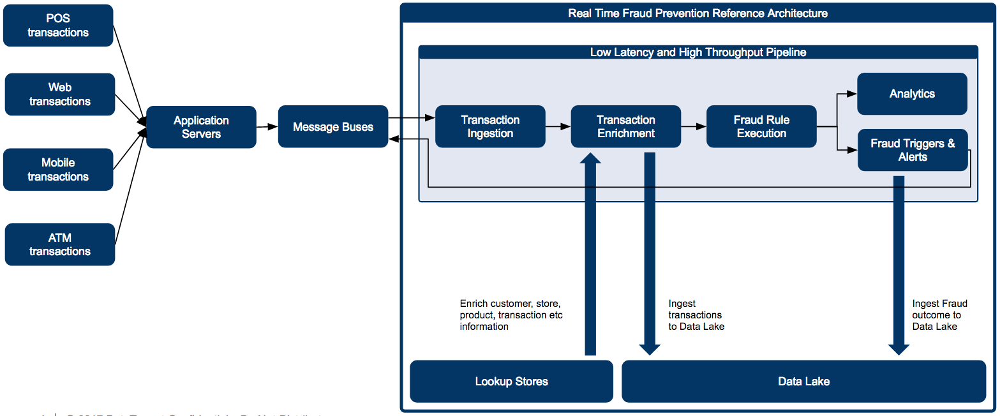
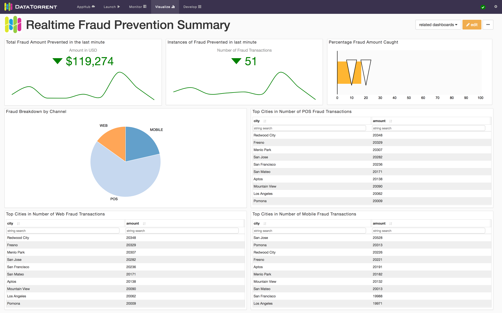
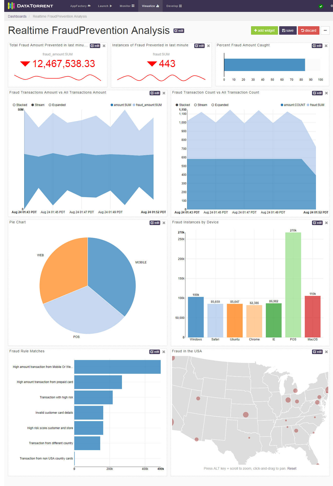
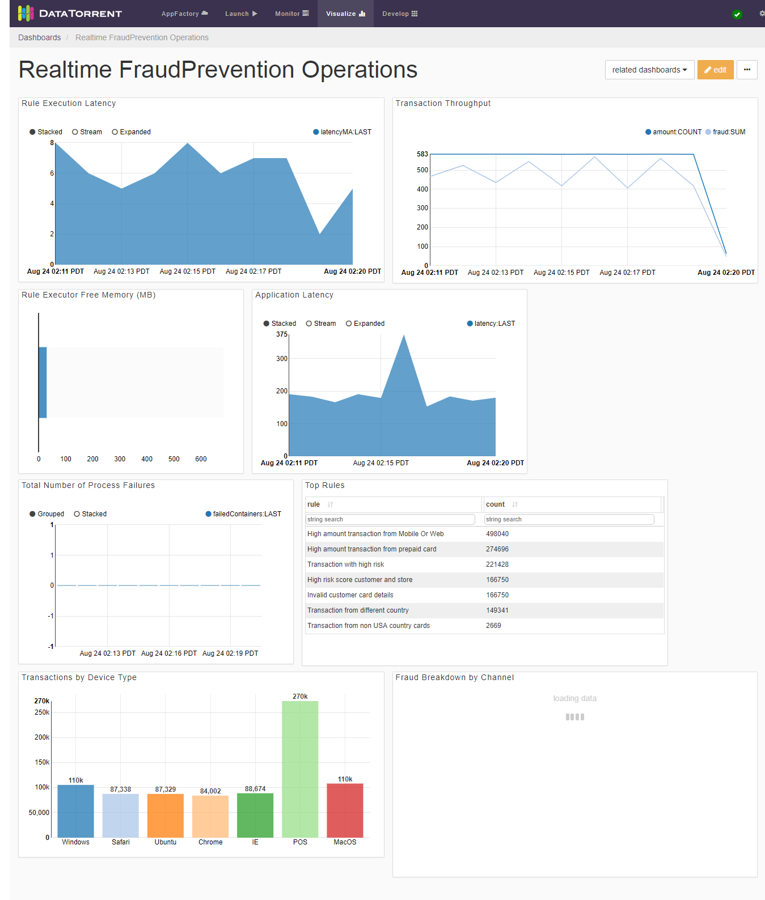
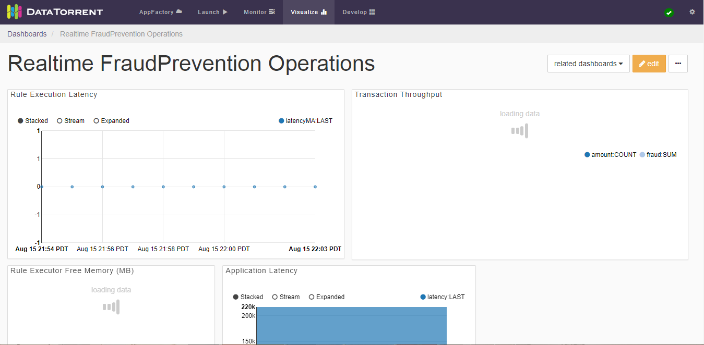
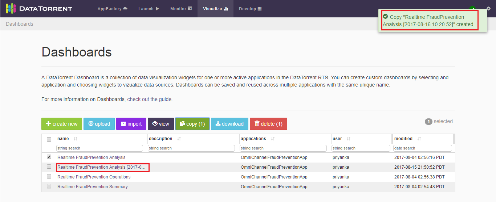

Omni Channel Fraud Prevention Application User Guide
====================================================

# Overview

**Omni Channel Fraud
Prevention** application is a pre-built application which can be used to identify frauds in financial transactions. This application is designed to ingest, transform, analyze, act, and visualize data as soon as it is generated thereby preventing fraud transactions in real time that is before it happens. You can view and monitor the historical and real-time data from the dashboards.

**Omni Channel Fraud Prevention** application is built over DataTorrent RTS platform and can be run on commodity hardware. The platform gives real time insights while providing fault tolerant and scalable way of processing. The fraud identification can be further customized by writing rules as per your business needs.

## Workflow

The following image presents the workflow of the application.

 
The following table lists the various processing phases of the incoming data tuples/event in **Omni Channel Fraud Prevention** application:

| **Phase** | **Process** | **Description** |
| --- | --- | --- |
| 1 | Transaction Ingestion | Data from all your input sources is pushed onto a message bus such as Apache kafka. The application leverages platform capabilities to ingest data from Kafka message bus to rest of its pipeline. Data tuples are filtered and transformed. The following operators are involved during Transaction ingestion: *Kafka Input Operator*, *Filter Operator*, *Transformation Operator*.|
| 2 | Transaction Enrichment | Data is enriched with the lookup information such as user profile data, card data, geo data, store profile data etc.The following operators are involved in the transaction enrichment phase: *Enricher*, *Geo Data*, *Customer Data*, *Card Data*, *Product Data*.|
| 3 | Fraud Rule Execution | Fraud detection rules are applied to the enriched data using drools as CEP engine. The following operators are involved in the Fraud Rule Execution phase: *Fraud Rule Executor*, *Data Writer*, *Scale Application.* |
| 4 | Analytics | Dimension computation is performed on the results and it is stored in a queryable format. The UI dashboards queries the data from the dimension compute store as well as from the auto metrics that are published by different DAG operators of the application. A unified view of the multiple app level widgets is provided, which helps to take actions in real time. For example, dedicated dashboards are shipped with application for executives, IT operations, and analytics. As per the role, a user can get their applicable metrics.The following operators are involved in the Analytics phase: *Dimension Computation*, *Store*, *Top Rules*, *Top N operators.* |
| 5 | Fraud Triggers and Alerts | Triggers are activated based on the output of the upstream processing. The processed transactions are written onto HDFS to run any historical analysis in future. Also, transactions are published on message bus such as kafka to take real time actions. The application is also integrated with alerting systems that send real time alerts to applicable users.  Email alerts are sent by default.The following operator is involved in the Fraud Triggers and Alerts phase: *Alert Mail*|

# Setting the Application

Before you run the **Omni Channel Fraud Prevention** application, you must ensure to fulfill the prerequisites and to configure the Enrichment operators.

## Prerequisites

The following should be installed on the computer before setting up the application:

| **Product** | **Version** | **Description** |
| --- | --- | --- |
| Apache Hadoop | 2.6.0 and Above | Apache Hadoop is an open-source software framework that is used for distributed storage and processing of dataset of big data using the MapReduce programming model. |
| DataTorrent RTS | 3.9.0 | DataTorrent RTS, which is built on Apache Apex, provides a high-performing, fault-tolerant, scalable, easy to use data processing platform for both batch and streaming workloads. DataTorrent RTS includes advanced management, monitoring, development, visualization, data ingestion, and distribution features. |
| Apache Kafka | 0.9 | Apache Kafka is an open-source stream processing platform that provides a unified, high-throughput, low-latency platform for handling real-time data feeds. |
| Maxmind |   | Ensure to copy the maxmind city database on HDFS and configure the operator with the location. For more details, refer to Configuring the Properties section. |

## Enrichment Operators

Before running the application, ensure that the prerequisites are installed and are running. Also ensure that the lookup data is available and the following enrichment operators are configured:

| **Enrichment Operators** | **Description** |
| --- | --- |
| **Geo Data Lookup** | The application identifies the geolocation of the transaction by performing a lookup of the transaction IP against [maxmind city database](https://dev.maxmind.com/geoip/). |
| **Customer Profile Lookup** | Customer details can be enriched from JDBC database store or json file on HDFS. You can configure the operator based on the input source you choose.If you wish to skip this method of enrichment, create empty json file on HDFS and provide its location in the operator. |
| **Card Data Lookup** | Card details can be enriched from JDBC database store or json file on HDFS.  You can configure the operator based on the input source you choose.If you wish to skip this method of enrichment, create empty json file on HDFS and provide its location in the operator. |
| **Product Data Lookup** | Product data can be enriched from json file on HDFS. You must configure the json filename to the operator. |

**Note** : Sample lookup data files are provided which can be used for test purposes.

# Configuring Rules

The application package contains sample rules. You can add rules based on your business requirements. These can be configured in drools supported formats such as **drl** and **xls**.

Drools is used to write business rules. Refer the following link to understand how to write rules using Drools. [https://nheron.gitbooks.io/droolsonboarding/content/](https://nheron.gitbooks.io/droolsonboarding/content/)

To configure the rules, do the following:

1. Save the output rule file onto your local machine. This file can be in **.drl** or in . **xls** format.
2. Copy the rule file into the HDFS folder.
3. Configure the FraudRulesExecutor
4. Restart the application after updating the rules.

**Note:** When folder path is not provided to FraudRulesExecutor, the packaged rules are uploaded by default. To override the packaged rules, configure your HDFS rules file path to operator.

# Configuring the Properties

The application configurations can be set as per your requirement. You can configure the properties while launching the application. The following properties can be configured for **Omni Channel Fraud Prevention** application:

- Application Properties
- Kafka Properties
- Parser Properties
- Validator / Filter
- Transformer
- Enricher
- Geo Data Enricher
- Customer Data Enricher
- Card Data Enricher
- Product Data Enricher
- Fraud Rule Executor
- Data Writer
- Alert Mail
- Scale the Application

## Application Properties

| **Property** | **Description** | **Type** | **Example** |
| --- | --- | --- | --- |
| **dt.includeOutputOperators** | Should write output to Kafka and HDFS | boolean | FALSE |

## Kafka

The **Omni Channel Fraud Prevention** application reads input data from kafka and sends output result to kafka. Therefore, you must ensure that your kafka setup is up and running.

Configure your kafka setup details in application properties file.  The following properties must be set:

| **Property** | **Description** | **Type** | **Example** | **Required** |
| --- | --- | --- | --- | --- |
| **apex.app-param.kafkaBrokerList** | Comma separated list of kafka-brokers. | String | node1.company.com:9098, node2.company.com:9098, node3.company.com:9098 | Yes |
| **apex.app-param.TransactionReceiverTopic** | Topics to read from Kafka.| String | transactions | Yes |
| **apex.app-param.FraudTransactionsOutputTopic** | Topics to write fraud transactions to Kafka. | String | fraud-transactions | Yes |
| **apex.app-param.ProcessedTransactionsOutputTopic** | Topcis to write processed transactions to kafka. | String | processed-transactions | Yes |
| **dt.operator.TransactionReceiver.prop.initialOffset** | Initial offset to read from Kafka. | String | *EARLIEST*, *LATEST*, *APPLICATION\_OR\_EARLIEST*, *APPLICATION\_OR\_LATEST* |   |
| **dt.operator.FraudResultPublisher.prop.properties(key.serializer)** | Serializer class | String | org.apache.kafka.common.serialization.StringSerializer |   |
| **dt.operator.FraudResultPublisher.prop.properties(value.serializer)** | Serializer class | String | org.apache.kafka.common.serialization.StringSerializer |   |
| **dt.operator.TransactionDataPublisher.prop.properties(key.serializer)** | Serializer class | String | org.apache.kafka.common.serialization.StringSerializer |   |
| **dt.operator.TransactionDataPublisher.prop.properties(value.serializer)** | Serializer class | String | org.apache.kafka.common.serialization.StringSerializer |   |

## Parser

Parser parses json input from kafka and generates plain java object for further processing.

Configure the java class which of plain java object to be generated by parser. The following properties must be set for parser:

| **Property** | **Description** | **Type** | **Example** |
| --- | --- | --- | --- |
| **dt.operator.TransactionParser.port.out.attr.TUPLE\_CLASS** | Fully qualified class name for the tuple class POJO (Plain old java objects) output to generate by parser | String | com.datatorrent.cep.schema.Transaction |

## Validator / Filter

Validator operator filters records as per the given condition. Following properties need to be set for validator:

| **Property** | **Description** | **Type** | **Example** |
| --- | --- | --- | --- |
| **dt.operator.TransactionValidator.port.input.attr.TUPLE\_CLASS** | Fully qualified class name for the tuple class POJO (Plain old java objects) input by validator | String | com.datatorrent.cep.schema.Transaction |
| **dt.operator.TransactionValidator.prop.condition** | Filter condition | Condition Expression | ({$}.getTransAmount() &gt;= 1000) |

## Transformer

The Transformer operator transforms the input fields as per requirements. The following properties must be set for transformer:

| **Property** | **Description** | **Type** | **Example** |
| --- | --- | --- | --- |
| **dt.operator.TransactionTransformer.port.input.attr.TUPLE\_CLASS** | Fully qualified class name for the tuple class POJO (Plain old java objects) input by transformer. | String | com.datatorrent.cep.schema.Transaction |
| **dt.operator.TransactionTransformer.port.output.attr.TUPLE\_CLASS** | Fully qualified class name for the tuple class POJO(Plain old java objects) output by transformer. | String | com.datatorrent.cep.schema.Transaction |
| **dt.operator.TransactionTransformer.expressionMap(deviceIP)** | Transform expression | Condition Expression | {$.mobileDetails} != null? {$.mobileDetails.deviceIP}: {$.webDetails} != null? {$.webDetails.deviceIP} : "" |

## Enricher

Missing fields from your incoming records can be enriched by referring to your lookup data in enrichment phase. You must ensure that the lookup data is configured correctly.

Enricher

The following properties must be set for enricher:

| **Property** | **Description** | **Type** | **Example** |
| --- | --- | --- | --- |
| **dt.connectEnricherErrorPorts** | Logs the failure tuples to console. | boolean | FALSE |

## Geo Data Enricher

GeoData Enrichment operator refers maxmind database to fetch geo information provided ip address of transaction location. Copy the maxmind city database (GeoLite2 City) to HDFS.

**Note:** Extract GeoLite2-City.mmdb file to load on HDFS, don&#39;t copy the zip file directly.

The following properties must be set for geo data enricher:

| **Property** | **Description** | **Type** | **Example** |
| --- | --- | --- | --- |
| **apex.app-param.geoIpLookupDataFilePath** | Path of maxmind city database file. | String | geoip/bindata/GeoLite2-City.mmdb |
| **dt.operator.GeoDataEnricher.port.input.attr.TUPLE\_CLASS** | Fully qualified class name for the tuple class POJO (Plain old java objects) input by enricher. | String | com.datatorrent.cep.schema.Transaction |
| **dt.operator.GeoDataEnricher.port.output.attr.TUPLE\_CLASS** | Fully qualified class name for the tuple class POJO (Plain old java objects) output by enricher. | String | com.datatorrent.cep.schema.Transaction |
| **dt.operator.GeoDataEnricher.store.retrievalFieldsString** | Comma separated list of fields to retrieve from database. | String | CITY,SUBDIVISION\_ISO,ZIPCODE,COUNTRY\_ISO,LATITUDE,LONGITUDE |
| **dt.operator.GeoDataEnricher.lookupFieldsString** | Comma separated list of fields to lookup from the database (or any other store) corresponding to the lookup fields of the POJO. | String | deviceIP |
| **dt.operator.GeoDataEnricher.passThroughOnErrors** | Should forward tuples on enrich failures. | boolean | TRUE |

## Customer Data Enricher

Customer details are important to evaluate transactions for potential frauds.

For example, customer home address, spending patterns, risk score, and so on can be used to decide if a specific transaction is fraud. Jdbc store or json file is supported for lookup of customer data.

If you do not have a database, you can use file input source. Put your json input file on HDFS and configure it accordingly.

The following properties must be set for custom data enricher:

| **Property** | **Description** | **Type** | **Example** |
| --- | --- | --- | --- |
| **dt.operator.UserProfileEnricher.port.input.attr.TUPLE\_CLASS** | Fully qualified class name for the tuple class POJO(Plain old java objects) input by enricher. | String | com.datatorrent.cep.schema.Transaction |
| **dt.operator.UserProfileEnricher.port.output.attr.TUPLE\_CLASS** | Fully qualified class name for the tuple class POJO(Plain old java objects) output by enricher. | String | com.datatorrent.cep.schema.Transaction |
| **dt.operator.UserProfileEnricher.prop.store.databaseDriver** | jdbc database driver | String | org.apache.derby.jdbc.EmbeddedDriver |
| **dt.operator.UserProfileEnricher.prop.store.databaseUrl** | jdbc database url | String | jdbc:derby:memory:EmbeddedJdbcTestDb;create=true |
| **dt.operator.UserProfileEnricher.prop.store.tableName** | jdbc database table name. | String | CUSTOMER\_INFO |
| **dt.operator.UserProfileEnricher.prop.store.dbDataPath** | json data file path **for test**. | String | lookupdata/customers.json |
| **dt.operator.UserProfileEnricher.prop.store.createTableQuery** | **For test** when using dbDataPath. | String | CREATE TABLE CUSTOMER\_INFO (cardNumber BIGINT, customerType VARCHAR(50),customerAvgSpending FLOAT, customerRiskScore FLOAT, custStreet1 VARCHAR(50),custStreet2 VARCHAR(50), custCity VARCHAR(50), custState VARCHAR(50), custCountry VARCHAR(50),custPoBox INT, custPostalCode INT, custPostalCodeType VARCHAR(50)) |
| **dt.operator.UserProfileEnricher.store.retrievalFieldsString** | Comma separated list of fields which should be retrieved from lookup database. | String | cardNumber,customerType,customerAvgSpending,customerRiskScore,custStreet1,custStreet2,custCity,custState,custCountry,custPoBox,custPostalCode,custPostalCodeType |
| **dt.operator.UserProfileEnricher.includeFieldsString** | Comma separated list of field names to which the values from retrieval fields will be written to in the result object. | String | customer.cardNumber,customer.customerType,customer.customerAvgSpending,customer.customerRiskScore,customer.custStreet1,customer.custStreet2,customer.custCity,customer.custState,customer.custCountry,customer.custPoBox,customer.custPostalCode,customer.custPostalCodeType |
| **dt.operator.UserProfileEnricher.store.storeLookupFieldsString** | Comma separated list of fields to lookup in the incoming object. | String | cardNumber |
| **dt.operator.UserProfileEnricher.lookupFieldsString** | Comma separated list of fields to lookup from the database (or any other store) corresponding to the lookup fields of the POJO. | String | cardNumber |
| **dt.operator.UserProfileEnricher.passThroughOnErrors** | Should forward tuples on enrich failures | boolean | FALSE |

**Note:** Ensure that the driver jar is in classpath. The driver jar can be added in classpath using config package.

## Card Data Enricher

Lookup the card data in your database. If you do not have a database you can use file input source. Please put your json input file on HDFS and configure operator accordingly.

The following properties must be set for card data enricher:

| **Property** | **Description** | **Type** | **Example** |
| --- | --- | --- | --- |
| **dt.operator.CardDataEnricher.port.input.attr.TUPLE\_CLASS** | Fully qualified class name for the tuple class POJO(Plain old java objects) input by enricher | String | com.datatorrent.cep.schema.Transaction |
| **dt.operator.CardDataEnricher.port.output.attr.TUPLE\_CLASS** | Fully qualified class name for the tuple class POJO(Plain old java objects) output by enricher | String | com.datatorrent.cep.schema.Transaction |
| **dt.operator.CardDataEnricher.prop.store.databaseDriver** | jdbc database driver | String | org.apache.derby.jdbc.EmbeddedDriver |
| **dt.operator.CardDataEnricher.prop.store.databaseUrl** | jdbc database url | String | jdbc:derby:memory:EmbeddedJdbcTestDb;create=true |
| **dt.operator.CardDataEnricher.prop.store.tableName** | jdbc database table name | String | CARD\_INFO |
| **dt.operator.CardDataEnricher.prop.store.dbDataPath** | json data file path **for test** | String | lookupdata/cards.json |
| **dt.operator.CardDataEnricher.prop.store.createTableQuery** | **For test** when using dbDataPath | String |   |
| **dt.operator.CardDataEnricher.store.retrievalFieldsString** | Comma separated list of fields which should be retrieved from lookup database | String | cardNumber,customerType,customerAvgSpending,customerRiskScore,custStreet1,custStreet2,custCity,custState,custCountry,custPoBox,custPostalCode,custPostalCodeType |
| **dt.operator.CardDataEnricher.includeFieldsString** | Comma separated list of field names to which the values from retrieval fields will be written to in the result object | String | customer.cardNumber,customer.customerType,customer.customerAvgSpending,customer.customerRiskScore,customer.custStreet1,customer.custStreet2,customer.custCity,customer.custState,customer.custCountry,customer.custPoBox,customer.custPostalCode,customer.custPostalCodeType |
| **dt.operator.CardDataEnricher.store.storeLookupFieldsString** | Comma separated list of fields to lookup in the incoming object | String | cardNumber |
| **dt.operator.CardDataEnricher.lookupFieldsString** | Comma separated list of fields to lookup from the database(or any other store) corresponding to the lookup fields of the pojo | String | cardNumber |
| **dt.operator.CardDataEnricher.passThroughOnErrors** | Forwards tuples on enrich failures | boolean | FALSE |

**Note** You must ensure that the driver jar is in classpath. The driver jar can be added in classpath using config package.

## Product Data Enricher

Lookup product details in your json records stored in HDFS files.

The following properties must be set for product data enricher:

| **Property** | **Description** | **Type** | **Example** |
| --- | --- | --- | --- |
| **dt.operator.ProductDataEnricher.port.input.attr.TUPLE\_CLASS** | Fully qualified class name for the tuple class POJO(Plain old java objects) input by enricher | String | com.datatorrent.cep.schema.Transaction |
| **dt.operator.ProductDataEnricher.port.output.attr.TUPLE\_CLASS** | Fully qualified class name for the tuple class POJO(Plain old java objects) output by enricher | String | com.datatorrent.cep.schema.Transaction |
| **dt.operator.ProductDataEnricher.prop.resultListField** |   | String | products |
| **dt.operator.ProductDataEnricher.prop.store.fileName** |   | String | lookupdata/products.json |
| **dt.operator.ProductDataEnricher.store.retrievalFieldsString** | Comma separated list of fields which should be retrieved from lookup database | String | productId, productName,productDescription |
| **dt.operator.ProductDataEnricher.store.storeLookupFieldsString** | Comma separated list of fields to lookup in the incoming object | String | productId |
| **dt.operator.ProductDataEnricher.includeFieldsString** | Comma separated list of field names to which the values from retrieval fields will be written to in the result object | String | productId,productName,productDescription |
| **dt.operator.ProductDataEnricher.lookupFieldsString** | Comma separated list of fields to lookup from the database(or any other store) corresponding to the lookup fields of the pojo | String | productIdList |
| **dt.operator.ProductDataEnricher.passThroughOnErrors** | Should forward tuples on enrich failures | boolean | FALSE |

## Fraud Rule Executor

This operator applies rules that can identify fraud to incoming tuples. The rules can be configured in drl or xls form using the following property.

| **Property** | **Description** | **Type** | **Example** |
| --- | --- | --- | --- |
| **dt.operator.FraudRulesExecutor.prop.rulesDir** | HDFS path of directory containing rule files, null means read packaged rules. | String |   |

## Data Writer

Processed transactions and Fraud transactions are written on HDFS files. Specify the file location and the file name. The following properties must be set for data writer:

| **Property** | **Description** | **Type** | **Example** |
| --- | --- | --- | --- |
| **dt.operator.FraudResultFileWriter.prop.outputFileName** | Fraud data file Name | String | fraudOutput.txt |
| **dt.operator.FraudResultFileWriter.prop.filePath** | Fraud data folder path | String | /tmp |
| **dt.operator.TransactionDataWriter.prop.outputFileName** | Transaction data file Name | String | resultOutput.txt |
| **dt.operator.TransactionDataWriter.prop.filePath** | Transaction data folder path | String | /tmp |

## Alert Mail

When a fraud is identified in the system, notifications can be send over mail.

**Note:** This feature is applicable only in demo mode as of now. To activate, set demo value to true in input tuple.

The following properties must be set for alert mail:

| **Property** | **Description** | **Type** | **Example** |
| --- | --- | --- | --- |
| **dt.operator.FraudResultMailer.prop.from** | Email Sender | String |   |
| **dt.operator.FraudResultMailer.prop.subject** | Email Subject Line | String | Fraud Detected |
| **dt.operator.FraudResultMailer.prop.content** | Email Body Text | String | Fraud Detected CEP &lt;list of transactionIds&gt; |
| **dt.operator.FraudResultMailer.prop.smtpHost** | SMTP Host | String | [smtp.gmail.com](http://smtp.gmail.com) |
| **dt.operator.FraudResultMailer.prop.smtpPort** | SMTP Port | Integer | 587 |
| **dt.operator.FraudResultMailer.prop.recipients(to)** | Recipients List | String |   |
| **dt.operator.FraudResultMailer.prop.smtpUserName** | SMTP UserName | String |   |
| **dt.operator.FraudResultMailer.prop.smtpPasword** | SMTP Password | String | \*\*\* |

## Scale the Application

To handle higher data loads, you can add more partitions of the processing units i.e. operators.

Update following properties as per your input load. The following properties must be set for scaling the application:

| **Property** | **Description** | **Type** | **Example** |
| --- | --- | --- | --- |
| **dt.operator.TransactionReceiver.initialPartitionCount** | Partition count of Kafka data receiver | Integer | 1 |
| **dt.operator.FraudRulesExecutor.attr.PARTITIONER** | Partition count of Rule execution opeartor | Integer | 1 |
| **dt.operator.RuleAndTransactionsWriter.attr.PARTITIONER** | Partition count of file writer operators | Integer | 1 |
| **dt.operator.TransactionDataWriter.partitionedFileNameformat** | File Name Format for transaction writer partition | String | %s-%04d |
| **dt.operator.FraudResultFileWriter.partitionedFileNameformat** | File Name Format for fraud writer partition | String | %s-%04d |

# Running the Application

The Omni Channel Fraud Prevention application can be launched from the DataTorrent RTS interface.
To run the application, do the following:
1. Go to the **Develop** page and upload the application package.
2. Specify the configuration as per the configure section.
3. Launch the application.

During the launch process, you can name the configuration and save it for future references.

## Generate Sample Input

For a test run, you may want to generate sample data. To generate sample data, do the following:
1. Run the **cep-datagen-1.3.0-SNAPSHOT.apa** application from the DataTorrent RTS interface.
2. Specify kafka server details and topic name which must be the same as configured for Transaction Receiver.

# Dashboards

DataTorrent Dashboards and Widgets are UI tools that allow you to quickly and easily visualize historical and real-time application data.

Packaged dashboards are the set of following dashboards in which various visualizations are built.

- Realtime FraudPrevention Summary
- Realtime FraudPrevention Analysis
- Realtime FraudPrevention Operations

### Realtime FraudPrevention Summary

 
### Realtime FraudPrevention Analysis

### Realtime FraudPrevention Operations

## Importing Dashboards

To view the dashboards, you need to import the dashboards. To import the dashboards, do the following:

1. On DataTorrent Console, click &#39;Visualize&#39; tab.
2. Click &#39;Import&#39; button to view &quot;Packaged Dashboards&quot; screen.

Packaged Dashboards consists of:
- Realtime FraudPrevention Summary
- Realtime FraudPrevention Analysis
- Realtime FraudPrevention Operations

To import the dashboard in the application from the list of packaged dashboards, do the following:

1. Click on &#39;Import&#39; button from &#39;actions&#39; column from the above screen.
2. Populate the data in the above screen and click on Import button to import selected dashboard in the application.
3. Once dashboards are imported, user can see in the list.

## Uploading Dashboard

If the dashboard file is available on your local machine, it can be uploaded using this option. To upload the dashboard, do the following:
1. On DataTorrent Console, click the **Visualize** tab.
2. Click **Upload** button to view the **Dashboard Upload** screen.
3. Browse or drag the dashboard file using the above screen. Once the dashboard file is uploaded, user can see in the list.

## Viewing Dashboard

To view the dashboard, make sure that dashboard is available. Dashboard can be created or imported or uploaded and in turn it will display in the list. To view the dashboard, do the following:

1. On DataTorrent Console, click **Visualize** tab. 
2. In the displayed list of dashboards, select dashboard using checkbox. The **view** button is displayed only when you select one dashboard. If you select more dashboards, **view** button disappears.
3. Select the dashboard to view in detail and click **view** button. This shows  the following screen: 

## Copying Dashboard

To copy the dashboard, make sure that dashboard is available in the list. Dashboard can be created or imported or uploaded and it gets displayed in the list. To copy the dashboard, do the following:
1. On the DataTorrent Console, click **Visualize** tab. In the displayed list of dashboard(s), select dashboard using checkbox. **copy** button will be displayed only after selecting dashboard. The total count of the selected dashboards is displayed on the **copy** button.
2. Select the dashboard(s) to be copied and click the **copy** button. This will create a copy of the dashboard(s). Copied dashboard(s) can be seen in the list. Message will be displayed at the upper right corner.

 
## Downloading Dashboard

To download the dashboard, make sure that dashboard is available in the list. Dashboard can be created or imported or uploaded and in turn it will display in the list.

1. On DataTorrent Console, click **Visualize** tab. In the displayed list of dashboard(s), select a dashboard using checkbox. **download** button will be displayed only after selecting only one dashboard.
2. Select the dashboard to be downloaded and click **download** button. The downloaded dashboard can be seen in the **Downloads** folder. The extension of the downloaded file will be .dtdashboard.

## Deleting Dashboard

To delete the dashboard, make sure that dashboard is available in the list. Dashboard can be created or imported or uploaded and in turn it will display in the list.

1. On DataTorrent Console, click **Visualize** tab. In the displayed list of dashboard(s), select dashboard using checkbox. The **download** button will be displayed only after you select the dashboard. Depending on the selection of number of dashboards, the count will be displayed on the **download** button.
2. Select dashboard(s) to be deleted and click **delete** button. This shows following confirmation popup.        
3. Click **Okay** to delete the selected dashboard(s). This will delete the dashboard and list will be updated.

# Troubleshooting

- **My App crashes immediately with Error stating:** _**Failed to construct kafka consumer**_

  _Solution_: Ensure that your kafka instance is up and running. Also check if your kafka server is accessible from your cluster hosts. Also check right if the kafka server configuration is provided to the operator.

- **My Enrichment operator crashes.**

  _Solution:_ Check if you have enrichment data in place. Also verify if enrichment file/data store is accessible from node. Also check right if the configuration is provided to the operator.

- **Latency of my application increases**

  _Solution:_ From DataTorrent RTS UI, check the operator which is a bottleneck. Increase operator memory by referring to the instructions on [datatorrent.com](http://docs.datatorrent.com). Also check Scaling section to add more resources for processing.

- **I don&#39;t see as many number of processed tuple at end operators as I receive from kafka / My tuples are getting filtered out.**

  _Solution:_ Check the following:
  - Check if the filter condition on the **Validator** operator is filtering out most of tuples. You can check that by looking at count of received tuples and processed tuples by the operator.
  - Check if enrichment is failing due to missing data. In case lookup data is missing enrichment operator can fail. By default, tuples are not passed on to the next operator if enrichment is failed. Based on your requirements either validate your lookup data or configure operators to pass on tuples in case of enrichment failures.
