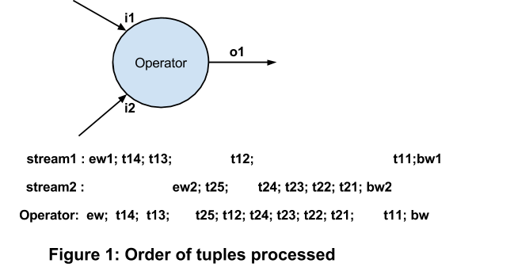
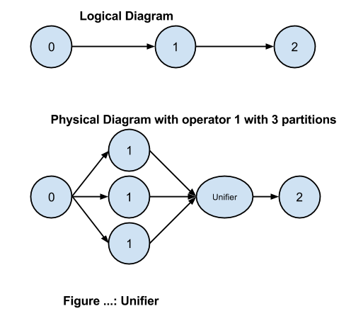

# Operator Development Guide Reference

* 1: Introduction

* 2: Operators

 * API

   * Interface - Component

   * Interface Operator

   * Class DefaultInputPort

   * Class DefaultOutputPort

   * Interface InputPort

   * Interface OutputPort

   * Interface ActivationListener

   * Interface CheckpointListener

   * Interface IdleTimeHandeler

 * Ports

   * Examples

     * Input Port

     * Output Port

     * Error Port

   * Unifiers

   * Port Declarations

 * Operator Properties

 * Operator Attributes

 * Templates

 * Validations

   * Compile Time Validations

   * Initialization/Instantiation Time

   * Runtime Validations

 * Transient Fields

 * Stateless vs Stateful

 * Single vs Multiple Inputs

 * Hierarchical Operators

 * Macros

* 3: Computation Model

 * Single Dedicated Thread Execution

 * Mutability of tuples

 * Passthrough vs End of Window tuples

 * Streaming Window vs Application Window

* 4: Commonly Used Operators

 * Window Generator

 * Default Unifier

 * Sinks

 * InputOperator

 * Apache Apex Malhar Library Templates

 * Database/Window Synchronization Operator

* 5: Fault Tolerance

 * Checkpointing

 * Recovery Mechanisms

   * At-Least-Once

   * At-Most-Once

   * Exactly-Once

* 6: Partitioning

 * Static vs Dynamic

 * Partitioner

 * Multiple Ports

 * StreamCodec

 * Unifier

* 7: Library

 * Common Operator Functions

   * Filtering-Selecting-Map

   * Aggregations

   * Joins

   * Input Adapters

   * Output Adapters

   * Event Generators

   * Stream Manipulation

   * User Defined

 * Sample Code

 * Latency and Throughput


1: Introduction
===============

A streaming application is a DAG that consists of computations (called
operators) and data flow (called streams). In this document we will
discuss details on how an operator works and its internals. This
document aims to enable the reader to write efficient operators and make
informed design choices.

2: Operators
============

Operators are basic computation units of the application. They are
interconnected via streams to form an application. Operators are classes
that implement the Operator interface. They read from incoming streams
of tuples and write to other streams. Reading and writing to streams is
done through connection points called ports. An operator may have no
ports (if the operator is an Input Adapter and the only operator in the
DAG) and there is no limit to the number of ports an operator can have.
Operators also
have **properties** and **attributes**. Properties
customize the functional definition of the operator, while attributes
customize the operational behavior of the operator.

Operators are designed to be simple and easy to use and develop. Their
job is to process tuples one at a time and emit a tuple as per business
logic. Ports that read tuples from a stream are input ports as they
implement the InputPort interface. Ports that write tuples to a stream
are output ports which implement the OutputPort interface. Given
operators A and B where an input port of B is connected to an output
port of A, we say that A is an upstream operator of B and B is a
downstream operator of A. The platform ensures that tuples emitted by A
reach B. Thus the operator solely focuses on the business logic
processing. The engine, i.e. Streaming Application Master (STRAM) is
cognizant of the connection order of the operators. This connectivity
and the dataflow is an intrinsic part of engine’s decision-making. All
guarantees of data delivery upon outage is done via attributes that can
vary per application. The same operator can be reused in different
applications. This means that the same operator code can be used in
various recovery mechanisms by different applications. Two instances of
the same operator within an application can also have different recovery
mechanisms (attributes).

Operators can have properties that are used to customize functional
behavior of the operator. Within an application attributes can be
assigned to an operator that impact the operability of the operator.
Later sections of this chapter cover the internal details of operators.

API
---

To write your own operator you need to implement the Operator interface.
This interface provides the basic API for an operator developer. It
extends the Component interface; important parts of both interfaces are
discussed below.

### Interface - Component

-   ``` setup (OperatorContext context) ``` This is part of  Component. This is
    invoked as part of initialization of the operator. This is part of
    initial pre-runtime setup of the operator that is called during
    initialization time. Care should be taken to not use this method to
    set parameters. It is strongly advocated that users use setter
    functions to set parameters. The setter functions work for both the
    Java API as well as the properties file based API of an application.
    Setter functions can also be invoked during runtime via CLI. Setup
    is useful for validation checks that can only be done during
    initialization time. Setup is also very useful for initializing
    transient objects like connections with outside systems (e.g.
    sockets or database sessions). These objects should not be part of
    the state of the operator as they are in session, i.e. upon recovery
    from a node outage, the connection has to be reestablished in setup.
    All objects that are not serializable must be transient and
    initialized during setup or at the declaration site.
-   ``` teardown() ``` This too is part of Component and is called as part of
    terminating the operator. Any session related objects should be shut
    down or deallocated in this callback. Graceful termination of
    outside connections (for example sockets, database sessions, etc.)
    should be done in this method

### Interface Operator

-   ``` beginWindow(long windowId) ``` Invoked at the start of a window. The
    windowId parameter identifies the window. All tuples received and
    emitted in that window belong to this windowId. A window gets
    started upon receipt of the first beginWindow tuple on any input
    port. The window computation starts at the first line of the
    beginWindow().
-   ``` endWindow() ``` Invoked at the end of window. This call is only made
    after all the input ports receive an end\_window tuple. All tuples
    emitted in endWindow belong to the same windowId (passed during
    beginWindow). The window computation ends with the last line in
    endWindow().

### Class DefaultInputPort

-   ```process(T tuple)``` Invoked within an input port for every tuple
    received from the port of an upstream operator. This method is part
    of the input port interface. The schema of the tuple is same as the
    schema of the input port. This callback is an abstract call that
    must be implemented by the operator developer.

### Class DefaultOutputPort

-   ```emit(T tuple)``` To be called by the operator developer when a tuple
    has to be emitted on the output port. Tuples can be emitted in
    beginWindow, endWindow, or process callbacks. The schema of the
    tuple is the same as the schema of the output port.

### Interface InputPort

-   ```StreamCodec < T > getStreamCodec()``` A stream codec serializes or
    deserializes the data that can be received on the port. If null,
    STRAM uses the generic codec.

### Interface OutputPort

-   ```Unifier < T > getUnifier()``` When operators are partitioned via round
    robin partitioning they may need to merge the outputs of the
    partitions. For example MaxMap operator may have N partitions, each
    would emit its maximum value. The maximum value is computed by
    finding the maximum of these N values. Thus another operator is
    needed to unify these tuples. getUnifier() returns such an operator.
    Developers need to implement the process() api. The schema of the
    input tuples sent to merge() and the output port are identical to
    the schema of the output port of the operator. If the operator has
    only one input and one output port, and if both have identical
    schema, then the operator itself can act as its unifier (see MaxMap
    as an example). The default unifier is a passthrough operator and it
    just passes the tuples from each partition to the downstream
    operators.

### Interface ActivationListener

An operator may be subjected to activate/deactivate cycle multiple times
during its lifetime which is bounded by setup/teardown method pair. So
it's advised that all the operations which need to be done right before
the first window is delivered to the operator be done during activate
and opposite be done in the deactivate.

An example of where one would consider implementing ActivationListener
is an input operator which wants to consume a high throughput stream.
Since there is typically at least a few hundreds of milliseconds between
the time the setup method is called and the first window, the operator
developer would want to place the code to activate the stream inside
activate instead of setup.

-   ```activate(CONTEXT context)``` Gets called just before the first
    beginWindow() call of the operator activation. Any processing that
    needs to be done, just before the operator starts processing tuples,
    must be done here.
-   ```deactivate()``` Gets called just before the operator is deactivated.
    Opposite of the operations done in activate() must be done in
    deactivate().

### Interface CheckpointListener

Operators which need to be notified as soon as they are checkpointed or
committed, must implement this interface.

-   ```checkpointed(long windowId)``` - Called when the operator is
    checkpointed. The windowId parameter contains the window id after
    which the operator was checkpointed.
-   ```committed(long windowId)``` - Called when the operator is committed. A
    commit operation is performed when all the operators in the DAG have
    successfully checkpointed a particular window id. This window id is
    passed as a parameter to the call back.

### Interface IdleTimeHandeler

An operator must implement this interface if it is interested in being
notified when it's idling. An operator can be said to be idling when

1.  An operator which is an Input Adaptor, is not emitting any tuple or
2.  A generic operator or an Output Adapter is not processing any inputs

-   ```handleIdleTime()``` - When the operator is idling, it is explicitly
    notified of such a state. The operators which implement this
    interface should make use of this idle time to do any auxiliary
    processing they may want to do when operator is idling. If the
    operator has no need to do such auxiliary processing, they should
    not implement this interface. In such a case, the engine will put
    the operator in scaled back processing mode to better utilize CPU.
    It resumes its normal processing as soon as it detects tuples being
    received or generated. If this interface is implemented, care should
    be taken to ensure that it will not result in busy loop because the
    engine keeps calling handleIdleTime until it does not have tuples
    which it can give to the operator.

All the above callbacks happen in a single dedicated thread, i.e. at any
one point of time only one of these callbacks is being executed. No
thread locking issues exist when writing code that process tuples.
Tuples are queued in a buffer and await their turn for process() calls
on their respective ports. Tuples are always in-order within a stream,
i.e. an input port receives them in the same order that they were
emitted. If an operator has two input ports then the order between
tuples on two different streams is not guaranteed.

Figure 1 shows an operator with two ports. It has a guarantee that
process() method on input port i1 will be invoked for tuples in the
following order: t11, t12, t13, t14; and process() method on input port
i2 will be invoked for tuples in the following order: t21, t22, t23,
t24, t25. But whether i2::process( t21) would happen before
i1:process(t11) is entirely dependent on when they arrive. Users are
strongly advised to not depend on the order of tuples in two different
streams as in a distributed application this order cannot be guaranteed.
Such operators would not be idempotent.

Tuples always belong to a specific window (identified by its window id).
All tuples emitted by the upstream operator, whether in beginWindow(),
endWindow(), or process(), are part of the same window and hence each of
these tuples would invoke process() on the input port of a downstream
operator in the same window. Output ports need not be connected for
tuples to be emitted. This leniency allows STRAM to monitor throughput
on an unconnected port, and information that is useful for future
changes, including dynamic modification of the DAG. For more details and
specific interfaces please refer to their API classes.



Ports
-----

Ports are connection points of an operator and are transient objects
declared in the Operator class. Tuples flow in and out through these
ports. Input ports read from the stream while output port write to one.
Input ports are implementation of the InputPort interface, while output
ports are implementations of the OutputPort interface. An output port
can be tagged as an error port by placing an annotation on it (error =
true). Later in this section we would discuss the implications of
tagging an output port as an error port. Ports have schemas as part of
their declaration. The schema of a port is useful for compile time error
checking as well as runtime checks required for dynamically inserting
operators at runtime.

We classify the operators in 3 buckets by observing the number of input
and output ports.

-   **Input Adapters (Having no input ports)**: The operator with no input
    ports is called an Input Adapter. (An Adapter is a special term used
    to denote an operator which interacts with the systems external to
    the DAG. We’ll use the terms Input Adapter and Input Operator
    interchangeably.) An Input Adapter is useful for reading data from a
    source external to the DAG. Some examples of external data sources
    are HDFS, HBase, Sockets, Message Busses, Cassandra, MySql, Oracle,
    Redis, Memcache, HTTP (GET), RSS feed, etc. It ingests the data from
    one or more external sources, creates a stream, introduces control
    tuples in the stream and emits them via its output ports. The
    streams at the output ports of the Input Operator are ready to be
    consumed by downstream operators. The Apache Apex Malhar library
    implements quite a few Input Operators named after the data sources
    they interface with. Input adapters have a window generator that
    generates begin\_window and end\_window tuples periodically. Since
    the STRAM initializes all window generators, they all start with
    same window id and the application is synchronized on these
    windows.

Input Operators have two modes, namely Synchronous and Asynchronous

-   **Synchronous (Pull mode)**: Examples of synchronous data intake is an
    HDFS file reader. The operator can thus decide the intake rate, i.e.
    "how much data to read per window?". This operator can be
    implemented with a single thread. Scaling such an operator is
    determinable at static/compile time.
-   **Asynchronous (Push mode)**: Examples of asynchronous data is typical
    message busses, where data is pushed to the reader (the Input
    Operator). In such a scenario, the operator does not know the
    inbound rate and hence is asynchronous with respect to the platform
    windows in nature. Asynchronous input operators create another
    thread to receive the incoming data. The basic operator task of
    taking the incoming data and converting to/emitting a tuple is done
    by the main thread of the operator. A connection buffer is provided
    to ensure that the two threads communicate effectively. Users are
    advised to pay particular attention to the inbound rate and design
    an asynchronous operator carefully.

-   **Output Adapter (Having no output port)**: The operator having no
    output ports is called an Output Adapter. An Output Operator is
    useful for handing over the data to the systems outside of the DAG.
    Typically output operators remove the control tuples from the
    stream, transform it, and write the resulting data to external
    sources like HDFS, HBASE, Sockets, Message Busses, Cassandra, MySql,
    Oracle, HTTP Server (POST), and others. The Apache Apex Malhar
    library has a few Output Operators also available ready for use in a
    DAG.

-   **Generic Operator (Having both input and output ports)**:  These are
    the most generic operators. They use one or more input ports to read
    the input tuples and use one or more output ports to emit the
    computed tuples. Unifiers are examples of generic operators where
    process() is used for all input ports instead of process() per input
    port.
-   **Singleton Operator (Having no input or output ports)**: These
    operators are self-sufficient in implementing the business logic and
    have no input or output ports. An application with such an operator
    will not have any other operator in the DAG. Such an operator
    effectively acts as both an Input Adapter as well as an Output
    Adapter.

Both output adapters and generic operators process tuples on the input
port and look alike, the difference is that a general operator emits
tuples while output adapter has to ensure tight integration with outside
sources. As far as the interface is concerned, both have to implement
the
Operator[ ](https://www.google.com/url?q=http://docs.google.com/apidocs/com/datatorrent/api/Operator.html&sa=D&usg=AFQjCNGqoCKvez6sQaf8ALriKfbxtwMbRw)interface.
Both input adapters and generic operators emit tuples, but input
adapters generate the streams by talking to external systems and at
times need two threads. Input operators do not have a process API, and
implement the InputOperator interface. Only input adapters have window
generators which insert begin\_window and end\_window events (control
tuples) in the stream. The details of window generators are discussed in
a later Chapter.

Ports have to be transient objects within the Operator as they should
not be part of a checkpointed state. The importance of the transient
keyword is explained in the section on checkpointing. Ports are objects
in the operator class that the platform recognizes. All objects that
implement the interface InputPort and OutputPort make this list. A
special kind of output port is also supported, namely a port for
emitting error tuples. Though this port is in essence an output port,
i.e. it writes tuples to a stream, it is identified as error port via an
annotation (error = true). The STRAM can then leverage this information
for better reporting, statistics, tools (for example UI), monitoring
etc. The port need not be connected for the STRAM to gather information
on it, as emitted tuples can be counted even if no stream is connected
to it.

### Examples

#### Input Port

An example of an input port implementing the abstract class
DefaultInputPort is

``` java

@InputPortFieldAnnotation(name = "data")
public final transient DefaultInputPort <KeyValPair < K,V > > data = new DefaultInputPort <KeyValPair < K,V > >(this); {
  @Override</p>
  public void process(KeyValPair < K,V > tuple) {
    // code for processing the tuple</p>
  }
};

```
process() is an abstract method and must be provided by the developer of
the operator. This method is responsible for implementing the processing
logic for the incoming tuple.

#### Output Port

Here is an example of an output port implementing the abstract class
DefaultOutputPort:

``` java

@OutputPortFieldAnnotation(name = "sum", optional = true)
public final transient DefaultOutputPort < HashMap < K, V > > sum = new DefaultOutputPort < HashMap < K, V > >(this) {
  @Override
  public Unifier < HashMap < K, V > > getUnifier()
  { // The unifier is also an operator, that is initialized in the container of the downstream operator</p>
    return new UnifierHashMapSumKeys < K, V >();
  }
;
```

#### Error Port

An example of an error port is:

``` java

@OutputPortFieldAnnotation(name = "sum", optional = true, error=true)
public final transient DefaultOutputPort <KeyValPair <String,Integer > > monitor = new DefaultOutputPort < KeyValPair < String,Integer > >(this);

```

### Unifiers

An operator that uses round robin partitioning may need a unifier to
merge data back. An example of this is a sum operator that takes a
HashMap as its input tuple. In the above example of an output port, the
key-value pairs in the HashMap consist of keys and their values that are
to be added. If this operator is partitioned in N ways, each partition
would emit its own sum for a key. So the unifier (merge operator) needs
to unify them and compute the final result per key as sum of all the
values from every partition for that key. An operator that uses a sticky
key partition does not need to provide its own merge as the default
merge put in by the platform is a passthrough merge (i.e. just emits the
incoming tuple on the output port).

### Port Declarations

Annotations should be added to the ports, as these are very useful in
validating them. Annotations are declared with
```@InputPortFieldAnnotation()``` for input ports and
```@OutputPortFieldAnnotation()``` for output ports. Currently the following
annotations are supported on the ports

-   ```name = “portname”```
-   ```optional = true (or false)```
-   ```error = true (or false)```

Over time mode annotations would be added as per needs of our customers.

The schema of the tuple emitted on a port is part of the port
declaration and thus is defined as compile time. These types may be
defined using Java generics. The schema declaration on the ports allow
compile time validation when an output port of an operator is connected
to input port of another operator. On IDEs like Eclipse or NetBeans,
this check is done as you type. The application creator thus experiences
productivity gains by leveraging type safety alerts generated by the
IDEs. The port schema also enables the STRAM to do schema validation
before run time addition of an operator. The added sub-query can do a
check (instanceof) before accepting a tuple.

Operator Properties
-------------------

Operator can have properties which are used to customize the
functionality of the operator. Operator properties should be accessed
using standard Java beans convention (read via getter method, and write
via setter method) so that values can be injected and validated as
per[ ](https://www.google.com/url?q=http://docs.oracle.com/javaee/6/tutorial/doc/gircz.html&sa=D&usg=AFQjCNE_i2aABJVp1qFtSWyXRxJ-91ETXw)[javax
annotation](https://www.google.com/url?q=http://docs.oracle.com/javaee/6/tutorial/doc/gircz.html&sa=D&usg=AFQjCNE_i2aABJVp1qFtSWyXRxJ-91ETXw) .
Through properties is a broad definition of anything instantiated inside
an operator, as a generic definition we count variables of the object
that can be read and written to by the user via getter and setter
methods.

The DAG (including all the operators) is initialized on the client side
and then passed to the STRAM. This means that the setter method is not
called during initialization in the container. So during node recovery
the checkpointed state needs to have these values. In order for the
properties to be saved in the checkpoint, they cannot be transient. This
is irrespective of whether they are set only during initialization and
would have same values in every checkpoint. The platform enables runtime
changes to property values via setter functions. If a setter function is
called during runtime, STRAM would call the setter function after
checkpoint is loaded, so runtime changes are remembered irrespective of
whether the checkpoint happened between property set and operator
outage.

Operator Attributes
-------------------

Operators can have attributes. Attributes are provided by the platform
and do not belong to user code. Attributes do not change the basic
functionality of an operator, and most often the operator code would be
oblivious to these attributes. The platform recognizes these and takes
decisions (compile time or run time) that mainly impacts the performance
of an operator. A very common example of an attribute is
APPLICATION\_WINDOW\_COUNT. This attribute is by default equal to the
streaming window (count = 1), and an user can set this on any operator.
Attributes also exist at the application level and on a stream. If an
operator can only work with certain values of an attribute, they can be
accessed during setup call on an operator. During development of the
operator the values of these attributes could be used to provide better
operability for the operator. Details of attributes are covered in
Operation and Installation Guide.

Templates
---------

Since operators are java classes they can be templatized (generic types)
for reuse. The streaming platform leverages all features in Java for
type safety and parameterization. Templates have no performance impact
as they exist only at compile time. Templates greatly reduce the number
of operators that need to be maintained, and enable operators for lot
more reuse. Apache Apex Malhar Library Templates are examples of
operator templates. In general, it is advisable to templatize operators
wherever possible. This allows the core computation to be used for
derived types. For example Sum operator can be used for any tuple type
that
extends Number.
In general an operator should set the schema of the tuple to the minimum
required for its functionality. Apache Apex Malhar Library package
sample code has examples of a lot of such operators.

Validations
-----------

The platform provides various ways of validating application
specifications and data input. Validation of an application is done in
three phases, namely:

1.  **Compile Time**: Caught during application development, and is most
    cost effective. These checks are mainly done on declarative objects
    and leverage the Java compiler. For example "schema of two ports on
    the same stream should match".
2.  **Initialization Time**: When the application is being initialized,
    before submitting to Hadoop. These checks are related to
    configuration/context of an application, and are done by the logical
    DAG builder implementation. For example, check that "a particular
    port must be connected"
3.  **Runtime**: Validations done when the application is running. This is
    the costliest of all checks. These are checks that can only be done
    at runtime as they involve data integrity. For example divide by 0
    check, or negative age value.

Operator properties and ports are validated at compile time (IDE) as
well as launch time (STRAM). Java annotations are used extensively to
check validations such as ranges for the properties, string formatting,
etc. For example, a port, by default has to be connected. This check is
done during compile time in your IDE, as well as during launch time
(CLI-\>STRAM). If you have an port whose connectivity is optional, it
needs to be mentioned via annotation given below:


``` java

@InputPortFieldAnnotation(name = "data", optional=true)
public transient DefaultInputPort data = new DefaultInputPort(this) { }

```

### Compile Time Validations

Compile time validations apply when an application is specified in Java
code and include all checks that can be done by Java compiler in the
development environment (including IDEs like NetBeans or Eclipse).

Examples include the following

1.  **Schema Validation**: The tuples on ports are POJO (plain old java
    objects) and java compiler checks to ensure that all the ports on a
    stream have the same schema. This check works in any IDE as well as
    with a command line java compiler.
2.  **Stream Check**: Single Output port and at least one Input port per
    stream. A stream can only have one output port writer. This is part
    of the addStream API. This check ensures that developers only
    connect one output port to a stream. The same signature also ensures
    that there is at least one input port for a stream
3.  **Naming**: Compile time checks ensures that applications components
    like operators and streams are named

We will continue to add as many checks as possible in compile time. But
the Java compiler cannot do 100% of the checks, and validations have to
be done during initialization time. Further, for the errors that can
happen only during run time, run time checks are supported.

### Initialization/Instantiation Time

Initialization time validates include various checks that are done post
compile, and before the application starts running in a cluster (or
local mode). These are mainly configuration/contextual in nature. This
checks are as critical to proper functionality of the application as the
compile time validations.

Examples include the following

-   [JavaBeans
    Validation](https://www.google.com/url?q=http://docs.oracle.com/javaee/6/tutorial/doc/gircz.html&sa=D&usg=AFQjCNE_i2aABJVp1qFtSWyXRxJ-91ETXw)

The most common checks for properties are listed below

[](#)[](#)

<table>
<col width="33%" />
<col width="33%" />
<col width="33%" />
<tbody>
<tr class="odd">
<td align="left"><p>Constraint</p></td>
<td align="left"><p>Description</p></td>
<td align="left"><p>Example</p></td>
</tr>
<tr class="even">
<td align="left"><p>@Max</p></td>
<td align="left"><p>The value of the field or property must be an integer value lower than or equal to the number in the value element</p></td>
<td align="left"><p>@Max(100)</p>
<p>int success_ratio;</p></td>
</tr>
<tr class="odd">
<td align="left"><p>@Min</p></td>
<td align="left"><p>The value of the field or property must be an integer value greater than or equal to the number in the value element</p></td>
<td align="left"><p>@Min(0)</p>
<p>int mass;</p></td>
</tr>
<tr class="even">
<td align="left"><p>@NotNull</p></td>
<td align="left"><p>The value of the field or property must not be null</p></td>
<td align="left"><p>@NotNull</p>
<p>String username;</p></td>
</tr>
<tr class="odd">
<td align="left"><p>@Pattern</p></td>
<td align="left"><p>The value of the field or property must match the regular expression defined in the regexp element</p></td>
<td align="left"><p>@Pattern(regexp = &quot;lte|lt|eq|ne|gt|gte&quot;, message = &quot;Value has to be one of lte, lt, eq, ne, gt, gte&quot;)</p>
<p>String cmp;</p></td>
</tr>
</tbody>
</table>

-   **Input port connectivity**: An input port must be connected, unless
    optional = true. For example:

    ```@InputPortFieldAnnotation(name = "data", optional = true)```

-   **Output port connectivity**: At least one output port must be
    connected, unless optional = true.

    ```@OutputPortFieldAnnotation(name = "result", optional = true)```

-   **Unique names for operators and streams**: Check is done to ensure that
    operators and streams are named uniquely within the application.

-   **Cycles in the dag**: Check is done to ensure that the application is a
    DAG and no cycle exists.
-   **Port annotations with the same name**: Checked to ensure that the port
    annotations are one per port
-   **One stream per port**: A port can connect to only one stream. This
    check is very clear for an input port as by definition only one
    stream can input to a port. This check is also done for an output
    port, even though an output port can technically write to two
    streams. This is done as the message queue infrastructure does a
    much better job and allows STRAM to better do run time
    optimizations. If you must have two streams originating from a
    single output port, use a StreamDuplicator  operator.

### Runtime Validations

Run time checks are those that are done when the application is running.
The[ ](https://www.google.com/url?q=http://docs.google.com/RealTimeStreamingPlatform.html&sa=D&usg=AFQjCNEYYLIb0bnIWPvAaNxtIoN3K8BM1A)Apache
Apex platform provides rich run time error handling mechanisms. These
checks also include those done by application business logic. In these
cases the platform allows applications to count and audit these.

Examples include the following:

-   **Error Tuples**: Applications can log error tuples during computation.
    These are counted on a per window basis and are part of application
    statistics. This allows for an automated way to integrate error
    catching into a monitoring system. These tuples can be written into
    a file. The default storage engine is HDFS. This allows application
    developers to debug and analyse data.
-   **Test Framework**: The ability to test the application at run time
    includes the need to verify the functionality against a previous
    run. Users can do that via a test framework that allows an
    application to process parallel sets of streams, get the
    computations on a selected list of output ports and compare the
    results. The test would be user driven, would verify that the atomic
    micro-batches generated are identical and certify an application.
    This test allows users to validate any change to the application
    operator logic in run time.
-   **Error Ports**: Ports that emit error tuples are supported by the
    ```@OutputPortFieldAnnotation```. This means that users have to create
    these ports just like any other ports with an annotation
    ```@OutputPortFieldAnnotation (error = true)```. The platform can then
    support a “number of error tuples” computation just by counting the
    errors emitted on this port and aid in persistence.
-   **Bucket Testing**: When any new application logic needs to be tried
    out, it is useful to first try it on a very small sample of a
    stream. The concept of bucket testing will be available in a future
    release. In this mode, the incoming streams (input adapters) would
    have a Sampler operator inserted on appropriate streams in the
    application. Users would thus be able to test a modification to the
    application on a small subset of data. This feature will be
    available in a later release.
-   **Unifier Output Port**: A unifier has to have only one output port as
    the platform needs to know which port to connect the input port of
    the downstream operator to. This is achieved by checking that
    unifier operator has only one output port.

Regarding the stream schema and the ability to validate dynamic DAG
modifications, the engine has only partial knowledge of the port types
since type information may be erased by the Java compiler and the exact
type used to instantiate a parameterized operator may not be known
(HashMap, ArrayList, Object, etc.). Many validations are performed
before an application is fully launched (compile time, startup). There
are cases that need runtime checks, including connectivity, error
tuples, operator uptime, container uptime, and others. Run time schema
checks can still be performed using the instanceof() function. Object
oriented design and usage of base class APIs is very critical to enable
run time schema checks. If the port of the operator to be inserted on
the stream only accesses the base class API, then run time insertion can
be done via usage of the instanceof() function. In later versions,
stronger support would be provided by the platform for run time check
for dynamic insertion of objects.

Transient Fields
----------------

During the application lifecycle, operators are serialized as part of
checkpointing in the distributed environment. The platform uses Kryo for
serialization. If a field is marked "transient" it will not be
serialized. A number of guidelines need to be followed to avoid error or
inefficiencies due to serialization:

-   Port objects need to be declared as public static final. The port
    objects are non-static inner classes that cannot be deserialized due
    to absence of a default constructor. There is no need to serialize
    port objects as port objects are stateless. State can be maintained
    by the enclosing operator instance.
-   Use non-transient fields for properties that configure/customize the
    operator (and are set at initialization time). These properties are
    required when operator is setup in the executing container and need
    to be serialized. You can allow runtime changes to properties via
    setter functions. This means that such objects/properties must be
    non-transient as you now rely on the set value being serialized.
-   Use non-transient for objects that are required across window
    boundaries. This will ensure that the state is checkpointed and
    recovered when the operator is transferred between containers as
    result of rescheduling or an outage. An operator whose functionality
    depends on tuples from previous windows must have those objects as
    non-transient.
-   Use transient objects for state of the operator in the following two
    cases:
 -   If the computation and resultant output from an incoming tuple does
    not depend on any previous tuples. This means that the operator is
    completely stateless. For such an operator, all serializable objects
    should be declared as transient to reduce the size of the checkpoint
    state.
 -   If the computation and resultant output from an incoming tuple only
    depends on other tuples in the same window. Such an operator can
    technically be made stateless. The down side is that you would need
    to ensure that application window is always equal to the streaming
    window. If the application window is not equal (i.e. more than) the
    streaming window, then the checkpoint will still happen on streaming
    window boundaries, and therefore the state would include the state
    of the operator within a window. This is because once the
    application developer sets an application window, the endWindow call
    is skipped until the application window boundary. As an operator
    developer you can force this operator to be stateless by checking
    for the application window value during the setup call.

To force the checkpoint of such operators to align with the application
window boundary set the attribute “CHECKPOINT\_WINDOW\_COUNT” to
“APPLICATION\_WINDOW\_COUNT”. This will ensure more efficient execution
as it avoids unnecessary serialization. Currently, by default
checkpointing happens at the checkpoint period, and that is most likely
more frequent than an application window. For long application windows
it is more efficient to checkpoint more often and thereby avoid a very
long replay queue. For such an operator the parameters including those
that only exist within a window are part of the state of the operator as
the checkpoint would happen on an intermediate streaming window
boundary. As an operator developer, if you are using transient objects
for state within a window it is very critical that you ensure that the
Application window is equal to streaming window. This can be done either
during the setup call, or you can set the checkpointing window count to
application window count.

Stateless vs Stateful
---------------------------------------------

The platform intends to discern stateless vs. stateful without direct
specification from the developer. This depends on declaring objects as
transient. Therefore, care should be taken to ensure that objects that
may form state of the operator are not declared as transient. This
aspect is a critical part of the operator design.

The state of an operator is defined as all the non-transient fields of
the operator. To exclude a variable from being included in the state,
the developer must declare that variable as transient. Since the
computing model of the platform is to treat windows as atomic
micro-batches, the operator state is checkpointed after an endWindow and
before the next beginWindow event. In a future version, we will be
adding an attribute that would allow an operator developer to force the
checkpoint to align with the application window boundary.

Checkpointing is a process of serializing the operator object to disk
(HDFS). It is a costly procedure and it blocks computations. To avoid
this cost checkpointing is done every Nth window, or every T time
period, where T is significantly greater than the streaming window
period. A stateless operator (all variables are transient) can recover
much quicker than a stateful one and pay a far lower checkpointing
penalty. In the future, the platform may interpret an operator as
stateless and remove the checkpointing penalty. The needed windows are
kept by the upstream buffer server and are used to recompute the lost
windows, and also rebuild the buffer server in the current container. A
passthrough operator is an example of a stateless operator. For example,
an operator that takes a line, splits it into key/val pairs, and sends
one HashMap\<key,val\> per line is stateless as the outbound tuple is
derived solely from the in-bound tuple.

The Stateless vs. Stateful distinction of an operator does not impact
the core platform engine, i.e. the platform does not distinguish between
these. However it is a very good distinction to learn for those who want
to write operators. The data that has to be transferred to the next
window must be stored in non-transient objects, as a node recovery
between these two windows must restore its state. If the outbound tuple
depends on tuples before the current tuple, then the operator has a
state. These objects must be non-transient. The state of an operator is
independent of the number of ports (ports are transient objects).

A stateless operator is defined as one where no data is needed to be
kept at the end of any API call (e.g. beginWindow, process, or
endWindow). In other words, all variables are transient and one where
the outbound tuple solely depends on the current in-bound tuple. Such an
operator is completely stateless. Another stateless operator is one
where all the computations of a window can be derived from all the
tuples the operator receives within that window. This guarantees that
the output of any window can be reconstructed by simply replaying the
tuples that arrived in that window. But for such an operator the
operator developer needs a mechanism to ensure that no checkpointing
must be done within an application window. The downside of such an
operator is that if it is used for a very large application window, e.g.
a few hours, then the upstream buffer server must maintain that many
tuples. Stateless operators have much more efficient recovery, however
operator developers must take into account the cost of maintaining the
buffers of an application window in the upstream bufferserver.

A stateful operator is defined as one where data needs to be stored at
the end of a window for computations, i.e some variables are
non-transient. Stateful operators are also those where outbound tuples
depends on more than one incoming tuple (for example aggregates), and
the operator developer has allowed checkpointing within an application
window. Stateful operators have costlier recovery as compared to
stateless operators.

If a container object has to be cleared after every window, it is better
to clear it in endWindow as compared to beginWindow. Since checkpointing
is done after endWindow, in cases where the checkpointing is done only
after application window or streaming window, this object is empty. If
the operator developer is not sure about application developer not
asking for checkpointing within an application window, clearing
container objects in endWindow is more efficient as the object in most
cases does not become part of the checkpoint state.

Single vs Multiple Inputs
-------------------------------------------------

A single-input operator by definition has a single upstream operator,
since there can only be one writing port for a stream.  If an operator
has a single upstream operator, then the beginWindow on the upstream
also blocks the beginWindow of the single-input operator. For a window
to start processing on any operator at least one upstream operator has
to start processing that window. The platform supports “at least one
upstream operator should start processing” model to allow processing to
start as soon as possible. For a single input operator this is very
efficient as setting up internal objects for processing can be done in
parallel and before the first tuple arrives.

A multi-input operator can have more than one upstream operator. Each
input port has an upstream operator. In some cases all the input ports
may be connected to output ports of the same upstream operator. In
either case the multi-input operator will not close a window until all
the upstream operators close this window. Thus the closing of a window
is a blocking event. A multi-input operator is also the point in the DAG
where windows of all upstream operators are synchronized. The windows
(atomic micro-batches) from a faster (or just ahead in processing)
upstream operators are queued up until the slower upstream operator
catches up. The STRAM monitors and guarantees these conditions. These
may occur dynamically due to changes in throughputs on various streams,
caused by internal or external events.

Hierarchical Operators
----------------------------------------------

Hierarchical operators are those whose functional logic it itself a DAG.
The difference between an application and a hierarchical operator is
that the later has ports and thus can be inserted in other applications.
Hierarchical operators are very useful for reuse, and enforcing common
design practices. The development for hierarchical operator is underway
and will be available in a future version.

Macros
------------------------------

Macros are sets of instructions that run via the CLI to insert a
sub-query (sub-DAG) into the application. They have a similar result as
the hierarchical operators, except they are executed at run time. In the
future when the CLI supports application creation, macros can be used
during application creation time. Macros would still differ from a
hierarchical operators as the operator would have a scope that the macro
may not.

3: Computation Model
====================

In this section we discuss details of the computation model of an
operator. It is very important for an operator developer to understand
the nuances of the operator computational model to be able to leverage
all the rich features provided by the platform.

Single Dedicated Thread Execution
---------------------------------

All code of an operator always executes in a single dedicated thread
within a Hadoop container. This is a design principle of the platform,
and that ensures that all the calls on the operator are invoked in the
same thread. This frees the user from synchronization considerations in
the operator logic. This makes coding very easy for the operator, as
only one tuple is processed at any given time and no locking has to be
done. Arrival of two tuples on the same stream is not an issue as they
always arrive in order. However, for operators that process multiple
input streams, the platform serializes (de-parallelizes) the multiple
parallel streams into one so that the processing of individual tuples
does not overlap with that of another tuple on the same stream or any
other stream processed by the operator. Since the streams are coming
from different sources in a distributed architecture, there is no
guarantee when tuples in two different streams would arrive with respect
to each other. Thus the order of tuples from two different streams is
random and cannot be guaranteed. The only guarantee is that all tuples
of the streams that the operator listens to that belong to a window id
would arrive in that window. Operator logic should thus be written in
such a way that it does not depend on the order of tuples from two
different streams. An operator that has such a dependency is not
idempotent. The serialization of streams also ensures that all the
streams are synchronized on window boundaries. The management of
in-flowing tuples is handled by the platform to allow the operator code
to run in a single thread execution, and frees the developer to focus
solely on the business logic.

Mutability of tuples
--------------------

Tuples emitted and received from ports are POJO (plain old java
objects). Operator developers should be careful about the ownership
semantics of tuples that are mutable objects and passed through
THREAD\_LOCAL or CONTAINER\_LOCAL streams (shared object references).
Immutable objects can be passed without regard to the type of stream
being used. In general immutable objects are better as they free the
downstream tuple from having to worry about the life span of the tuple.
For performance reasons it may be okay to use mutable objects during
processing (internal data of the objects), but emitted tuples should
ideally be immutable. Emitting mutable tuples may be ok if they are not
accessed by the operator post emit.

Within the operator code, care should be taken to not change a tuple
emitted by that operator. The example below may result in bad data
(empty HashMap) for a downstream operator:

``` java
// Bad example, as object 't' is being changed post emit
HashMap < String, Integer > t = new HashMap <String, Integer > ();
t.put("i", 2);
outputport.emit(t);
t.clear();

```

Passthrough vs End of Window tuples
-----------------------------------

Tuples can be emitted during beginWindow(), process(), or endWindow().
All these tuples would have the windowId associated with the window
marked by beginWindow() and endWindow() calls. The same operator can
emit a tuple in each of the above calls.

A passthrough tuple is one that is emitted during beginWindow() or
process(). The reason for emitting a tuple during beginWindow() is rare
as the tuple would be emitted without receiving any data. The most usual
passthrough tuple is the one that is emitted during an input port's
process() call. In case of multiple input ports, care should be given
that a passthrough tuple is not dependent of the order of tuple arrival
on two different input ports, as this order is only guaranteed within a
stream, i.e. on one input port. Passthrough tuples do not always imply
that the operator is stateless. For an operator to be stateless, an
outbound tuple should depend only on one tuple of the process call.

An end of window tuple is the one that is emitted during endWindow()
call. These tuples are usually aggregates, are and the ones that wait
for all tuples to be received in the window before they are emitted.
They are thus by definition not impacted by the order in which tuples
may arrive on different input windows. However existence of an end of
window tuple almost always means that the operator is stateful.

A passthrough tuple has lower latency than an end of window tuple. The
platform does not differentiate between a “passthrough” tuple or an “end
of window” tuple, and in fact does not even recognize them as different.
For downstream operators there is no semantic difference between a tuple
that is emitted as passthrough or as end of window. All the tuples are
always received as part of the process() call on the input ports of
downstream operators. This means that the difference in latency of a
tuple emitted during end of window as compared to that during process()
is "window period/2". The rest of the downstream operators make no
contribution to latency other than their processing time, which would be
identical for both passthrough and end of window emission. This is true
for the entire DAG irrespective of which operator decides between
emitting a tuple during process call or during endWindow() call. An end
of window tuple also has one safety feature that it is easy to ensure
that the outbound tuple does not depend on the order in which tuples
arrived on different input ports. Operators that only emit during
endWindow() can be clearly marked as "independent of tuple order in two
input streams". This is very useful as it allows a host of
optimizations, re-partitioning, and other operations to be done. Even if
the STRAM is not able to dynamically figure this difference, there is a
possibility of adding annotations on the operator to signal the STRAM
about their behavior in the future. In the future, the platform would
leverage this data.

Streaming Window vs Application Window
--------------------------------------------------------------

The platform supports two windowing concepts. The first one is the
streaming window, i.e. the smallest atomic micro-batch. All bookkeeping
operations are done between an end of a window and the start of the next
one. This includes checkpointing, inserting the
debugger, inserting charting, recovery from the start of such a window,
etc. The second is the application window. This is decided by the
functionality of the application. For example if an application is
computing revenue per hour, then the application window is one hour. For
better operability, minimizing the streaming window is recommended as
that denotes the smallest loss of computations in the event of an
outage. The platform supports both these natively. By default, the
checkpointing is aligned with the endWindow() call, and hence it aligns
with end of the application window. For large application windows this
may be a problem as the upstream bufferserver has to retain a very long
queue. The way around is to set "checkpoint=true" for within the
application window, and to write the operator
in such a fashion that the state of the operator consists of both the
data that is passed between windows, as well as the dependency of an
outbound tuple on all previous tuples. Such a state definition is safe.
The downside is that the state may be large and make checkpointing
costly. A way around this is to partition the operator based on the size
of the state to ensure checkpoints are being saved equally by
partitions.

There are two types of application windows: aggregate application
windows and sliding application windows. Aggregate application windows
are for applications that do computations per fixed time period. It is
specified by an attribute since exactly the same code works for a
streaming window as application window. Once the aggregate application
window flag is specified (by default it is equal to streaming window)
the the begin\_window starts an application window and then the
intermediate begin and end windows are skipped until the application
window boundary is reached. Then the end\_window is called. Sliding
application windows are for applications that do computations for past
fixed time period. In such a case the operator code needs access to all
the state of the computations in a sliding fashion (e.g. the last 5
minutes). The platform has a Java interface written for sliding windows
that allows operator developers to easily code a sliding window
operator. For details refer to Real-Time Streaming Platform
Guide.

4: Commonly Used Operators
==========================

There are operators in the platform that support commonly needed
functions. In this chapter we review them.

Window Generator
----------------

A Window Generator is inserted for every input adapter. This operator is
tasked with creating windows. The windows from two different window
generators get synced on the first operator that listens to streams
whose windows originate from the window generators. Since the downstream
operator syncs the streams on endWindow, all the tuples from a window
generator that started early would wait until the lagging window
generator starts sending window events.

As much as possible, window generators should not be directly used by
users in their designs. The API of the window generator class is not
public and therefore should not be relied upon. An application that uses
window generators directly also risks complications and compatibility
issues with future releases of the platform.

Default Unifier
---------------

A default unifier is provided for merging partitions. The default
unifier is a passthrough, i.e. it forwards all the tuples from
partitions to downstream operators, thus enabling the downstream
operators to connect to one upstream source (i.e. the unifier). The
unifiers works the same in Nx1 partitions as well as NxM partitions; the
only difference is that a NxM partition would have M unifiers - one for
each downstream operator partition.

Sinks
-----

Sinks are objects that implement the Sink interface. The sink is the
basic interface that has the process(tuple) API. The platform
transparently connects output ports to sinks for needed functionality.
These sink objects are used inside the engine for various purposes.
Examples include stats collection, debugging, chart data collection,
etc. We have also included a host of sinks in testbench library. These
are very valuable as they help developers quickly run their tests. Using
sinks in tests is recommended as they follow the same API concepts and
are fully supported by the platform. All the sinks are included in unit
and performance tests and their functionality and performance is
guaranteed.

-   CollectorTestSink
-   PartitionAwareSink
-   WindowIdActivatedSink
-   ArrayListTestSink
-   CountAndLastTupleTestSink
-   HashTestSink
-   CountTestSink

InputOperator
-------------

The InputOperator interface should be used to develop input adapters.
This is the interface that all input adapters implement. Operators that
implement this interface need to implement the following method:

public void emitTuples();

This method is called continuously between the beginWindow() and
endWindow() calls and is supposed to fetch data from an external system
and write it out to the output port(s).

Apache Apex Malhar Library Templates
------------------------------------

The Util and Common libraries have a collection of operators that can be
extended to create custom operators. These include operators for key/val
pairs, matching, filters, unifiers, and others.

Database/Window Synchronization Operator
-----------------------------------------------------------------

Database adapters (input or output) need to be able to instrument the
at-most-once mechanism. This is needed as that is the final output
state, or once-only processing of incoming data. The standard library
templates for databases have such a mechanism built in. A base operator
is provided for precisely such a behavior. These operators rely on last
completely processed window being written to these outside system for
ouputAdapters, and retaining the last read event for inputAdapters.

5: Fault Tolerance
==================

Fault tolerance in the platform is defined as the ability to recognize
an outage in any part of the application, provision replacement
resources, initialize the lost operators to a last-known state, and
recompute the lost data. The default method is to bring the failed part
of the DAG back to a known checkpointed state and recompute atomic micro
batches from there on (also called the “at-least-once” recovery
mechanism). Operators can be set for "at-most-once" recovery, in which
case the new operator starts from the next available window. Operators
can be set for an “exactly-once” recovery, in which case the operator
only recomputes the window it was processing when the outage happened.
At-most-once recovery as an attribute will be available in a later
version. For now, “exactly-once” recovery is
achieved by setting the checkpoint interval to 1. This mechanism is very
costly as checkpointing is done after every
window. In the future when the platform
provides the ability to recognize a stateless operator, an exactly-once
mechanism will be significantly less costly as checkpointing is not
needed for stateless operators. At-most-once recovery in most
applications is an outbound need, i.e. the data being written out to a
system outside the application needs to be written only once.  This is
instrumented for output adapters (where it really matters) by saving the
processed window ID into the outbound system (database, files, etc.) to
be used as a GUID or primary key. The default output adapters provided
in the Apache Apex Malhar Library Templates  include such
mechanism.

A choice of a recovery mechanism is decided both by the operator design
as well as the application needs. If computations are data-loss
tolerant, an at-most-once mechanism works. For computations that are
data-loss intolerant, an at-least-once mechanism works. For computations
that write to an outside state and cannot handle re-computations, an
exactly-once model is needed.

Checkpointing
-------------

The STRAM provides checkpointing parameters to StreamingContainer during
intialization. A checkpoint period is given to StreamingContainer of the
containers that have window generators. A control tuple is sent when the
checkpoint interval is completed. This tuple traverses through the data
path via streams and triggers each StreamingContainer in the path to
instrument a checkpoint of the operator that receives this tuple. This
ensures that all the operators checkpoint at exactly the same window
boundary. The only delay is the latency of the control tuple to reach
all the operators. The checkpoint is thus done after the endWindow()
call of the current window and before the beginWindow() call of the next
window. Since all the operators are computing in parallel (separate
threads) they each process the “checkpoint” control tuple independently.
The asynchronous design of the platform means that there is no guarantee
that two operators would checkpoint at exactly the same time, but there
is guarantee that they would checkpoint at the same window boundary.
This feature also ensures that purging old data can be done very
efficiently, since when the checkpoint window tuple is done traversing
the DAG, the checkpoint state of the entire DAG increments to this
window id.

In case of an operator that has an application window that is different
from the streaming window, the checkpointing happens after the
application window is complete. Though this allows the operators to
treat the application window as an atomic unit, it does need the
upstream bufferserver to keep tuples for the entire application window.

By default, checkpoints are not done inside of an application window.
Application developers can choose to override this and specify that
checkpoint windows be used. This is possible only if the operator is
completely stateless, i.e. an outbound tuple is only emitted in process
call and only depends on the tuple of that call. If the operator is
stateful within a window, the operator developer should disallow
checkpointing within the window as the atomic computation could be for
an application window. If the application developer allows for
checkpointing within an application window, then the checkpoint window
is followed by the STRAM. If the application window is not an exact
multiple of the checkpoint window, then the checkpoints get done a
little early. For example, in an application with streaming window = 1
sec, if the checkpoint window is 30 for the application, and application
window is 100, then the operator will checkpoint at 30, 60, 90, 100,
130, 160, 190, 200 secs. For such a case, STRAM purge process will take
these into account by keeping required tuples in the bufferservers.

Checkpointing involves pausing an operator and serializing the object to
HDFS. After the checkpoint state is saved, the operator may start
processing events again. Thus, checkpointing has a latency cost
implications in the throughput. It is important to ensure that
checkpointing is done with minimal required objects. This means that all
data that is not part of an operator state must be declared as
transient. An operator developer can also create a stateless operator as
long as the life span is only within a streaming window (i.e not part of
the state of the operator). By default this would work and such data can
be declared as transient. The serialized data is stored as a file, and
is the state that the operator can be brought back to. The ID of the
last completed window (per operator) is sent back to the STRAM in the
next heartbeat. The default implementation for serialization
uses[ ](https://www.google.com/url?q=https://github.com/EsotericSoftware/kryo&sa=D&usg=AFQjCNHIL2kXmyh5q_b3VC72KigxO6i4_A)[KRYO](https://www.google.com/url?q=https://github.com/EsotericSoftware/kryo&sa=D&usg=AFQjCNHIL2kXmyh5q_b3VC72KigxO6i4_A) .
Multiple past checkpoints are kept per operator. Depending on the
downstream checkpoint, one of these are chosen to start from. These are
purged only after they are are no longer needed. STRAM takes the purge
decision and informs all bufferservers about these.

A complete recovery of an operator needs that the operator be brought
back to a checkpoint state and then all the lost atomic windows being
replayed by upstream buffer server. The above design keeps the
bookkeeping cost very low, and still allowing rapid catch up of
processing. In the next section we would see how this simple abstraction
allows applications to recover under different requirements.

Recovery Mechanisms
-------------------

Recovery mechanisms are ways to recover from a container (or an
operator) outage. In this section we explain a single container outage.
Multiple container outages are handled as independent events. Recovery
requires the upstream buffer server to replay windows and it would
simply go one more level upstream if the immediate upstream container is
also down. If multiple operators are present in a container, then the
container recovery treats each operator as independent objects when
figuring out the recovery steps. Application developers can set any of
the below recovery mechanisms for node outage. In general, the cost of
recovery depends on the state of the operator and the recovery mechanism
selected, while the data loss tolerance is specified by the application.
For example a data loss tolerant application would prefer “at-most-once”
recovery.

All recovery mechanisms treat a streaming window as an atomic
computation unit. In all three recovery mechanisms the new operator
connects to the upstream bufferserver and asks for data from a
particular window onwards. Thus all recoveries translate to deciding
which atomic units to re-compute, and which state the new operator
should start from. A partially computed micro-batch is always dropped.
They are re-computed in at-least-once or exactly-once mode. In
at-most-once mode, they get skipped. Atomic micro-batches are a critical
guiding principle as this allows for very low bookkeeping cost, high
throughput, low recovery time, and high scalability.

Within an application, each operator can have its own recovery
mechanism. The operators can be developed oblivious to the recovery mode
in which they will function. Yet, in the cases where they do need to
know, the processing mode can be obtained as:

``` java
ProcessingMode mode =
context.attrValue(OperatorContext.PROCESSING\_MODE,      
ProcessingMode.AT\_LEAST\_ONCE);
```

### At-Least-Once

At-least-once recovery is the default recovery mechanism, i.e it is used
if no mechanism is specified. In this method, the lost operator is
brought back to its latest checkpointed state and the upstream buffer
server is asked to replay all windows since the checkpointed window.
There is no data loss in this recovery mode. The viable checkpoint state
is defined as the one whose window ID is in the past as compared to all
the checkpoints of all the downstream operators. All downstream
operators are restarted at their checkpointed state in the same
container. They ignore the data until the stream catches up to their
state by subscribing after their checkpointed window. All the lost
atomic micro-batches are thus recomputed and the application catches up
with live incoming data. This is the at-least-once mechanism, as lost
windows are recomputed. For example, if the streaming window is 0.5
seconds and checkpointing is being done every 30 seconds, then upon node
outage all windows since the last checkpoint (up to 60 windows) need to
be re-processed. If the application can handle loss of data, then this
is not the most optimal recovery mechanism.

In general in this recovery the average time lag on a node outage in at
least recovery is:

``` java
Recovery time = (CP/2 \* SW) \* T + HC

Where:

CP        Checkpointing period (default value is 30 seconds)

SW        Streaming window period (default value is 0.5 seconds)

T         Time taken to re-compute one lost window

HC       Time it takes to get a new Hadoop Container, or make do with the current ones, and initialize the operator(s) to its checkpointed state
```

A lower CP is a trade off between the cost of checkpointing and the need
to have lower latency during node recovery. Input adapters cannot do
at-least-once without the support from sources outside Hadoop. For an
output adapter, care needs to be taken if external systems cannot handle
re-writing the same data.

### At-Most-Once

Applications that can tolerate data loss get the quickest recovery in
return. The engine brings the operators to the most recent checkpointed
state and connects its ports to the upstream buffer server, subscribing
to data from the start of the next window. It then starts processing
that window. The downstream operators realize some windows were lost,
but continue to process. Thus, an at-most-once mechanism forces all
downstream operators to follow. In the cases where an at-most-once
operator has more than one input port, it’s possible that they play
different windows. In this case, some of the windows get the data from
just from a few of the input ports and some of the windows get lost - by
definition of at-most-once. This is acceptable because we care about
catching up to a steady state as fast as possible, and once achieved not
losing any data.

For example, if the operator has ports in1 and in2 and a checkpointed
window of 95, and their buffer server responds with window id 100 and
102 respectively (window 100 was received before 102),  then the
operator will work on the tuples from only that buffer server which is
at window 100. At the completion of that window, if tuples from 101 were
received before 102, then it will work with the one with the data
received for window 101, and then it will go on to process window 102.
But if tuples from window 102 were received before window 101, then
window 102 will be processed and window 101 will be skipped completely.
But from window 102 onwards the operator will resume regular processing
unless one of the inputs starts skipping the windows.

In general in this recovery the average time lag on a node outage in
at-most-once recovery is:

``` java
Recovery time = SW/2 + HC

Where:

SW        Streaming window period (default value is 0.5 seconds)

HC       Time it takes to get a new Hadoop Container, or make do with the current ones, and initialize the operator(s)
```

### Exactly-Once

This recovery mechanism is for applications that need no data-loss as
well as no recomputation. Since a window is an atomic compute unit,
exactly-once applies to the window as a whole. In this recovery the
operator is brought back to the start of the window in which the outage
happened, and the window is recomputed. The window is considered closed
when all the data computations are done and end window tuple is emitted.
 Exactly-once requires every window to be checkpointed. Hence, it’s the
most expensive of the three recovery modes. The operator asks the
upstream buffer server to send data after the most recent checkpoint.
The upstream node behaves the same as in at-most-once. Checkpointing
after every streaming window is very costly, but users will most often
do exactly-once per application window in which case the cost of running
an operator in this recovery mode may not be as costly. In the current
set, up exactly-once can be achieved by setting checkpointing window to
1 on an operator.

6: Partitioning
===============

Partitioning is the fundamental building block for scaling a streaming
application. Any of the logical units in an application may face a
resource crunch. This could be an operator that does not have enough CPU
or RAM to complete its computations, or it could be a stream that just
cannot fit within a NIC bandwidth limit. The platform provides rich
partitioning schemes to help scale an application. The platform is
designed to scale at a Hadoop level and has several functionalities
built in that support scalability.

Static vs Dynamic
-----------------

In general, partitioning can be done statically (during launch time) or
dynamically (during run time). There is no other difference between
these. The same logic and schemes hold true to both launch time as well
as run time partitioning. The advantage of dynamic partitioning is that
the application can respond to runtime demands and leverage resources
from Hadoop to meet SLAs or other constraints. This helps to optimize
resources, since they may be provisioned only when exactly needed.

The implementation of dynamic partitioning impacts runtime as the new
partitions are rolled out and stream processing is restarted based on
the recovery mechanism of the operator. In the case of at-least-once
processing, the operator partitions go back to a checkpointed state. In
the case of at-most-once processing, the new partitions simply start
from the latest window (i.e. there is data loss). Finally, in the case
of exactly-once processing, the operator restarts at the current window.
This becomes very tricky when the operator is stateful. In certain
cases, the STRAM needs to ensure that all the partitions are at the same
state. Scaling up may be accomplished by splitting all the partitions
into N different partitions, or by splitting the largest partition into
two, but scaling down needs to ensure that the partitions being merged
are checkpointed at the same window id. Thus, dynamic partitioning is
costlier and impacts application performance. Static partitioning,
however, is done at launch time and if correctly done may not need
further partitioning. In general this means that extra resources, if
any, stay idle and are wasted. A choice between (possibly) wasting
resources, or impacting application performance is a decision for the
user to make. With commodity hardware this decision is a close one.

Partitioner
-----------

How does the platform know what data an operator partition needs to
receive in order to implement its logic? It depends on the functionality
of the operator. In a simplified example, an operator may want to
process a range of data, let us say all names that start with A through
C should be belong to partition 1 and the rest to partition 2 (a custom
stream codec would hash A through C to  1 and the rest to 2). The
operator needs the ability to declare that there should be 2 partitions
(one receives tuples with hash code 1, the other tuples with hash code
2). We provide the interface Partitioner, which is designed to give
control over the distribution scheme to the operator developer. In this
case, the operator would provide a mapping that declares:

-   Operator Instance one receives on port inputPortName, all tuples
    with hash code 1
-   Operator Instance two receives on port inputPortName, all tuples
    with hash code 2

While this may look complicated at first glance, it is necessary for
more complex scenarios.

Multiple Ports
--------------

Operators may have multiple input ports. The partitioning of incoming
streams on each of the ports depends entirely on the logic or the
operator. One port may be connected to a high throughput stream that we
would like to partition, while the other port may deliver low throughput
stream, but each tuple is required for the functionality of each
operator instance, regardless which portion of the other stream it
handles. An example for this could be the processing of location
updates. In this case, the operator may receive (high speed) location
updates on one input port, and (slow) location queries on the other. We
would like to partition the first stream by location, and receive
location query on the the other port. Only the operator instance that
handles the corresponding location will respond to the query.  A
different mapping would be needed for an operator with 2 ports that
joins tuples. In this case, each of the streams would need to be
partitioned in exactly the same way. Since the StreamCodec could be
custom, there is no way for the platform to check if two ports are
listening to streams that are partitioned the same way (or in a
particular manner).

StreamCodec
-----------

The StreamCodec is responsible for serialization of data tuples into
bytes (object to byte array) and deserialization (byte array to object)
for transmission through buffer server streams. The codec is defined on
input ports and is used by the platform to serialize the data when
emitted through the upstream operator’s output port before writing to
the stream and to deserialize after reading from the stream, before
handing over the tuple object to the input port.

When partitioning is enabled for a stream, the codec is responsible to
assign the partition key for a tuple before it is transmitted over the
stream. The buffer server then uses the key to determine the partition
that will process the tuple. The default codec is using Object’s
hashCode function to calculate this value. If the hashCode function
cannot compute the partition key (for example, when using data
structures such as HashMap or ArrayList) it is necessary to supply a
codec that understands the data and can compute the partition key.

If no codec is set on an input port explicitly, the default stream codec
is used. The default implementation
uses[ ](https://www.google.com/url?q=https://code.google.com/p/kryo/&sa=D&usg=AFQjCNFs-pX3X8-WfDMu1LDSIxlncJERdg)[Kryo](https://www.google.com/url?q=https://code.google.com/p/kryo/&sa=D&usg=AFQjCNFs-pX3X8-WfDMu1LDSIxlncJERdg) for
serialization. It generically supports most standard types and is used
for all port types of library operators. To customize how objects are
serialized or the partition key is computed, the operator developer can
supply a custom stream codec by overriding InputPort.getStreamCodec().

Unifier
-------

When an operator is partitioned into N physical operator instances, the
downstream operator needs to get streams from all the partitions. All
operator instances however, have fixed number of ports, and hence have
fixed number of streams they can read from or write to. This anomaly is
solved by having the STRAM insert a dummy merge operator before the
downstream operator. This merge operator is CONTAINER\_LOCAL (intra jvm
process) with the partitioned operator. Since the STRAM knows exactly
how many partitions exists at execution roll out time, it inserts a
merge operator with precisely that number of inputs. The default merge
operator is a passthrough, i.e. it simply forwards all the tuples from
its input ports onto the output port. It has a single output port whose
schema is same as that of the output port of the partitioned operator.
The downstream operator thus does not notice any difference as the
outputs of all partitions are combined.

An example of an operator that needs specific functionality for the
merge to work is SumMap operator. This operator takes a HashMap\<K,V\>
as input. Its output is the sum of all the values of a particular key.
Since HashMap is a single tuple that could be a collection of various
keys, the input port has to be partitioned on a round-robin basis. This
means that any particular key may appear in any of the partitions. So
the only way to get correct output is for the merge operator to do a
key-wise sum again. This can be implemented in the unifier logic.

Another example is this would be top N calculation, where top N results
from each partition need to be consolidated into aggregate top N at the
end of the processing window. For this, the output port of any operator
can define a “nifier” object, which is an operator that has no input
ports but instead a single method that accepts tuples emitted from
partitions and implements the logic required to merge them. The outputs
of each instance of a partitioned operator feeds to this unifier
operator and thus intercepts the output stream in front of the
downstream operator.

The unifier is an operator that implements Unifier interface. This
interface needs one method to be implemented - process(\<type\> tuple).
The schema (\<type\>) of the process() method is same as the schema of
the output port in which the getUnifer method is implemented. Thus, for
parent operators that have only one output port, proper coding habits
allow usage of the parent operator itself to be used as the Unifier.
Since a Unifier is an operator, it has access to the operator interface,
namely beginWindow(), and endWindow() in addition to process. The
platform automatically inserts a process call that allows developers to
do a proper merge as seen above. Any object that implements this API can
be used as a unifier. Code specific to the unifying functionality for
output streams of a particular operator should be coded in this class.
Some examples of usage of a parent operator as an unifier are MinMap or
MaxMap. This is the interface for a unifier operator:


``` java
// < T > is the tuple schema for the output port for which
// the unifier object would be used
public interface Unifier < T > extends Operator
{
  public void process(T tuple);
}
```

When using a unifier that collects all the output tuples in one
operator, users can get away from a sticky key
partitioning scheme, as long as the the unifier
can function within one Hadoop container (usually \~ 1GB
RAM), i.e. a single unifier object that has
enough resources (CPU, RAM, and Network) to process the outputs of all
the partitions. Combining the output of all partitions allows the basic
partitioning to be done by round-robin without a sticky key, and thus
avoids any skew. For operators which are partitioned by sticky key, the
default merge (passthrough) works fine.

Care should be taken in cases where partitioning is done mainly to
manage outbound throughput, especially if it is more than the NIC
capacity of a Hadoop node. In this case, a Unifier does not help as all
the tuples flow back into the same operator. In almost all cases, the
outbound throughput problem should be resolved by partitioning both the
current operator and the downstream operator. One way to look at this is
that the stream in question has a network resource requirement that no
single Hadoop node can provide, hence all operators on that stream must
be partitioned, and no partition should read/write the full stream.



7: Library
==========

The platform includes a set of operator templates, which are available
under Apache 2.0 license. These are open source operator library under
Apache Apex Malhar project.They are provided to enable quick application
development. As an operator developer, you can leverage this by either
extending them, or creating your own library. In addition to reducing
the development time, they also help reduce maintenance cost. The
library operators can be benchmarked, tested, and have data that the
STRAM can leverage for running applications optimally.

Common Operator Functions
-------------------------

There are several common operator functions that can be utilized. We
describe a few categories below. You can find many more operators in the
Apache Apex Malhar project. These are provided for a developer to
quickly create an application. They are not meant to replace or
substitute custom operators. Developers should judiciously decide on
which operators to use.

### Filtering-Selecting-Map

Filtering is a very common operation. Filters can be employed in the
following ways:

-   Conversions of tuple schemas. Examples include selecting/extracting
    a particular set of keys from the tuple (a collection) and drop the
    rest. Changing the contents (lower/upper case, round-up/down, etc.).
    Contents of input tuples and output tuples are different in this
    computation.
-   Passing through certain tuples. Examples include letting tuples that
    meet certain conditions go through. Tuple content remains the same
    in this computation
-   Comparison. This is similar to conversion, except that the tuple
    (flag) is just an alert.
-   Map can be done on file contents, or lines (word count). Combiner
    (map-side reduce) can be done over the streaming window.

Filtering operations usually do not increase the throughput. In most
cases the throughput will decrease. These operators are also most likely
stateless. The resource requirements are usually not directly impacted
by the micro-batch size.

### Aggregations

Aggregate computations are those that need the entire window (atomic
micro-batch) to be computed for the results to be known. A lot of
applications need these to be computed over the application window.
Common aggregation examples include

-   Counters like sum, average, unique count etc.
-   Range of the incoming data. Compute maximum, minimum, median etc.
-   Match. The first or the last match in the micro-batch.
-   Frequency. Most or least frequent
-   Reduce

Aggregate functions are very effective in ensuring that the micro batch
is treated in an atomic way. Computations are dependent on the size of
the micro-batch and this size is usually decided between what the
application needs (application window) and how much micro-batch
processing makes sense from an operability point of view

### Joins

Joins are very common operations done on streams. These computations are
mostly done over the application window. The concept of the atomic micro
batch is very critical for joins. The tuples in the two streams can
arrive at unpredictable times within the window and thus at the end of
the window, the computation can guarantee that join operation is done
over all the tuples in that window.

### Input Adapters

Input adapters enable the application to get data from outside sources.
Data read is done by the Input Adapter either by pulling from the source
or by data being pushed to the adapter. Input adapters have no input
ports. The primary function of an Input Adapter is to emitdata from
outside the DAG, as tuples for rest of the application. Once the data is
emitted as tuples all the mechanisms and abstractions in the platform
apply. To enable a data flow to have a recovery mechanism that spans
outside of the application, the outside source must have support for
such mechanisms. For scalability (partitioning) the outside source must
have support or enabling features. As an example, if the application
needs at-least-once recovery then an input adapter must be able to ask
for data from a specific timestamp or frame number upon re-connect after
an outage. The design of an Input Adapter needs very careful
consideration and needs application logic to be built correctly as
streaming platform infrastructure is sometimes not applicable to outside
sources. Examples of outside sources include HDFS, HBase, HTTP, Messages
busses like ZeroMQ, RabbitMQ, ActiveMQ, Kafka, Rendezvous, Databases
like MongoDB, MySql, Oracle.

### Output Adapters

Output adapters write out results of the application to outside sources.
Data is written to a message bus, a database, to files (HDFS), or sent
over the network to a data collection service. The primary function of
an Output Adapter is to write data to destinations outside the DAG, and
manage data integrity during node outages. Output adapters have no
output ports. The data received by the Output Adapter follows all the
mechanisms supported by the streaming platform. For recovery mechanisms,
the Output Adapter has to store the state of the current written data.
Since the platform is atomic on a streaming window, output adapters
should use end of window as a commit. This way, during a recomputation
due to operator outage, data integrity can be ensured.

### Event Generators

Event generators are operators that generate events without an input
port. They are needed for testing other operators, for functionality or
load. These are different from input adapters as event generators do not
connect to any source. Various event adapters are available in the
testbench  library.

### Stream Manipulation

Stream manipulation operators are those that do not change the content
of the tuples, but may either change schema, or just merge or split the
stream. Schema change operators are needed to allow data to flow between
two sets of ports with different schemas. You can use merge and split
streams between streams with different execution attributes. For
example, you would use a split operator if you want one stream to be
CONTAINER\_LOCAL, while another to be across containers. Merge is also
used to merge in streams from upstream partition nodes.

### User Defined

Operator developers can easily develop their own operators, allowing for
quick turnaround in application development. Functionality-wise, any
user defined operator is the same as one provided as a bundled solution.
Standard operators do get tested with each build, are benchmarked, and
are supported. An operator developer should take on these
responsibilities for user defined operators.

Sample Code
-----------

Code samples are included in the samples project. We will continually
add examples of various operator templates to this package. This package
is part of the open source Malhar project, and users are encouraged to
add their examples to enable community reuse and verification. Here is the github link to the project: https://github.com/apache/incubator-apex-malhar/tree/master/samples.

Latency and Throughput
----------------------

The latency of an atomic window compute operation of an operator is
defined as the time between the first begin window received on any input
port and the last of the end window tuple sent out by the operator on
any output port. Since the streaming window period is not contributed to
by the operator, the real latency contribution of the operator is the
above latency minus the streaming window period. Operator developers can
leverage distributed computing by doing as much computations upfront as
possible. This is very useful for an operator that only emits tuples in
end of window call.

Throughput of an operator is defined on a per port basis. The incoming
throughput is the number of tuples it processes per unit time on each
port. The outgoing throughput is the number of tuples it emits per unit
time on each output port. Per-port data is found in the “stream view” of
the application, while the incoming and outgoing totals are found on the
operator view of the application.

© 2012-2015 DataTorrent Inc.  Patent pending        
