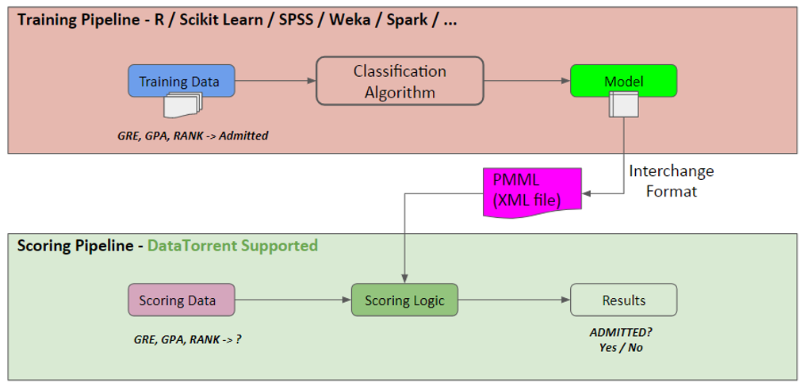
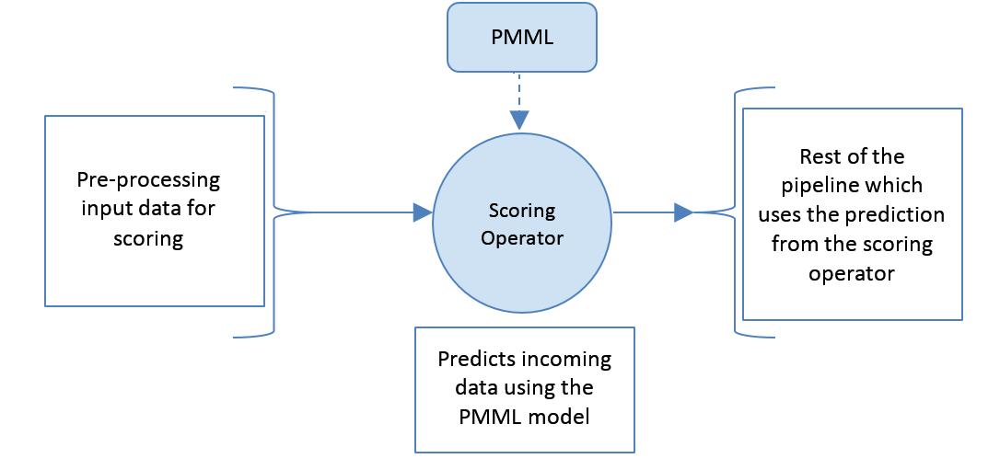

# About the PMML Operator

[PMML](http://dmg.org/pmml/v4-3/GeneralStructure.html) stands for Predictive Model Markup Language and is an XML-based model interchange format for predictive machine learning models. PMML provides a way for analytic applications to describe and exchange predictive models produced by data mining and machine learning algorithms.

The PMML operator allows persisting a model into an XML format that is given by the PMML standard.

DataTorrent RTS provides scoring operator which can be used to score or  predict incoming data using a PMML model.

The only input that the operator takes is the PMML file. The operator identifies the algorithm, that is used to train the model, by processing the file and instantiates an appropriate scorer which understands the PMML format for that algorithm.

For example, the following image depicts how the PMML operator process the scoring data to predict about an admission to a graduate school.



The PMML operator is available under _DT Premium_ license.

## Tools Supporting Export of Models into PMML

The following tools support export of models into PMML:

- R
- Apache Spark
- Scikit-Learn
- Big ML
- Zementis
- Weka
- Knime
- IBM
- Lot more… [http://dmg.org/pmml/products.html](http://dmg.org/pmml/products.html)

## Ports

The following ports are available for the PMML operator:

| **Port Type** | **Port Name** | **Details** |
| --- | --- | --- |
| Input port | input | Receives incoming tuples from upstream operators |
| Output port | output | Emits processed data in the form of clusters/classes &amp; distance of the tuple with them |
| Error port | error | Emits errors if not able to process incoming tuple |

## Partitioning

PMML operator implementation supports static and parallel partitioning.

## Supported Algorithms

Machine learning algorithms that are supported as part of release 3.10.0 are:

- Naive Bayes classification
- Support Vector Machine
- K-Means Clustering

## Testing

The PMML Operator is tested with the following components:

- Cloudera Hadoop version 5.8.2 along with Apache Hadoop version 2.6.0
- Java version 1.7 and above
- PMML version 4.3

## Workflow of the Operator


The PMML operator is preceded by a pre-processing operator, which adapts incoming tuple in the format that suits PMML standard.

# Configuring for PMML Operator

For running the PMML operator, the following properties must be set in the **properties.xml** file:

| **Property Name** | **Description** |
| --- | --- |
| pmmlFilePath | Path of XML file on HDFS |
| modelIndexInPmml | Index (number) of the model to be used from XML file. |

# Using the Operator

Following is a sample code to use the PMML operator:
```
package com.datatorrent.Classification;
import org.apache.apex.malhar.lib.fs.GenericFileOutputOperator;
import org.apache.hadoop.conf.Configuration;

import com.datatorrent.api.annotation.ApplicationAnnotation;
import com.datatorrent.api.StreamingApplication;
import com.datatorrent.api.DAG;
import com.datatorrent.api.DAG.Locality;
import com.datatorrent.lib.io.ConsoleOutputOperator;
import com.datatorrent.lib.io.fs.AbstractFileOutputOperator;
import com.datatorrent.pmml.operator.ClassificationScoringOperator;
import com.datatorrent.pmml.scorer.ClassificationScorer;

@ApplicationAnnotation(name = "PMML-Classification-Scoring-App")
public class Application implements StreamingApplication
{

  @Override
  public void populateDAG(DAG dag, Configuration conf)
  {

	ClassificationInput inputOp = dag.addOperator("inputOp", ClassificationInput.class);
	inputOp.setEmitBatchSize(1);
	ClassificationScoringOperator scoring = dag.addOperator("classificationOperator", ClassificationScoringOperator.class);
	ScoringOutputOperator logger = dag.addOperator("Logger", ScoringOutputOperator.class);

	dag.addStream("data to scoring", inputOp.scoringOut, scoring.input);
	dag.addStream("scoring to output", scoring.output, logger.input);
  }
}

```
