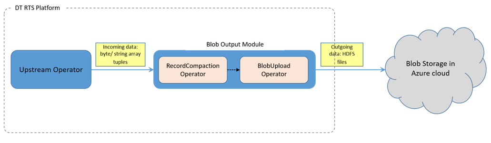

# About Azure Blob Storage Operator

Azure Blob storage is a service for storing large amounts of unstructured object data, such as text or binary data, that can be accessed from anywhere in the world through HTTP or HTTPS. Blob storage can be used to expose data publicly to the world or to store application data privately.

Common uses of Blob storage include:

- Serving images or documents directly to a browser
- Storing files for distributed access
- Streaming video and audio
- Storing data for backup and restore, disaster recovery, and archiving
- Storing data for analysis by an on-premises or Azure-hosted service

Azure Blob Output operator receives tuples from upstream operators in the form of byte array or string. These tuples are written to HDFS file. The files are rolled over based on user configuration. Rolled over files are then uploaded to Azure Blob storage.

This operator is available under DT Plus license.

## Ports

The following port is available for the Azure Blob Output operator

| **Port Type** | **Port Name** | **Details** |
| --- | --- | --- |
| Input port | input | Receives tuples from upstream operators in byte / string array format. |

## Testing

The Azure Blob Output operator  is tested with the following components:

- Cloudera Hadoop version 5.8.2 along with Apache Hadoop version 2.6.0
- Java version 1.8
- HDInsight : Hadoop 2.7.3 - HDI 3.6
- Microsoft Azure Storage Client SDK - com.microsoft.azure:azure-storage:5.5.0

## Requirements

Java 1.8 and above

# Workflow of the Operator

The following image depicts the workflow of the Azure Blob Output operator:

 
The Blob Output module consists of the following two operators:

- **Record Compaction operator**
This operator combines multiple incoming tuples that are written into the HDFS file. It also rolls over the files based on the user configuration values.
- **Blob Upload operator**
This operator uploads the rolled-over files to Blob storage.

# Supported Data Types

Pre-defined implementations are provided for the following data types:

- Byte array (BlobOutputModule.BytesBlobOutputModule)
- String (BlobOutputModule.StringBlobOutputModule)

If there are any other custom data types, user can extend the class _BlobOutputModule_ providing implementation for _getConverter()_ method, which converts the incoming tuple into byte array to write to HDFS file.

# Configuring Azure Blob Storage Operator

The following properties must be configured in the **properties.xml** file:

| **Property** | **Description** |
| --- | --- |
| maxIdleWindows | The maximum number of idle windows allowed before the files are rolled over. |
| maxLength | The permitted length of the file after which the file is rolled over (in bytes). |
| tupleSeparator | Character/string that separates 2 consecutive tuples. |
| expireStreamAfterAccessMillis | The Time interval allowed after which the file output stream is evicted from the cache. |
| rotationWindows | The number of windows after which the file should be rolled over. |
| storageAccountName | Storage account name for Azure blob storage. |
| storageAccountKey | Storage account key for Azure blob storage. |
| storageContainer | Storage container name for Azure blob storage. |
| virtualDirectory | Virtual directory name. |
| blobUploadPartitionCount | Partition count for blob upload operator. |

# Partitioning

- Partitioning for the RecordCompaction operator is decided based on number of partitions for the upstream operator (PARTITION\_PARALLEL).
- Partionining for the BlobUpload operator can be controlled using the property blobUploadPartitionCount.

# Using the Operator

The following code illustrates how Azure Blob output operator can be used within an application:

```
@ApplicationAnnotation(name = "Kafka-to-Azure-blob")
public class Application implements StreamingApplication
{
 public void populateDAG(DAG, Configuration conf)
 {
   KafkaSinglePortInputOperator kafkaInput =
       dag.addOperator("kafkaInput", KafkaSinglePortInputOperator.class);

   BlobOutputModule<byte[]> blobOutput = dag.addModule("blobOutput",
       new BlobOutputModule.BytesBlobOutputModule());
   dag.addStream("data", kafkaInput.outputPort, blobOutput.input);
 }
}
```
