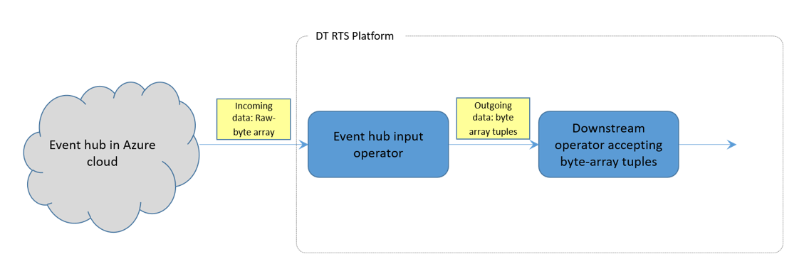

# About Event Hub Input Operator

Event Hub is part of Microsoft Azure cloud ecosystem. It is a highly scalable data streaming platform and event ingestion service which can receive and process millions of events per second. Event Hubs can process and store events, data, or telemetry produced by distributed software and devices. Data sent to an Event Hub can be transformed and stored using any real-time analytics provider or batching/storage adapters. Using Event Hub, you can also publish-subscribe with low latency and at a massive scale.

Event Hub input operator receives events from Azure Event Hub in the form of raw byte arrays. It processes them and converts into byte array tuples. These tuples are then processed by downstream operators.

This operator is available under DT Plus license.

## Ports

| **Port Type** | **Port Name** | **Details** |
| --- | --- | --- |
| Output port | output | Emits tuples received from Event Hub in byte array format |

## Testing

Tested with the following components:

- Cloudera Hadoop version 5.8.2 along with Apache Hadoop version 2.6.0
- Java version 1.8
- HDInsight: Hadoop 2.7.3 - HDI 3.6
- Eventhub client library - com.microsoft.azure:azure-eventhubs:0.14.0

## Requirements

Java 1.8 and above

# Workflow of the Operator


 
# Supported Data Types

This operator reads events from the Event Hub as raw byte array and emits them as byte array tuples.

# Configuring Events Hub Input Operator

The following properties must be configured in the **properties.xml** file:

| **Property** | **Description** |
| --- | --- |
| maxTuplesPerWindow | Maximum tuples that are  allowed to be emitted in each window. |
| strategy | Partitioning strategy for the operator: _ONE\_TO\_ONE_: Each operator partition connects to one event hub partition, _MANY\_TO\_ONE_: Each operator consumes from several partitions. |
| partitionManager | Partition manager for the operator. |
| initialPartitionCount | Decide initial partition count based on partition strategy. |
| initialOffset | initialOffset could be either earliest or latest. Earliest is  beginning of partition. Latest is the current record to consume from partition. |
| namespaceName | Event Hub name space. |
| eventHubName | Event Hub name. |
| sasKeyName | SAS key name for accessing Event Hub. |
| .sasKey | SAS key for accessing Event Hub. |
| consumerGroup | Consumer group for accessing Event Hub. |
| windowDataManager | windowDataManager value. Default will be FSWindowDataManager. |

# Supplementary Classes

- **WindowDataManager:** Manages the state of an operator in every application window. Application developers can specify custom implementation of _WindowDataManager_ if it requires special handling.
- **PartitionManager:** Used to manage offset positions for individual partitions. For example, you can write _PartitionManager_ to HDFS and reload it when restarting the application.  If required, Application developers can also specify custom implementation of _PartitionManager_. There is no default implementation for this.

# Partitioning

This operator supports the following types of partitioning strategies:

- **ONE\_TO\_ONE** : If this is enabled, the AppMaster creates one input operator instance per Event Hub partition. So, the number of Event Hub partitions equals the number of operator instances.
- **MANY\_TO\_ONE**: The AppMaster creates _K = min(initialPartitionCount, N_)
Event Hub input operator instances where N is the number of Event Hub partitions. If K is less than N, the remaining topic partitions are assigned to the K operator instances in round-robin fashion. If K is less than initialPartitionCount, the AppMaster creates one input operator instance per Event Hub partition.
For example, if initialPartitionCount = 5 and number of Event Hub partitions(N) = 2 then AppMaster creates 2 Event Hub input operator instances.
Default Value = ONE\_TO\_ONE

# Using the Operator

The following code illustrates how Events Hub Input operator can be used within an application:
```
@ApplicationAnnotation(name = "event-hub-to-hdfs")
public class Application implements StreamingApplication
{

 public void populateDAG(DAG dag, Configuration conf)
 {
   EventHubByteArrayInputOperator eventHubInput =
       dag.addOperator("eventHubInput", EventHubByteArrayInputOperator.class);

   BytesFileOutputOperator fileOutput = dag.addOperator("fileOutput", BytesFileOutputOperator.class);

   dag.addStream("data", eventHubInput.outputPort, fileOutput.input);
 }
```

# Performance Benchmarking

Following are the numbers for _MANY\_TO\_ONE_ 30:3 (30 partitions on eventhub and 3 partitions on app-template) on morado.

| **Time Taken** | **recordslimit** | **Queue Size** | **Processed/s** | **Total Messages** | **Message size** |
| --- | --- | --- | --- | --- | --- |
| 29 min 30 sec | Default (100recordslimit) | Default (1024) | 994,1003,951,977 | 5000000 (5M) | 4 KB |
| 29 min 25 sec | 500 | 2048 | 1003,998,982,990 | 5000000 (5M) | 4 KB |
| 29 min 21 sec | 999 | 3072 | 999,989,1001,982 | 5000000 (5M) | 4 KB |

Initial Offset - Earliest for all above.

Processed/s is the average of all three input operators taken at 4 different times.
