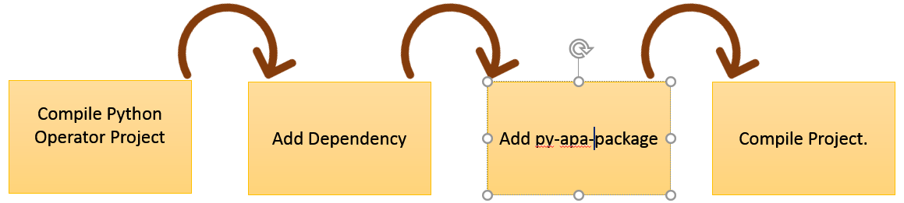
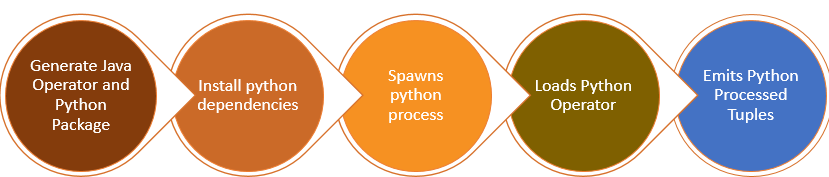

# About the Operator

Python Operator support provides capability for Python developers to write DT Operators and use these operators in DT application. It ensures that developer can focus more on the actual business logic, just like the Java DT operators, and the execution aspect is handled by the framework with minimal configurations to the project.

This implementation can be used under DT Plus license.

Support includes tasks such as the follows:

- Generation of Java operator that is to be used in DT application.
- Dependency collection
- Transport and installation on Hadoop nodes
- Fault-tolerance support for Python operator etc.

## Testing

Python operator is tested with the following components:

- Cloudera Hadoop version 5.8.2 along with Apache Hadoop version 2.6.0
- Java version 1.7 and above
- Python 2.7

## Requirements <a name="Reference1"></a>

The following must be pre-installed before running the operator:

-  **dt-operators-python**

	To install dt-operators-python, do the following:

1. Go to **/saarang/plugins**and run mvn install to create maven plugin required by Python implementation.
2. Go to **saarang/operators/python** and run mvn install to install dt-operators-python and dt-operators-python jar file to .m2 directory.


- **Python 2.7**

# Workflow of the Operator

The following image depicts the workflow of the operator:

 
- Compile Python Operator Project
- Add dependency on actual application project.
- Add py-apa-package as goal to application project.
- Compile Project.

The following image depicts the steps in the operator execution:


# Supplementary Classes

### PythonAsyncStorageAgent

 Python Operator support also provides fault-tolerance as any other DT operator but as of now Python application developer will have to explicitly provide STORAGE\_AGENT as DAG attribute. Please refer to the application example from Using Operator Section.

# Partitioning

The Python operator can be partitioned using the default partitioner provided by Apex.

This operator can be dynamically partitioned, when rules are stateless.

For partitioning, you must add the following property in the **properties.xml** file. For example, if you add Python operator with the name _PythonOperator_ in the DAG, then this property creates four partitions of the operator when the application starts.
```
<property>
     <name>dt.operator.PythonOperator.attr.PARTITIONER</name>
     <value>com.datatorrent.common.partitioner.StatelessPartitioner(4)</name>
</property>
```

# Using the Operator

You can create a directory named   **python** under **src/main** at same level as Java in any DT application maven project directory.

If you want to include any **requirements.txt** for python dependencies, add it at the top level in the project directory so maven plugins can find those and add to final \*.apa file.

The following code illustrates how the Python operator can be written for DT application:
```
from dtbase.operator.Operator import *
import types
@Properties(var1=types.IntType, var2=types.StringType, var3=types.FloatType)
@OutputPort("outPort")
@OutputPort("outPort1")
class TestOperator(BaseOperator):

   def __init__(self):
       self.counter=0

   @InputPort('inPort')
   def process1(self, tuple):
       if tuple['amount'] >= 200000:
           tuple['fraud'] = True
           self.counter=self.counter+1
       self.outPort.emit(tuple)
       print "Current Counter", self.counter

   @InputPort('inPort1')
   def process2(self, tuple):
       print 'Do Nothing'
       print "Current Counter", self.counter

   def setup(self, context):
       print "setup",context

   def activate(self, context):
       print "activate",context

   def deactivate(self):
       print "deactivate"

   def teardown(self):
       print "teardown"

   def beforeCheckpoint(self, windowId):
       print "Operator is checkpointing ",windowId

   def checkpointed(self, windowId):
       print "Operator is checkpointed ",windowId

   def committed(self, windowId):
       print "Operator is committed",windowId

   def beginWindow(self, windowId):
       print "Begin Window",windowId

   def endWindow(self):
       print "End Window"
```

The above python operator examples after compilation generate equivalent Java operator with the same name TestOperator and input ports [inPort,inPort1] and output ports [outPort, outPort1].

These generated Java operators can be used in the DT applications to create the hybrid DAG.

## Application Example

The following code illustrates  how the generated Java operator can be used in a DAG:
```
@ApplicationAnnotation(name="PythonOperatorExample")
public class Application implements StreamingApplication
{
 @Override
 public void populateDAG(DAG dag, Configuration conf)
 {
   // Sample DAG with 2 operators
   // Replace this code with the DAG you want to build
   RandomTransactionGenerator randomGenerator = dag.addOperator("randomGenerator", RandomTransactionGenerator.class);
   randomGenerator.setNumTuples(500);
   TestOperator pyOp = dag.addOperator("testop",TestOperator.class);
   ConsoleOutputOperator cons = dag.addOperator("console", new ConsoleOutputOperator());
   dag.addStream("randomData", randomGenerator.out, pyOp.inPort);
   dag.addStream("output", pyOp.outPort, cons.input);
   dag.setAttribute(Context.DAGContext.HEARTBEAT_TIMEOUT_MILLIS,100000);
   dag.setAttribute(Context.OperatorContext.STORAGE_AGENT, new PythonAsyncStorageAgent(".",conf));
 }
}
```
# Compiling DT Application with Python Implementation

To compile DT application with Python, you must first add dt-operators-python as dependency to **pom.xml**. Refer [Requirements](#Reference1).

```
<dependency>
 <groupId>com.datatorrent.operators</groupId>
 <artifactId>dt-operators-python</artifactId>
 <version>1.4.0-SNAPSHOT</version>
</dependency>
```
Later, you must add the following plugin to **pom.xml** for packaging the python code and required dependencies in \*.apa.

```
<plugin>
 <groupId>com.datatorrent.plugins</groupId>
 <artifactId>dt-plugins-maven-python</artifactId>
 <version>1.4.0-SNAPSHOT</version>
 <executions>
   <execution>
     <id>pyGenerate</id>
     <goals>
       <goal>pydependency</goal>
       <goal>transform</goal>
     </goals>
   </execution>
   <execution>
     <id>pyCompile</id>
     <goals>
       <goal>whl-compile</goal>
     </goals>
   </execution>
   <execution>
     <id>pyInstall</id>
     <goals>
       <goal>whl-install</goal>
     </goals>
   </execution>
   <execution>
     <id>build-python-apa</id>
     <!--<phase>prepare-package</phase>-->
     <goals>
       <goal>py-apa-package</goal>
     </goals>
     <configuration>

     </configuration>
   </execution>
 </executions>
</plugin>
```
