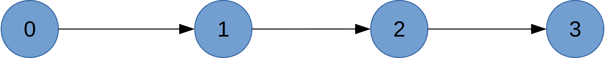
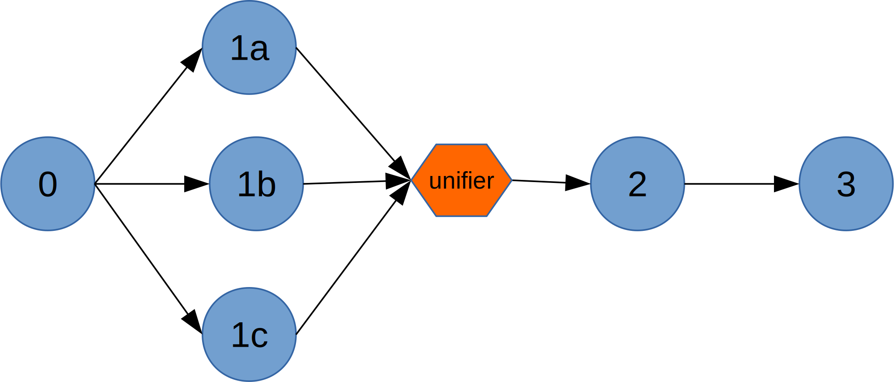
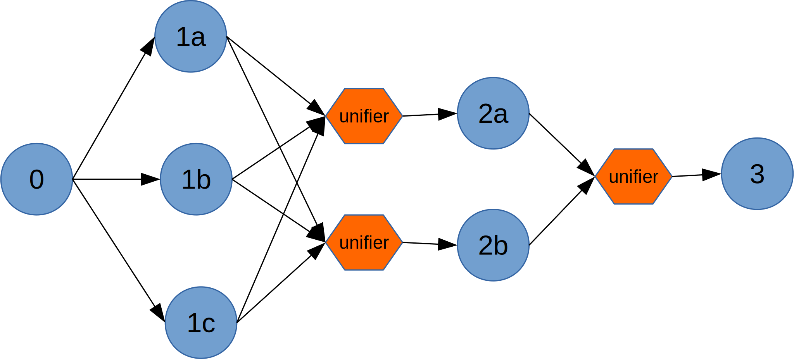
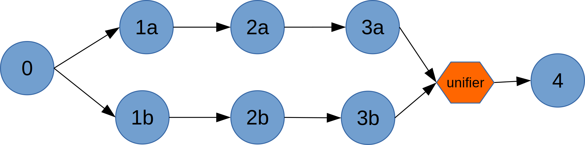

# Partitioning

Partitioning is a mechanism for load balancing and scaling. When the volume of tuples
entering the input port(s) of an operator is very high, the operator may
not be be able to cope, resulting in increased latencies and reduced
throughput. In such situations, the platform provides multiple mechanisms to
replicate the operator so that the load can be shared by all the replicas. These
replicas can run as separate processes on separate nodes (assuming the cluster
has adequate resources) thus yielding, potentially, a near-linear speedup.
The replicas are often referred to as _partitions_ of the operator.

Partitioning introduces a number of specialized terms: _static partitioning_,
_MxN partitioning_, _parallel partitioning_, _dynamic partitioning_, _stateless partitioning_,
_unifiers_, _cascading unifiers_, _stream codecs_, _logical DAG_, and _physical DAG_.
These terms will be explained in the sections that follow. We begin with a brief
conceptual description of the various terms and then get into the specific
mechanisms that developers can use to enable, configure and trigger partitioning.

## No Partitioning

On rare occasions, we may want to prevent an operator from being partitioned (for
example, if the operator creates a connection to an external system, and multiple
such connections are undesirable). This is done by explicitly adding the
[annotation](beginner.md#annotations) `@OperatorAnnotation(partitionable = false)`
to the operator.

## Static Partitioning

When the expected input volumes are reliably known in advance, the number of partitions
needed for an operator to process that flow at speed can be precomputed and specified
as part of the application configuration. The platform will create the desired number
of partitions before application launch and this number does not change thereafter.
This is called _static partitioning_.

In the presence of partitioning, the DAG as embodied by
the running application clearly differs from that specified by the application writer:
for one thing, there are replicas of one or more operators running; secondly, since
the original computation defined as part of a single operator is now performed by
multiple partitions, each partition can only compute partial results since it only sees part
of the input stream; these partial results need to be stitched together somehow
downstream of all the partitions. This is the function of a _unifier_. Application
developers can optionally supply a unifier with custom logic (see below) to perform
this unification; if none is provided, the platform will insert a default pass-through
unifier.

To reflect these differences, we use the term _logical DAG_ to refer
to the original version and _physical DAG_ to refer to the version that is embodied
by the running application. For example, consider an application that has 4 operators
connected in a linear sequence; the logical DAG looks like this:


*Logical DAG*

If operator 1 is partitioned into 3 replicas, the physical DAG looks like this:



*Physical DAG*

## MxN Partitioning

When two consecutive operators _A_ and _B_ are partitioned respectively into _M_ and _N_
partitions, each group of partitions needs, as noted above, a unifier. In such scenarios,
there is potential for the unifiers themselves to become a bottleneck since they are
handling all of the output data from the partitions of A or B. To mitigate this situation
for A, the platform creates as many unifiers as there are partitions of B thus spreading
the unification load across multiple unifiers. If the unifier for B is overloaded, the
platform can be directed to create multiple replicas of that unifier, cascading into
multiple levels if necessary to limit the number of input streams entering a single
replica. This situation is called _MxN partitioning_ and is illustrated by the following
diagram where operators 1 and 2 respectively have 3 and 2 replicas.


*MxN Partitioning*

## Parallel Partitioning

Sometimes, when an operator is partitioned, it is appropriate to replicate an entire
linear segment of the DAG that is immediately downstream of that operator; this is called
_parallel partitioning_ and is typically done to avoid the shuffling of data that happens
with MxN partitioning.  The streams of each partition are then kept segregated for the
duration of that linear segment.  In such cases, if the stream volume substantially
reduces at the end of the linear segment, network bandwidth consumption can also be
significantly reduced by using CONTAINER_LOCAL or NODE_LOCAL
[locality](configuration.md#stream-modes) for the streams within that segment.

Parallel partitioning is accomplished by setting an attribute of the input port of each
operator that is part of the linear segment. Doing this for operators 2 and 3 and
partitioning 1 into two replicas results in the following physical DAG:


*Parallel Partitioning*

It is important to note that if an operator is connected to multiple downstream operators
(via multiple ports), the parallel partitioning flag need not be set the same way on all
the downstream operator ports. For example, assume operator A is connected (directly) to B
and C and the flag is set on the input port of C but not B. If we create 2 partitions of
A, we will see 2 partitions of C but only one of B.

## Dynamic Partitioning

When the volume of data flows in a stream are not known in advance, using a fixed number
of partitions is suboptimal: if the number is too large for the flows actually encountered,
we end up consuming cluster resources needlessly; if too small, the original goal
of removing bottlenecks remains unaccomplished.

In such cases, the appropriate number of partitions needs to be determined based on
observed latencies, throughput values or some custom performance metrics at runtime
and the operator partitioned accordingly. This is called _dynamic partitioning_ and
is supported by the platform (discussed further below).

## Stateless Partitioning

When an operator has no state (computed data that needs to persist across streaming
window boundaries) dynamic paritioning is relatively simple -- the newly created
partitions simply initialize themselves in the `setup` and `activate` callbacks
and proceed to process inbound tuple flows. This is the case with static partitioning
as well since there is no state to worry about when an application is starting.

However, when partitioning dynamically (at runtime), if the operator replicas have some
state (for example, a set of files that have already been processed), this state needs
to be redistributed across the new set of partitions in some application-specific way in
order to preserve proper semantics (for example, that file set needs to be replicated
in all of the new partitions to ensure that those files are not reprocessed).
Partitioning that ignores operator state is called _stateless partitioning_.

## Triggering and Configuring Parititioning

Partitioning is typically achieved in one of two ways:

1. Create a custom partitioner class (or use one of the predefined ones) that implements
   the `Partitioner` interface and specify it in the configuration file as the `PARTITIONER`
   attribute of the operator.
1. Implement the `Partitioner` interface in the operator itself and provide a suitable
   `definePartitions` method with appropriate logic to create and return the new set of
   partitions. If dynamic partitioning is desired, a closely related interface (discussed
   below) `StatsListener` must also be implemented.

We've already mentioned above the use of the `@OperatorAnnotation(partitionable = false)`
annotation to disable partitioning. In the absence of this annotation, one of the simplest
ways of triggering stateless partitioning is to use the the `StatelessPartitioner` class
that is provided in Apex (core) by adding the following fragment to the configuration file
(no code changes are needed):

```xml
<property>
  <name>dt.application.{appName}.operator.{opName}.attr.PARTITIONER</name>
  <value>com.datatorrent.common.partitioner.StatelessPartitioner:2</value>
</property>
```

Here, _{appName}_ and _{opName}_ are the appropriate application and operator names) and
the number after the colon specifies the number of desired partitions.

This partitioner, as the name implies, ignores state and is intended for static partitioning.
A couple of other stateless partitioners are provided in the Malhar library and are
discussed in a later section below.

Setting the parallel partition flag on the input port of an operator is done via a
snippet in the configuration file:

```xml
<property>
  <name>dt.application.{appName}.operator.{opName}.inputport.{portName}.attr.PARTITION_PARALLEL</name>
  <value>true</value>
</property>
```

When implementing a custom partitioner or implementing the interface directly as part of
the operator, there are two methods that need to be implemented: The first is the
`partitioned` method that is invoked by the platform to inform the operator that some
change to the partitioning has occurred:

```java
void partitioned(Map<Integer, Partition<T>> partitions);
```

The argument is the new set of partitions. Often, an empty implementation or one that
emits suitable log messages suffices. The more important one is the `definePartitions`
method:

```java
Collection<Partition<T>> definePartitions(Collection<Partition<T>> partitions,
                                          PartitioningContext context);
```

The argument is the current collection of partitions and the method should return
the desired new collection. Any number of existing partitions may be added to the
returned collection. Existing partitions that are not in the result will be killed;
those that are in both will be left untouched. New ones will be created and deployed.

This method is invoked by the platform at application launch to determine the
initial set of partitions; thereafter, it will be invoked whenever the response
of the `processStats` method of `StatsListener` returns with the `repartitionRequired`
field set to true.

A typical implementation skeleton of this method for the `MyOperator` class might
look like this:

```java
Collection<Partition<MyOperator>>
definePartitions(Collection<Partition<MyOperator>> existing,
                 PartitioningContext context)
{
    // collect state (if any) from existing partitions
    int newPartitionCount = ...;
    Collection<Partition<MyOperator<T>>> result = new ArrayList<>(newPartitionCount);
    for (int i = 0; i < newPartitionCount; ++i) {
        MyOperator op = new MyOperator();
        // initialize op suitably
        result.add(op);
    }
    return result;
}
```

## StatsListener
The `StatsListener` interface can, analogously to the `Partitioner` interface, either
be implemented by a standalone class or by the operator itself; its only method is:

```java
Response processStats(BatchedOperatorStats stats);
```

Within this method, which is invoked at regular intervals by the platform (currently once
per second), various operators metrics are made available; based on these metrics, the
method should return a `Response` object with the `repartitionRequired` field set to true
if a repartition is required, false otherwise. For example, here is a simple
implementation of this method with the actual test stubbed out:

```java
@Override
public Response processStats(BatchedOperatorStats batchedOperatorStats)
{
  Response res = new Response();
  res.repartitionRequired = false;
  if ( ...use appropriate test... ) {
    LOG.info("processStats: repartitioning");
    res.repartitionRequired = true;
  }
  return res;
}
```

The platform will then invoke the `definePartitions` method of the operator (or its
partitioner) if the `repartitionRequired` field is true.

Example operators that implement both `StatsListener` and `Partitioner` interfaces are
`AbstractFileInputOperator` and `AbstractKafkaInputOperator`.

## Stream Codecs
When a downstream operator is partitioned, tuples leaving the output port of the upstream
operator are distributed to the partitions based on their hashCode. If the distribution
needs to be done based on a specific field (or combination of fields) of the tuple, a
custom `StreamCodec` needs to be created and attached as the value of the `STREAM_CODEC`
attribute of the input port of the partitioned operator.

An example scenario that needs a custom StreamCodec is the following: Suppose
we have 2 downstream partitions and our tuples are transaction records that contain a
country code. Suppose further that roughly half the transactions occur in one country
and the rest are distributed across a number of other countries. A custom StreamCodec
would allow us to funnel each of these 2 groups of tuples to different partitions,
thus evenly distributing the load.

The StreamCodec interface has 3 methods, 2 for customizing the serialization and
deserialization and the third for customizing tuple delivery:

```java
Object fromByteArray(Slice fragment);    // deserialize
Slice toByteArray(T o);                  // serialize
int getPartition(T o);                   // determine destination partitions
```
For convenience, the platform provides a concrete class `KryoSerializableStreamCodec`
which provides implementations of all 3 methods (but the implementation of the
`getPartition` method is the same as the default -- it just uses the tuple hashCode),
so the easiest way to create a custom codec is to extend this class. For the example
outlined above, the StreamCodec definition might look like this (assuming the high
frequency country code is "XYZ"):

```java
public class CountryCodec extends KryoSerializableStreamCodec<Transaction> {
    @Override
    public int getPartition(Transaction tuple) {
      String country = tuple.getCountryCode();
      return ("XYZ".equals(country) ? 0 : 1;
    }
}
```

This codec would be used in the `populateDAG` method as follows:

```java
MyOperator oper  = dag.addOperator("downstream", new MyOperator());
CountryCodec codec = new CountryCodec();
dag.setInputPortAttribute(oper.in, PortContext.STREAM_CODEC, codec);
// assuming the input port in MyOperator is called "in"
```

## Partition Keys
TBD

## Built-in Partitioners

In addition to the `StatelessPartitioner` already mentioned, the Malhar library provides
a couple of other stateless partitioners:

`StatsAwareStatelessPartitioner` : The is an abstract class that requires a concrete
implementation of the `getLoad` abstract method which should examine current metrics
and, for each partition, return -1, 0 or 1 according as the partition is underloaded,
properly loaded or overloaded. Based on these results, overloaded partitions will be
split and underloaded partitions will be combined. A concrete extension is provided
by the partitioner discussed next.

`StatelessThroughputBasedPartitioner` : This partitioner is an extension of the
`StatsAwareStatelessPartitioner` mentioned above. It can be configured so that it
increases or decreases the number of partitions as appropriate to 
ensure that the throughput is between a defined range. It also implements the
`StatsListener` interface. Currently, it must be configured from Java code in the `populateDAG`
method of the `StreamingApplication` interface, for example:

```java
MyOperator op = dag.addOperator("myop", MyOperator.class);
StatelessThroughputBasedPartitioner<MyOperator> p = new StatelessThroughputBasedPartitioner<>();
p.setCooldownMillis(10000);
p.setMaximumEvents(30000);
p.setMinimumEvents(10000);
dag.setAttribute(op, OperatorContext.STATS_LISTENERS, Arrays.asList(new StatsListener[]{p}));
dag.setAttribute(op, OperatorContext.PARTITIONER, p);
```

This code will dynamically repartition `MyOperator` based on throughput (a moving average
of the number of tuples moving through the operator per second). If the throughput of an
individual operator partition exceeds 30000 it will be split into two or more partitions;
if it falls below 10000 for a set of adjacent partitions, that set will be combined into a
single partition.  The CooldownMillis parameter of 10000 milliseconds is used as the
observation interval for throughput computation.

## Unifiers

As mentioned earlier, in the presence of partitioning, a unifier is required to combine
the the partial results computed by the individual partitions to form the final result.

For example, suppose an operator is processing numbers and computes the sum of all the
values seen in a window. If it is partitioned into N replicas, each replica is computing
a partial sum and we would need a unifier that computes the overall sum from
these N partial sums. A sample application that shows how to define and use a unifier is
available [here](https://github.com/DataTorrent/examples/tree/master/tutorials/unifiers).

A unifier for an operator is provided by a suitable override of the `getUnifier()` method
of the output port, for example:

```java
public final transient DefaultOutputPort<HighLow<Integer>> out
  = new DefaultOutputPort<HighLow<Integer>>() {
    @Override
    public Unifier<HighLow<Integer>> getUnifier() {
        return new UnifierRange<Integer>()
    }
}
```

A unifier is an instance of a class that implements the `Unifier` interface; that
interface extends the `Operator` interface and adds just one additional method:

```java
void process(T tuple);
```

A unifier therefore is also an operator and so all the usual callback methods such as
`beginWindow` and `endWindow` are available to override. It differs from a normal operator
in a couple of ways:

1. It is not explicitly created as part of the DAG in the `populateDAG` method.
1. It should define no input ports -- an input port will be automatically supplied by the
   platform and connected to the appropriate output ports of the upstream partitions.
1. It must define an output port which will be automatically connected to the input port
   of the downstream operator.
1. It should handle incoming tuples in the `process` method where it can immediately
   emit appropriate tuples on the output port or aggregate the information in local
   variables for emitting later (in the `beginWindow` or `endWindow` callbacks for
   example).

If no unifier is supplied for a partitioned operator, the platform will supply a default
pass-through unifier.

When the number of partitions is large and the unifier involves non-trivial computations
there is a risk that it can become a bottleneck; in such cases, the `UNIFIER_LIMIT`
attribute can be set on the appropriate output port. The platform will then automatically
generate the required number of parallel unifiers, cascading into multiple levels if
necessary, to ensure that the number of input streams at each unifier does not exceed
this limit.

