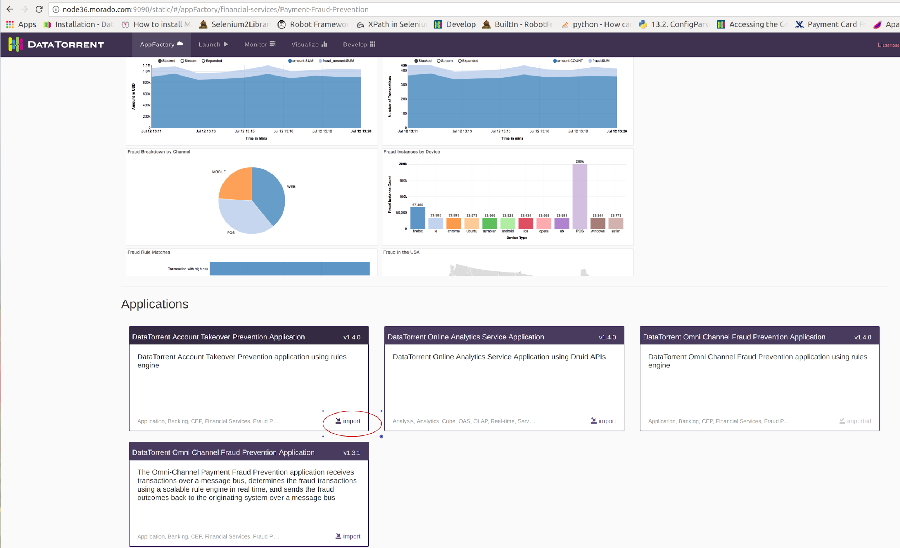
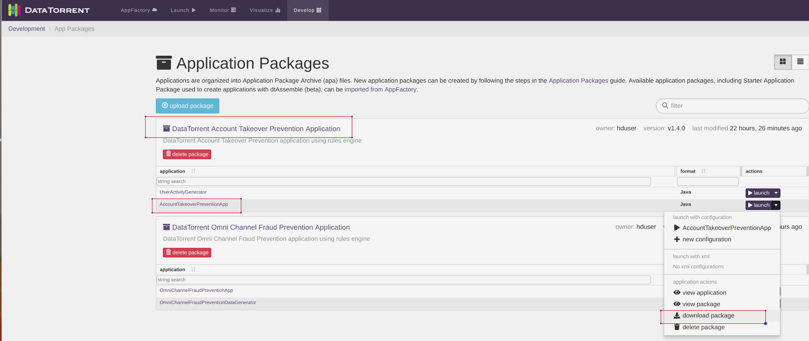
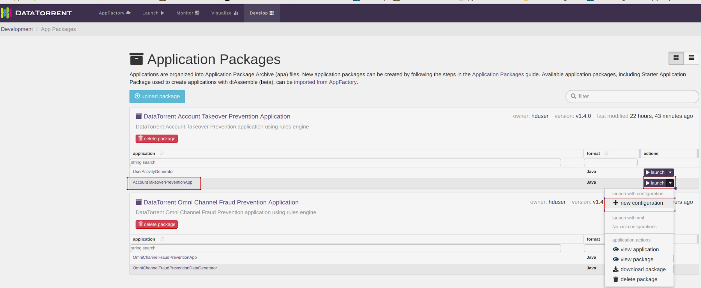
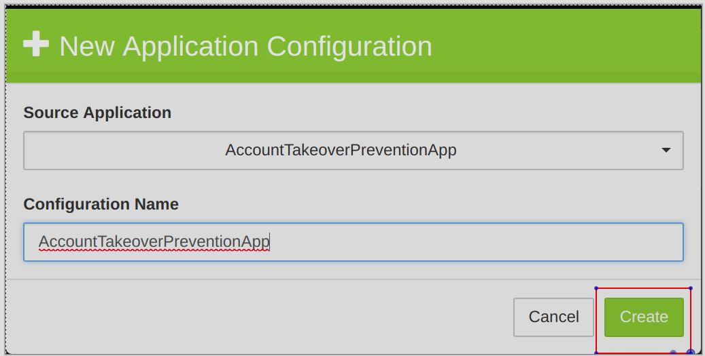
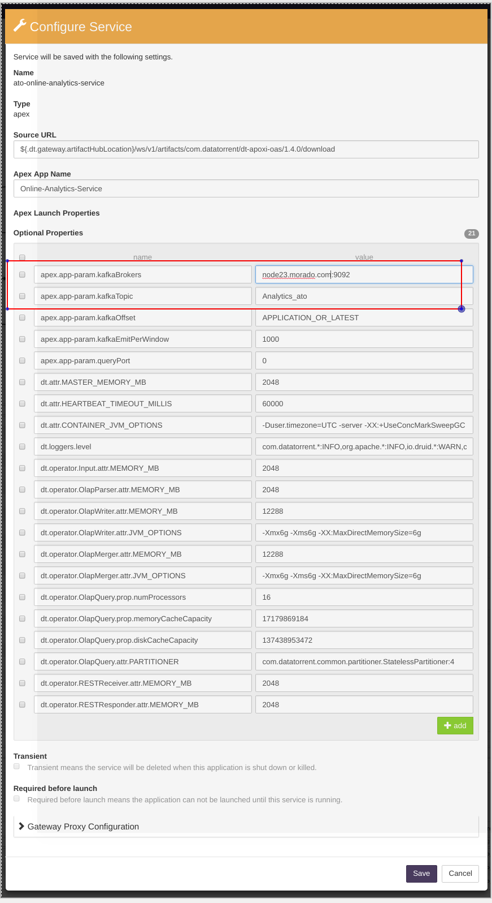
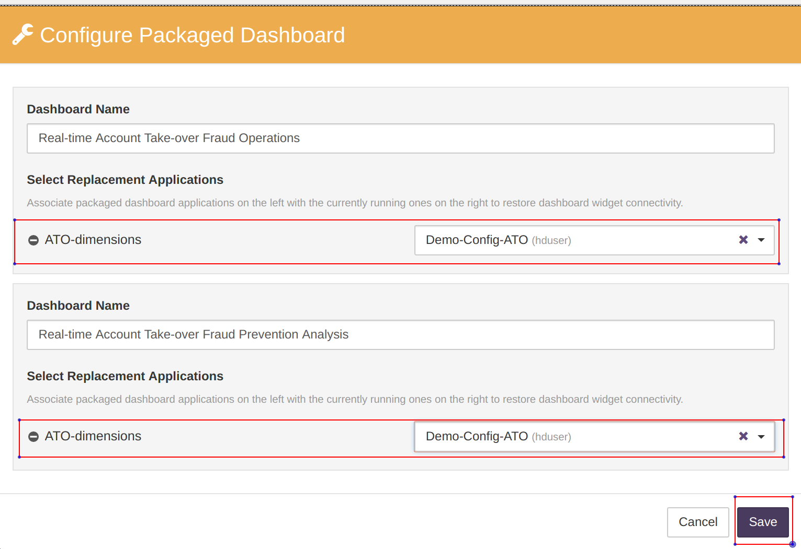
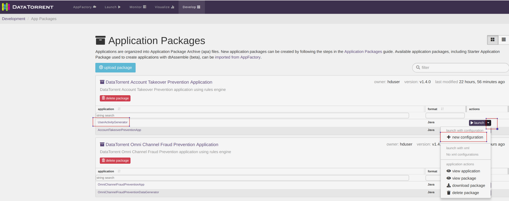
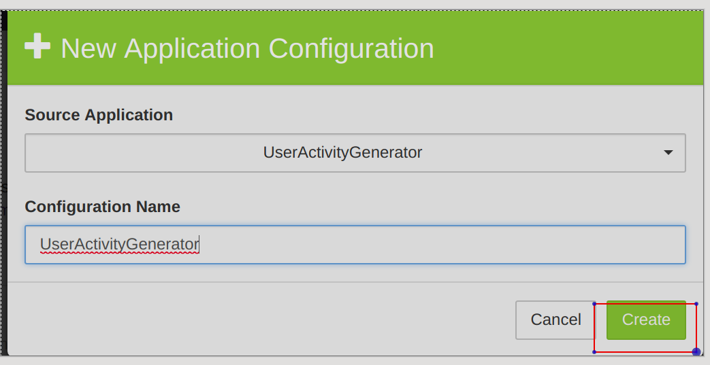
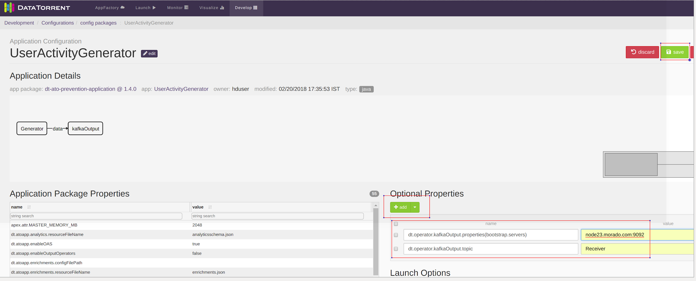

# Quick Start Guide - Account Takeover Prevention Application

## Setup Docker and RTS

1. Setup docker daemon host (preferably same as gateway machine). This supplies the docker images for **Online Analytics Service**, **OAS Dashboards Service** that is a customized implementation of Apache Superset and **CEP Workbench** that is a customized Drools Workbench implementation.

2. Install rts 3.10 bin. In the installation wizard, specify the docker location.

## Launching Account Takeover Prevention Application

1. Import the Account Takeover Prevention Application from the AppFactory.

2. In the DataTorrent Account Takeover Prevention Application box, click **import**. 

3. Download the package, after DataTorrent Account Take Over Prevention Application package is imported.
   
   i. Navigate to **Develop** > **Application Package** > **DataTorrent Account TakeOver Prevention Application**.
   
   i. Click **launch** drop-down and select **download package**.
   
4. Get the Geolite Maxmind Database (Use Hadoop user or user that has access to Hadoop). Getting the Geolite Maxmind Database using Bash:
  
         url http://geolite.maxmind.com/download/geoip/database/GeoLite2-City.tar.gz -o GeoLite2-City.tar.gz
         tar -zxvf GeoLite2-City.tar.gz 
         hdfs dfs put GeoLite2-City*/GeoLite2-City.mmdb city.mmdb
  
5. Generate test lookup data which will be used by the enrichment operators in the DAG. Use Hadoop user or user that has access to Hadoop to run following commands. Generating sample lookup data using Bash:
   
         Bash
         mkdir ato_package
         cd ato_package
         unzip ../dt-ato-prevention-application-1.4.0.apa 
         java -cp app/*:lib/*:`hadoop classpath` com.datatorrent.ato.userActivityGenerator.DumpLookupData ato_lookupdata
  
6. Create configuration for ATO.
   
   i. Navigate to **Develop** > **ApplicationPackages** > **+ new configuration** 
   
   ii. Click **create**. 
   
7. Enter the Required Properties. 

8. Configure the **CEP Workbench Service**.

   i. On the configuration page, scroll down.
   
   ii. Select the **drools-workbench** and click **configure**.
   
   iii. Click **save** after specifying the configuration.
    **Note:** Ensure that the Proxy Address is set correctly.
    
9. Configure **Online Analytics Services**.

   i. Select the **ato-online-analytics-service** and click **configure**. 
   
   ii. Click **save** after the configuration is set correctly.
   
   **Note:** Make sure **KafkaBrokers** and the **KafkaTopic** are set correctly.
   
10. Configure **OAS Dashboards**.

    i. Select **superset-ato** and click **configure**. 
    
    ii. Click **save** after the configuration is set correctly.
    **Note** : Make sure to set correct druid\_cluster IP and the Proxy Address. 
    
11. Configure the Dashboards.

    i. Click **configure**. 
    
    ii. From the **Select Replacement Applications** drop down, select the correct configuration name for both the Dashboards.
    
    iii. Click **Save**. 
    
12. Save the complete configuration.

### Launch Test Data Generator Application

1. Create new configuration for the **UserActivityGenerator**.

   - Go to **Develop** > **Application Packages** > **+ new configuration**. 
   
2. Add Optional Properties.
    i. In **Optional Properties** , click **+add** to add Optional Properties.  
   **Note:**   **Kafka** topic of the DataGenerator should be same as the **Transaction Receiver** topic of the Omni Channel Fraud Prevention Application.
   
   ii. Click **save**.
   
  iii. Click **launch** to launch the Data Generator.

