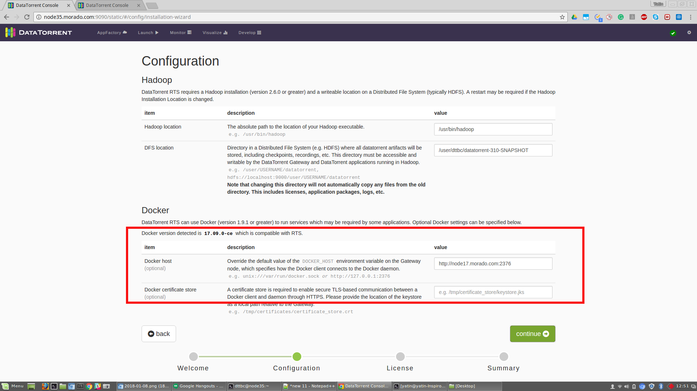
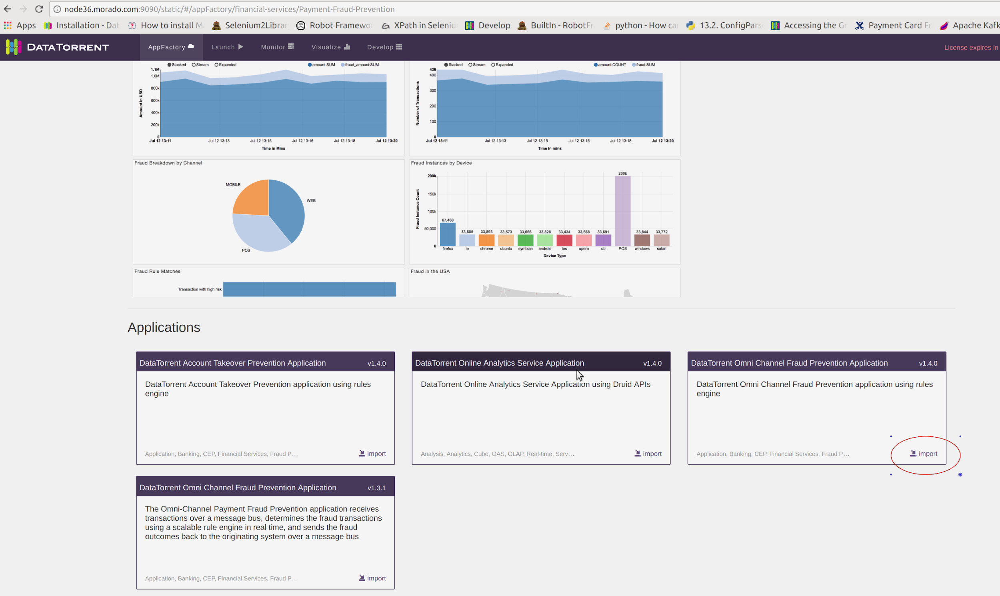
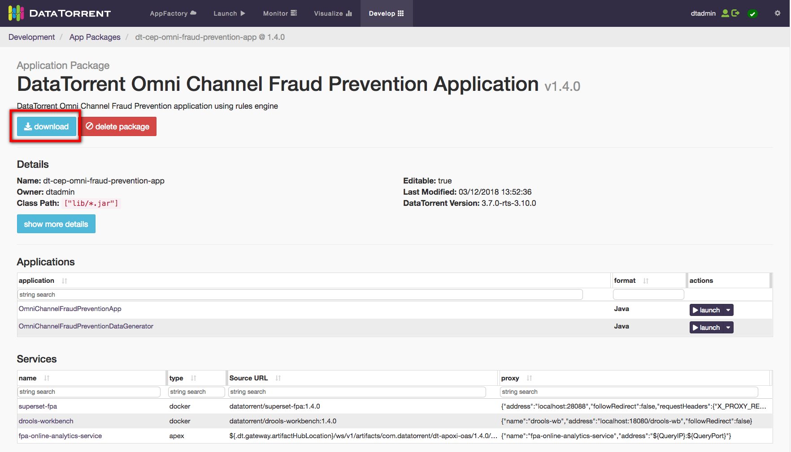
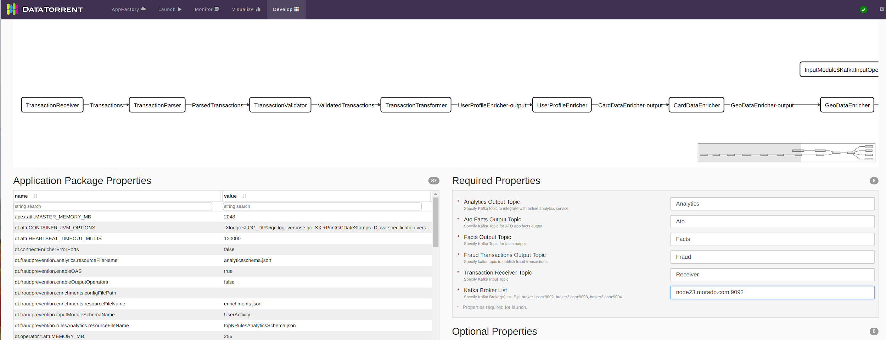
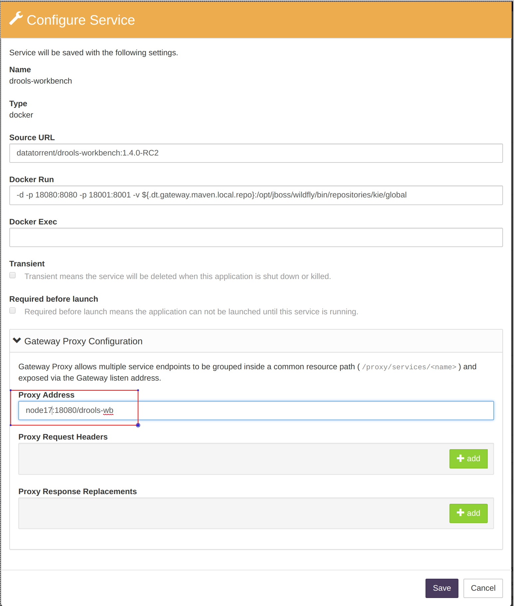
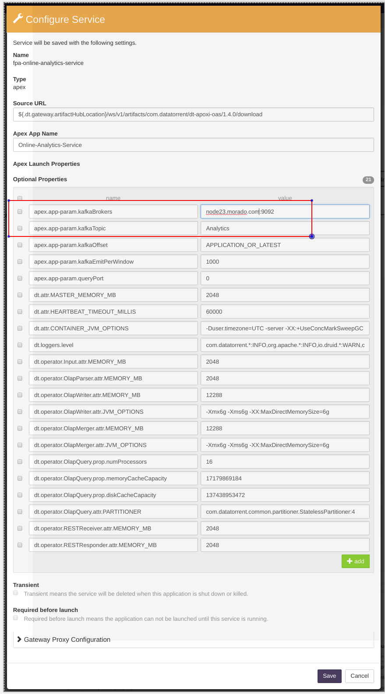
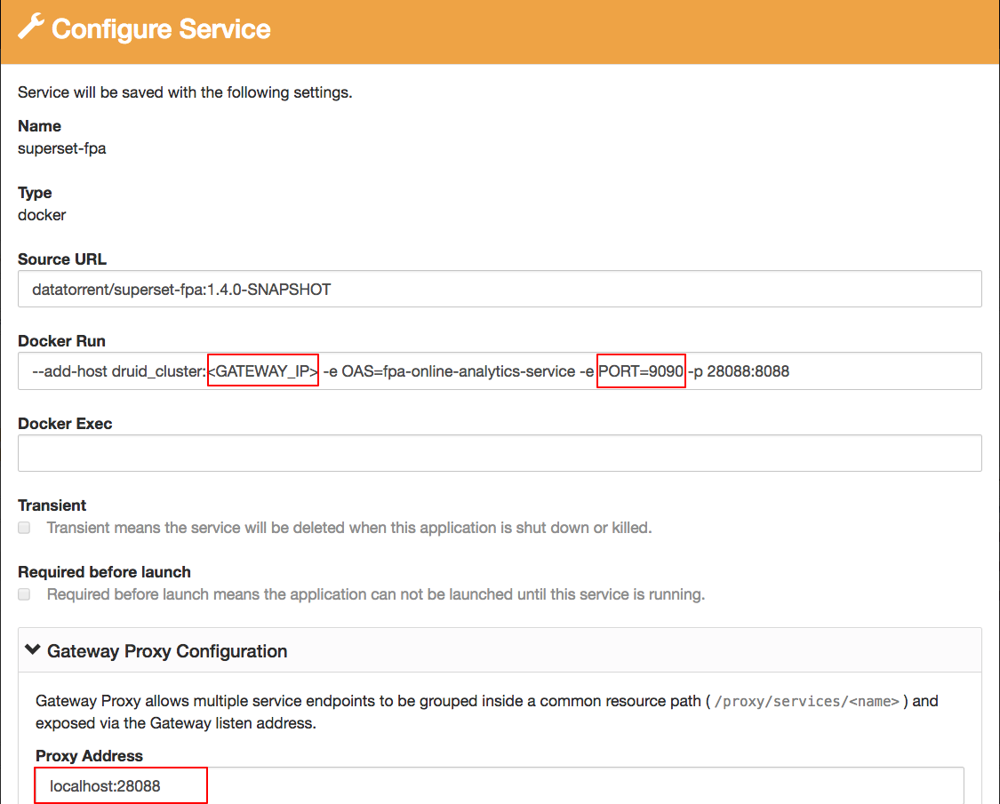
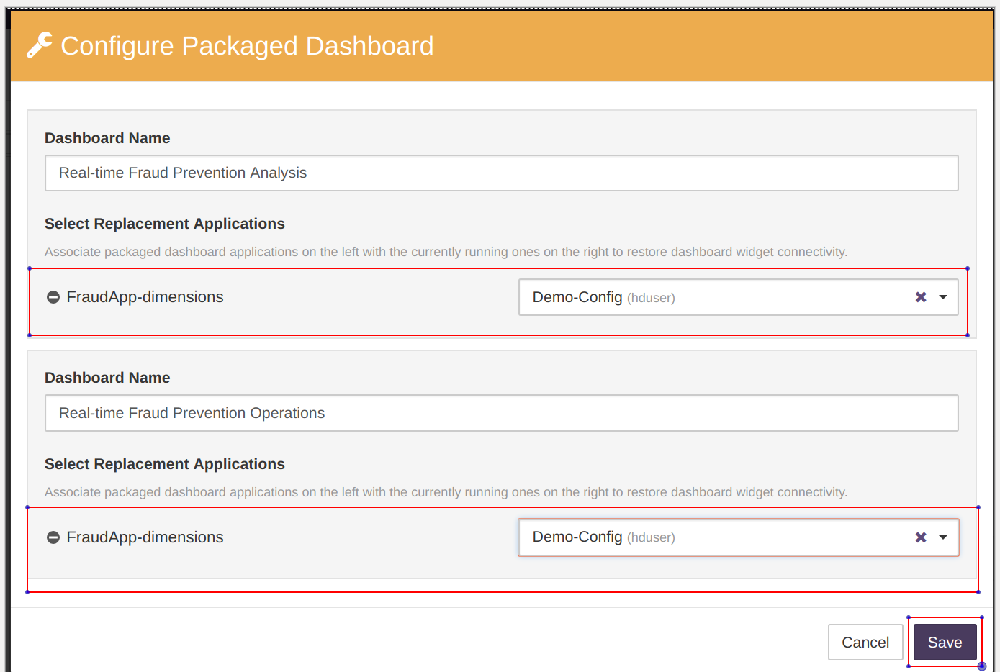
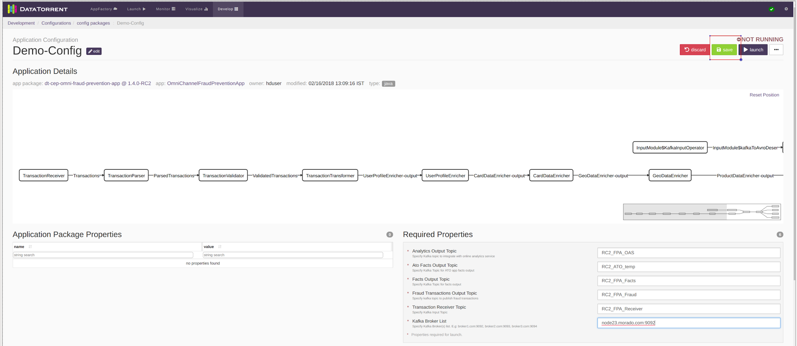
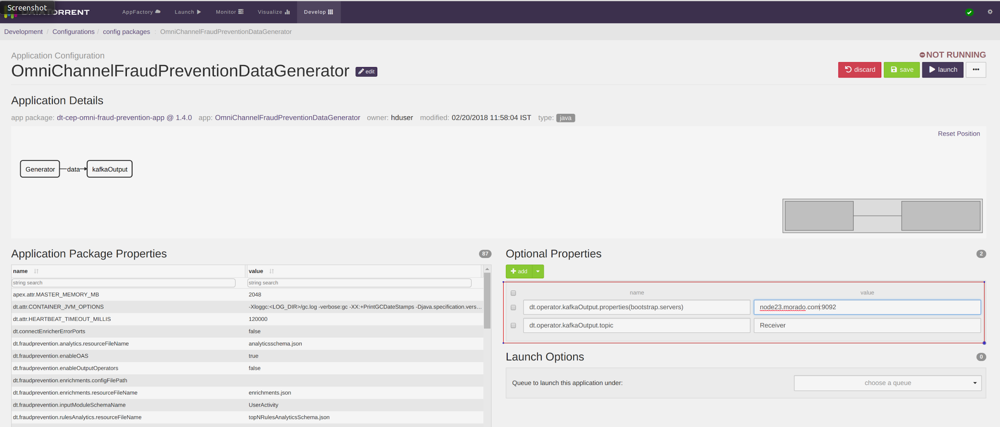

# Quick Start Guide - Omni-Channel Fraud Prevention Application

## Setup Docker and RTS

1. Setup docker daemon host (preferably same as gateway machine). This supplies the docker images for **Online Analytics Service (OAS)**, **OAS Dashboards** which is a customized implementation of Apache Superset, and **CEP Workbench** that is a customized Drools Workbench implementation.
2. Install rts 3.10 bin. In the installation wizard, specify the docker location.


## Launching Fraud Prevention Application

1. Navigate to the **AppFactory page** > **Financial Services** > **Omni-Channel Payment Fraud Prevention.**
2. In the DataTorrent Omni Channel Fraud Prevention Application box, click **import**. 
3. Download the application after DataTorrent Omni Channel Fraud Prevention Application package is imported.
4. Navigate to **Develop** > **Application Package** > **Data Torrent Omni Channel Fraud Prevention Application.** Click **launch** drop-down and select **download package**. 
5. Get the Geolite Maxmind Database (Use Hadoop user or user that has access to Hadoop). 
            Getting Geolite Maxmind Database using Bash: 
      
            ```
            url http://geolite.maxmind.com/download/geoip/database/GeoLite2-City.tar.gz -o GeoLite2-City.tar.gz
            tar -zxvf GeoLite2-City.tar.gz 
            hdfs dfs put GeoLite2-City*/GeoLite2-City.mmdb city.mmdb
            ```

6. Generate lookup data which will be used by enrichment operators in the DAG. Use Hadoop user or any user that has access to Hadoop.
            Generating sample lookup data using Bash: 
      
            ```
            mkdir fpa_package
            cd fpa_package
            unzip ../dt-cep-omni-fraud-prevention-app-1.4.0.apa 
            java -cp app/*:lib/*:`hadoop classpath` com.datatorrent.cep.transactionGenerator.DumpLookupData lookupdata
            ```
      
7. Create a New Configuration for the OmniChannelFraudPreventationApp.
      1. Go to **Develop** > **Application Configurations** > **+ create new.**
      2. Select a Source Application and enter the Configuration Name and then click **Create**. ![]  (images/applications/quickstart_launch/newappconfig.png)
      
   
8. Enter the Required Properties. 
9. Configure the **CEP Workbench Service**.
      1. On the configuration page, scroll down.
      2. Select the **drools-workbench** and click **configure**.   
      
      3. Click **save** after specifying the configuration.
   
   **Note:** Ensure that the Proxy Address is set correctly.


10. Configure the **Online Analytics Service**.
      1. Select the **fpa-online-analytics-service** and click **configure**.
      
      2. Click **save** after specifying the configuration.
    
    **Note** :Ensure that the **KafkaBrokers** and the **KafkaTopic** is set correctly.
    

11. Configure the **OAS Dashboards** service.
      1. Select **superset-fpa** and click **configure**
      
      2. Click **save** after specifying the configuration.
    
    **Note** : Ensure to set correct druid\_cluster IP and the Proxy Address.
    
   
12. Configure the Dashboards.
      1. Click **configure**.
      
      2. From the **Select Replacement Applications** drop down, select the corresponding configuration name for both the dashboards.
      3. Click **Save**.
   
13. Save the configuration.
      1. Click **Save.**
      2. Click **launch** to launch the application.
      

## Launch Test Data Generator Application

1. Create **New Configuration** for the OmniChannelFraudPreventationDataGenerator.
2. Go to **Develop** > **Application Packages > + new configuration.**
3. Add **Optional Properties**.
   - Under **Optional Properties** , click + **add** and add the required optional properties.
   **Note:**   **Kafka** topic of the DataGenerator should be same as the **Transaction Receiver** topic of the Omni Channel Fraud Prevention Application.
   
   
4. Click **save**.
5. Click **launch** to launch the Data Generator. 
