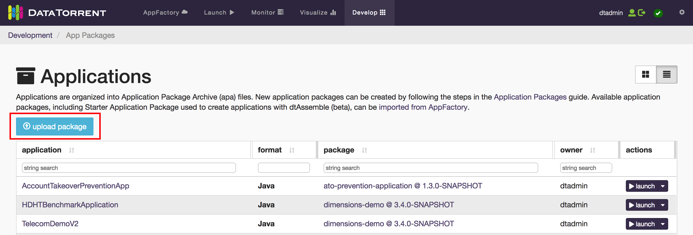
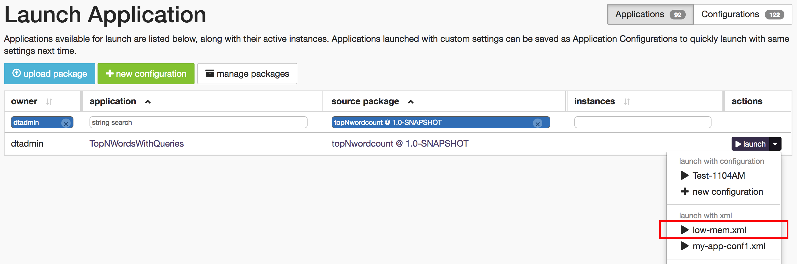

# Top N Words Application

The Top N words application is a tutorial on building a word counting application using:

-   Apache Apex platform
-   Apache Apex Malhar, an associated library of operators
-   Other related tools

Note: Before you begin, ensure that you have internet connectivity
because, in order to complete this tutorial, you will need to download
the Apex and Malhar code.

The Top N Words application monitors an input directory for new
files. When the application detects a new file, it reads its lines,
splits them into words and computes word frequencies for both that specific file
as well as across all files processed so far. The top N words (by
frequency) and their frequencies are output to a corresponding file in
an output directory. Simultaneously, the word-frequency pairs are also
updated on **dtDashboard**, the browser-based dashboard of DataTorrent RTS.

A simple word counting exercise was chosen because the goal of this tutorial is to focus on the use of:

-   The Apex platform
-   The operator library
-   The tools required for developing and deploying
    applications on a cluster
-   **apex** &ndash; the command-line tool for managing
    application packages and the constituent applications
-   **dtManage** &ndash; for monitoring the applications
-   **dtDashboard** &ndash; for visualizing the output

In the context of such an application, a number of questions arise:

-   What operators do we need ?
-   How many are present in the Malhar library ?
-   How many need to be written from scratch ?
-   How are operators wired together ?
-   How do we monitor the running application ?
-   How do we display the output data in an aesthetically pleasing way ?

The answers to these and other questions are explored in the sections below.

For this tutorial, use the DataTorrent RTS Sandbox; it comes pre-installed
with Apache Hadoop and the latest version of DataTorrent RTS configured as a single-node
cluster and includes a time-limited enterprise license. If you've already installed the licensed version of DataTorrent RTS, you
can use that setup instead.

## Setting up your development environment

To begin with, please follow the steps outlined in:
[Apache Apex Development Environment Setup](../apex_development_setup.md)
to setup your development environment; you can skip the sandbox download
and installation if you already have a Hadoop cluster with Datatorrent
RTS installed where you can deploy applications.

### Sample input files

For this tutorial, you need some sample text files to use as input to the application.
Binary files such as PDF or DOCX files are not suitable since they contain a
lot of meaningless strings that look like words (for example,  &ldquo;Wqgi&rdquo;).
Similarly, files using markup languages such as XML or HTML files are also not
suitable since the tag names such as  `div`, `td` and `p` dominate the word
counts. The RFC (Request for Comment) files that are used as de-facto
specifications for internet standards are good candidates since they contain
pure text; download a few of them as follows:

Open a terminal and run the following commands to create a directory named
`data` under your home directory and download 3 files there:

    cd; mkdir data; cd data  
    wget http://tools.ietf.org/rfc/rfc1945.txt  
    wget https://www.ietf.org/rfc/rfc2616.txt  
    wget https://tools.ietf.org/rfc/rfc4844.txt


## Building Top N Aords Application

This chapter describes the steps to build the application in Java using some
source files from the Malhar repository, suitably modified and customized to
run on a cluster (or sandbox). We will use the **dtManage** GUI tool to launch the
application.

### Step 1: Clone the Apex Malhar repository

Clone the Malhar repository (we will use some of these source files in a later
section):

1.  Open a terminal window and create a new directory where you want the code
    to reside, for example: `cd ~/src; mkdir dt; cd dt`

2.  Download the code for Malhar:

        git clone https://github.com/apache/incubator-apex-malhar

    You should now see a directory named `incubator-apex-malhar`.

### Step 2: Create a new application project

Create a new application project as described in (you can use either an IDE
or the command line):
[Apache Apex Development Environment Setup](../apex_development_setup.md)

### Step 3: Copy application files to the new project

We will now copy over a few of the application files downloaded
in Step I to the appropriate subdirectory of the new project.

1. Delete files `Application.java` and `RandomNumberGenerator.java`
   under `src/main/java/com/example/topnwordcount`.
2.  Delete file `ApplicationTest.java` file under
   `src/test/java/com/example/topnwordcount`.
3.  Copy the following files from:

    `incubator-apex-malhar/demos/wordcount/src/main/java/com/datatorrent/demos/wordcount/`

    to

    `src/main/java/com/example/topnwordcount`

    - ApplicationWithQuerySupport.java
    - FileWordCount.java
    - LineReader.java
    - WCPair.java
    - WindowWordCount.java
    - WordCountWriter.java
    - WordReader.java

4.  Copy the file `WordDataSchema.json` from

    `incubator-apex-malhar/demos/wordcount/src/main/resources/`

    to

    `src/main/resources/`

    in the new project.

    _Note_: This file defines the format of data sent to the visualization widgets within **dtDashboard**.

### Step 4: Configure the application and operators

Next, we need to configure application properties. These
properties accomplish the following aims:

- Limit the amount of memory used by most operators so that more memory can
  be allocated for `fileWordCount` which maintains the frequency counts.
- Set the locality of a couple of streams to `CONTAINER_LOCAL` to further
  reduce memory pressure (necessary on the memory-limited environment of the
  sandbox).
- Define the regular expression for matching the non-word string that
  delimits words.
- Define number of top (word, frequency) pairs we want output.
- Define the path to the monitored input directory where input files are
  dropped and the output directory (both HDFS) to which the per-file top N
  (word, frequency) pairs are output.
- Define the topics for sending queries and retrieving data for visualization.

To do this:

Open the file `src/main/resources/META-INF/properties.xml`, and replace its
content with the following:

```
<configuration>
 <property>
   <name>dt.attr.MASTER_MEMORY_MB</name>
   <value>500</value>
 </property> <property>
   <name>dt.application.*.operator.*.attr.MEMORY_MB</name>
   <value>200</value>
 </property> <property>
   <name>dt.application.TopNWordsWithQueries.operator.fileWordCount.attr.MEMORY_MB</name>
   <value>512</value>
 </property> <property>
   <name>dt.application.TopNWordsWithQueries.operator.lineReader.directory</name>
   <value>/tmp/test/input-dir</value>
 </property> <property>
   <name>dt.application.TopNWordsWithQueries.operator.wordReader.nonWordStr</name>
   <value>[\p{Punct}\s]+</value>
 </property> <property>
   <name>dt.application.TopNWordsWithQueries.operator.wcWriter.filePath</name>
   <value>/tmp/test/output-dir</value>
 </property> <property>
   <name>dt.application.TopNWordsWithQueries.operator.fileWordCount.topN</name>
   <value>10</value>
 </property> <property>
   <name>dt.application.TopNWordsWithQueries.stream.QueryFileStream.locality</name>
   <value>CONTAINER_LOCAL</value>
 </property> <property>
   <name>dt.application.TopNWordsWithQueries.stream.QueryGlobalStream.locality</name>
   <value>CONTAINER_LOCAL</value>
 </property> <property>
   <name>dt.application.TopNWordsWithQueries.operator.QueryFile.topic</name>
   <value>TopNWordsQueryFile</value>
 </property> <property>
   <name>dt.application.TopNWordsWithQueries.operator.wsResultFile.topic</name>
   <value>TopNWordsQueryFileResult</value>
 </property> <property>
   <name>dt.application.TopNWordsWithQueries.operator.QueryGlobal.topic</name>
   <value>TopNWordsQueryGlobal</value>
 </property> <property>
   <name>dt.application.TopNWordsWithQueries.operator.wsResultGlobal.topic</name>
   <value>TopNWordsQueryGlobalResult</value>
 </property> <property>
   <name>dt.application.TwitterDemo.operator.wsResult.numRetries</name>
   <value>2147483647</value>
 </property>
</configuration>
```

_Note_:
The package name within the Java files we just copied currently reflects the
package from which they were copied. This may be flagged as an error by your IDE
but the application should build with no errors when built with maven on the
command line. You can fix the errors in the IDE by changing the relevant line
within each file from:

    package com.datatorrent.demos.wordcount;

to reflect the current location of the file, for example:

    package com.example.topnwordcount;

### Step 5: Build the top N words count application

From your IDE build the application in the usual way

From the command line build it with:

    cd topNwordcount; mvn clean package -DskipTests

In either case, if the build is successful, it should have created the
application package file
`topNwordcount/target/topNwordcount-1.0-SNAPSHOT.apa`.

### Step 6: Upload the top N words application package

To upload the top N words application package

1. Log on to the DataTorrent Console using the default username and password
   (both are `dtadmin`).
2. On the top navigation bar, click _Develop_.
3. Click _Application Packages_.
4. Under _Applications_, click the _upload package_ button.
  
5. Navigate to the location of the `topNwordcount-1.0-SNAPSHOT.apa`
   application package file is stored.
6. Wait till the package is successfully uploaded.

### Step 7: Launch the top N words application

_Note_: If you are launching the application on the sandbox, make sure that
an IDE is not running on it at the same time; otherwise, the sandbox might
hang due to resource exhaustion.

1. Log on to the DataTorrent Console (the default username and password are
   both `dtadmin`).
2. In the top navigation bar, click _Develop_.
3. Under _App Packages_, locate the top N word count application, and click
   _Launch Application_.
4. (Optional) To configure the application using a configuration file, select
    _Use a config file_. To specify individual properties, select _Specify
    custom properties_.
5. Click Launch.

A message indicating success of the launch operation should appear along with
the application ID.

_Note_: After a successful launch, monitor the top N words application following
instructions in the chapter _Monitoring with dtManage_.


## Monitoring the Application

**dtManage** is an invaluable tool for monitoring the state of a running
application as well as for troubleshooting problems.

### Monitor the Application

To monitor the top N words application

1. Log on to the Datatorrent Console (the default username and password
   are both `dtadmin`).
2. On the top navigation bar, click _Monitor_.
3. Under _Datatorrent Applications_, check if the application started.
4. Wait till the state entry changes to **RUNNING**.
4. Click _TopNWordsWithQueries_ to see a page with four tabs: _logical_,
   _physical_, _physical-dag-view_, and _metric-view_.
5.  Under _StramEvents_, ensure that all the operators have started.
    

### DAGs and widgets

When monitoring an application, the logical view is selected by default, with
the following panels, also called widgets:  _Application
Overview_, _Stram Events_, _Logical DAG_, _Logical Operators_, _Streams_, _Associated Services_, and _Metrics Chart_.
These panels can be resized, moved around, configured (using the gear wheel
icon in the top-right corner), or removed (using the delete button in the
top-right corner).

### Logical view and associated widgets (panels)


This section describes the widgets that you see when you select the logical
tab.

**Application Overview**

This panel displays application properties such as state, number of operators,
allocated memory, and the number of tuples processed. You can use the kill
button to terminate the application. The _visualize_ button allows you to
create one or more custom dashboards to visualize the application output.


**Stram Events**

As shown in the screenshot above, this panel shows the lifecycle events of all
the operators. If one of the operators fails, a white button labelled _details_
appears next to the event; click on it for additional details about the
failure.

**Logical DAG**

The logical DAG illustrates operators and their interconnections. You can
customize the logical DAG view by selecting operator properties that are
displayed above and below each operator.

To customize these properties

1. Click an operator for which you want to display additional details.
2. To display a detail on the top of this operator, click the Top list and
   select a metric.
3. To display a detail at the bottom of this operator, click the Bottom list
   and select a metric.


**Logical Operators**

This panel displays a table with detailed information about each operator such
as its name, the associated JAVA class, the number of tuples processed, and
the number of tuples emitted.


**Streams**

This panel displays details of each stream such as the name, locality, source,
and sinks.


**Associated Services**

This panel displays the services associated with the applications and their running statuses. 

**Metrics Chart**

This panel displays the number tuples processed and the number of bytes
processed by some internal components. Since this application has not processed
any tuples so far (no input file was provided), the green and blue lines
coincide with the horizontal axis:


### Physical view and associated widgets


The physical tab displays the _Application Overview_ and _Metrics Chart_
discussed above along with additional panels: _Physical Operators_ and
_Containers_. The _Physical Operators_ table shows one row per physical
operator. When partitioning is enabled, some operators can be replicated to
achieve better resource utilization and hence better throughput so a single
logical operator may correspond to multiple physical operators.

**Physical Operators**


**Containers**

For each operator, a crucial piece of information is the process
(the Java Virtual Machine) running that operator. It is also called a
container, and shown in a column with that name. Additional information about
the container (such as the host on which it is running) can be gleaned from the
matching row in the _Containers_ table.


If the state of all the physical operators and containers is **ACTIVE**
and green   this is a healthy state. If the memory requirements for all the
operators in the application exceeds the available memory in the cluster,
you'll see these status values changing continually from ACTIVE to PENDING.
This is an unhealthy state and, if it does not stabilize, your only option is
to kill the application and reduce the memory needs or acquire more cluster
resources.

### The physical-dag-view

The _physical-dag-view_ tab displays the Physical DAG widget, which
shows all the partitioned copies of operators and their interconnections.

### The metric-view

The metric-view tab displays only the _Metrics Chart_ widget.

### View application logs

When debugging applications, we are often faced with the task of examining
log files. This can be cumbersome, especially in a distributed environment
where logs can be scattered across multiple machines. **dtManage** simplifies
this task by making all relevant logs accessible from the console.

For example, to examine logs for the _FileWordCount_ operator, go to the physical
tab of the application monitoring page and check the physical operator table to
find the corresponding container. An example value might be 000010.

The numeric values in the _container_ column are links that open a page
containing a table of all physical operators running in that container.
In the _Container Overview_ panel, you should see a blue _logs_ dropdown
button; click on it to see a menu containing three entries: `dt.log`, `stderr`,
and `stdout`.


All messages output using **log4j** classes will appear in `dt.log`
whereas messages written directly to the standard error or standard
output streams will appear in the other two entries. Choose the entry
you want to view.


## Visualizing the Application Output

This chapter covers how to add input files to the monitored input directory and
visualize the output.

When adding files, it is important to add only one file at a time to the
monitored input directory; the application, as it stands, cannot handle
simultaneous addition of files at a time into the input directory. This
issue is discussed in more detail in the Appendix entitled _Further Explorations_.

> Note: If you are have trouble with any of the following steps, or have not
complete the preceding sections in this tutorial, you can import _Word Count Demo_
from AppFactory. The _Word Count Demo_ Application Package contains the
TopNWordsWithQueries Application.

### Step 1: Add files to the monitored directory

To add the files to the monitored input directory

1. Log on to the Datatorrent Console (the default username and password are
   both `dtadmin`).
2. On the top navigation bar, click _Monitor_.
3. Click TopNWordsWithQueries to see a page with four tabs: _logical_,
   _physical_, _physical-dag-view_, and  _metric-view_.
4. Click the _logical_ tab and make sure that the DAG is visible.
5. Create the input and output directories in HDFS and drop a file into the
   input directory by running the following commands:

        hdfs dfs -mkdir -p /tmp/test/input-dir
        hdfs dfs -mkdir -p /tmp/test/output-dir
        hdfs dfs -put ~/data/rfc4844.txt /tmp/test/input-dir

You should now see some numbers above and below some of the operators as the
lines of the file are read and tuples start flowing through the DAG.

You can view the top 10 words and the frequencies for each input file by
examining the corresponding output file in the output directory, for example:

    hdfs dfs -cat /tmp/test/output-dir/rfc4844.txt

For operating on these input and output directories, you may find the following
shell aliases and functions useful:

    in=/tmp/test/input-dir
    out=/tmp/test/output-dir
    alias ls-input="hdfs dfs -ls $in"
    alias ls-output="hdfs dfs -ls $out"
    alias clean-input="hdfs dfs -rm $in/\*"
    alias clean-output="hdfs dfs -rm $out/\*"
    function put-file ( ) {
        hdfs dfs -put "$1" "$in"
    }
    function get-file ( ) {
        hdfs dfs -get "$out/$1" "$1".out
    }

Put them in a file called, say, `aliases` and read them into your shell with:
`source aliases`.

Thereafter, you can list contents of the input and output directories with
`ls-input` and `ls-output`, remove all files from them with `clean-input` and
`clean-output`, drop an input file `foo.txt` into the input directory with
`put-file foo.txt` and finally, retrieve the corresponding output file with
`get-file foo.txt`.

_Note_: When you list files in the output directory, their sizes might show as
0 but if you retrieve them with get-file or catenate them, the expected output
will be present.

### Step 2: Visualize the results by generating dashboards

To generate dashboards

1. Perform step I above.
2. Make sure that the logical tab is selected and the _Application Overview_
  panel is visible.  
    
3. Click _visualize_ to see a dropdown containing previously created dashboards
 (if any), as well as the _generate new dashboard_ entry.  
    
4. Select the _generate new dashboard_ entry.

    You should now see panels with charts where one chart displays the data for
    the current file and a second chart displays the cumulative global data
    across all files processed so far.
    

5. Add more files, one at a time, to the input directory as described in
  step I above.
6. Observe the charts changing to reflect the new data.

You can create multiple dashboards in this manner for visualizing the output
from different applications or from the same application in different ways.

### Step 3: Add widgets

To derive more value out of application dashboards, you can add widgets to the
dashboards. Widgets are charts in addition to the default charts that you can see on the dashboard. DataTorrent RTS Sandbox supports 5 widgets: _bar chart_,
_pie chart_, _horizontal bar chart_, _table_, and _note_.

To add a widget

1. Generate a dashboard by following instructions of Step II above.
2. Click the _add widget_ button below the name of the dashboard.
3. In the _Data Source_ list, select a data source for your widget.
4. Select a widget type under _Available Widgets_.

    

5. Click _add widget_.

The widget is added to your dashboard.

### Step 4: Configure a widget

After you add a widget to your dashboard, you can configure it at any
time. Each widget has a title that appears in gray. If you hover over
the title, the pointer changes to a hand.

To configure a widget

1. To change the size of the widget, click the border of the widget, and
  resize it.
2. To move the widget around, click the widget, and drag it to the desired
  position.
3. To change the title and other properties, click the _edit_ button in the
  top-right corner of the widget.
    
  You can now enter a new title in the _Title_ box or configure the rest of the
  options in any suitable way.
4.  Click _OK_.
5.  To remove a widget, click the delete (x) button in the top-right corner of
  the widget.

### Perform additional tasks on dashboards

At any time, you can change the name and the description of a dashboard. You
can also delete dashboards.

To perform additional tasks

1. Ensure that you generated a dashboard as described in Step II above and
   select it.
2.  Click _settings_ button (next to buttons named _add widget_,
   _auto generate_, and _save settings_), below the name of the dashboard to see the _Dashboard Settings_ dialog:
    
3.  Type a new name for the dashboard in the _Name of dashboard_ box.
4.  Type a suitable description in the box below.
5.  Make sure that _TopNWordsWithQueries_ is selected under _Choose apps to
    visualize_.
6.  Click _Save_.


### Delete a dashboard

You can delete a dashboard at any time.

1. Log on to the DataTorrent Console (default username and password are both
  `dtadmin`)
2. On the top navigation bar, click _Visualize_.
3. Select a dashboard.

    

4.  Click delete.

    

  Note: The delete button becomes visible only if one or more rows are selected.


## Advanced RTS Features

This section touches on some advanced features of the RTS platform in the context of the
_Top N Words_ application. Accordingly, readers are expected to be familiar with the material
of the preceding sections.


The first topic we'd like to discuss is partitioning of operators to increase performance.
However, partitioning increases the memory footprint of the application, so it is important
to know how to allocate available memory to containers especially in a limited environment
like a sandbox. So we begin with a brief discussion of that topic.

### Managing Memory Allocation for Containers

In this chapter we describe how to monitor and manage the amount of memory allocated to the
containers comprising the application. This is useful in an environment where the needs of
the application begins to equal or exceed the memory resources of the cluster.

Recall the following facts from the earlier sections:

  - A container (JVM process) can host multiple operators.
  - The memory requirements for an operator can be specified via a properties file.

For reference, here is the application DAG:


If we look at the information displayed in the physical tab of `dtManage` for the memory
allocated to each container, we see something like this (the actual container id will most
likely be different each time the application is relaunched but the rest of the information
should be the same):

<table>
<colgroup>
<col width="30%" />
<col width="30%" />
<col width="40%" />
</colgroup>
<tbody>
<tr class="odd">
<td align="left"><p><b>Container Id</b></p></td>
<td align="left"><p><b>Allocated Memory</b></p></td>
<td align="left"><p><b>Hosted Operators</b></p></td>
</tr>
<tr class="odd">
<td align="left"><p><tt>1</tt></p></td>
<td align="left"><p>1 GB</p></td>
<td align="left"><p>None (AppMaster)</p></td>
</tr>
<tr class="even">
<td align="left"><p><tt>2</tt></p></td>
<td align="left"><p>768 MB</p></td>
<td align="left"><p>snapshotServerGlobal, QueryGlobal</p></td>
</tr>
<tr class="odd">
<td align="left"><p><tt>3</tt></p></td>
<td align="left"><p>768 MB</p></td>
<td align="left"><p>snapshotServerFile, QueryFile</p></td>
</tr>
<tr class="even">
<td align="left"><p><tt>4</tt></p></td>
<td align="left"><p>128 MB</p></td>
<td align="left"><p>wsResultGlobal</p></td>
</tr>
<tr class="odd">
<td align="left"><p><tt>5</tt></p></td>
<td align="left"><p>640 MB</p></td>
<td align="left"><p>windowWordCount</p></td>
</tr>
<tr class="even">
<td align="left"><p><tt>6</tt></p></td>
<td align="left"><p>128 MB</p></td>
<td align="left"><p>Console</p></td>
</tr>
<tr class="odd">
<td align="left"><p><tt>7</tt></p></td>
<td align="left"><p>128 MB</p></td>
<td align="left"><p>wsResultFile</p></td>
</tr>
<tr class="even">
<td align="left"><p><tt>8</tt></p></td>
<td align="left"><p>640 MB</p></td>
<td align="left"><p>wordReader</p></td>
</tr>
<tr class="odd">
<td align="left"><p><tt>9</tt></p></td>
<td align="left"><p>128 MB</p></td>
<td align="left"><p>wcWriter</p></td>
</tr>
<tr class="even">
<td align="left"><p><tt>10</tt></p></td>
<td align="left"><p>1.4 GB</p></td>
<td align="left"><p>lineReader</p></td>
</tr>
<tr class="odd">
<td align="left"><p><tt>11</tt></p></td>
<td align="left"><p>1.9 GB</p></td>
<td align="left"><p>fileWordCount</p></td>
</tr>
</tbody>
</table>

If we now look closely at column 2 (Allocated Memory) we notice some
unexpected values, for example, the value for the App Master container should have
been 300 MB since we had 300 as the value in the `properties.xml` file for
`dt.attr.MASTER_MEMORY_MB`. The discrepancy is due to the fact that the file
`.dt/dt-site.xml` in the home directory of user `dtadmin` has a value of 1024 for
this key which overrides the application specified value.

Looking now at container 2, we notice that it hosts 2 operators: `snapshotServerGlobal`
and `QueryGlobal` and each has a value of 128 MB specified in the application properties
file; so why is the value 768 MB ? Turns out that each output port of an operator
_connected to another operator outside the container_
also has an associated _buffer-server_ which buffers tuples exiting the output port
to provide fault-tolerance. The buffer server is discussed in detail in
[Application Development](https://docs.datatorrent.com/application_development.md).
The space allocated to the buffer server is governed by properties of the form:

    dt.application.app-name.operator.op-name.port.port-name.attr.BUFFER_MEMORY_MB

where _app-name_, _op-name_ and _port-name_ can be replaced by the appropriate
application, operator and port name respectively or by a wildcard (`*`). The
default value is 512 MB. Of the two operators, only one (`snapshotServerGlobal`)
has an output port connected externally so there
is only one buffer-server involved which then explains the value of
768 (= 512 + 128 + 128).

The values for `wsResultGlobal`, `Console`, `wsResultFile`, `wcWriter` are, as
expected, 128 MB &ndash; since no output ports are involved, there is no buffer-server.
The values for `windowWordCount` and `wordReader` are also the expected values
since a single buffer-server is involved: 640 = 512 + 128. The value of 1.9 GB
for `fileWordCount` is obtained as follows: it has 3 buffer-servers since there
are 3 output ports connected externally; our properties file setting requests
300 MB for this operator which gives us a total of 3 * 512 + 300 = 1836 MB which
approximates the value shown. The value for `lineReader` can be computed
similarly.

The total amount of allocated space shown on the GUI is 6.5 GB. We can substantially
reduce the memory footprint further by make a couple changes to attributes:
Create a new file named, say, `low-mem.xml` at `src/site/conf/` with this content:

    <configuration>
      <property>
        <name>dt.attr.MASTER_MEMORY_MB</name>
        <value>512</value>
      </property> <property>
        <name>dt.application.TopNWordsWithQueries.operator.*.port.*.attr.BUFFER_MEMORY_MB</name>
        <value>128</value>
      </property>
    </configuration>

We will use this file at launch time.

The BUFFER_MEMORY_MB attribute changes the memory allocation per buffer server
to 128 MB (from the default of 512 MB).

The MASTER_MEMORY_MB attribute change sets the memory allocated to the Application Master
to 512 MB and is required for a rather obscure
reason: The existing value of 300 MB in `META-INF/properties.xml`
is actually overridden by the setting of 1024 MB for this parameter in
`~dtadmin/.dt/dt-site.xml`; however, if we use a launch-time configuration file,
values in it override those in `dt-site.xml`. A value of 300 is too
small even for simple applications; in normal use and we rarely see a case, even in production,
where a value larger than 1024 MB is needed, though it is possible if the number of
operators is large. If the App Master runs out of memory,
you'll see messages like this in the corresponding log file (see _Debugging_
section below):

    java.lang.OutOfMemoryError: GC overhead limit exceeded.

Rebuild the application, upload the package and use this file at launch time:


The allocated memory shown in the "Application Overview" panel should now drop
to around 3.1GB.

### Debugging

On the sandbox, various log files generated by YARN and Hadoop are located at
`/sfw/hadoop/shared/logs`; the `nodemanager` directory has application specific
directories with names like this: `application_1448033276100_0001` within
which there are container specific directories with names like
`container_1448033276100_0001_01_000001`. The App Master container has the `000001`
suffix and the corresponding directory will have these files:

    AppMaster.stderr  AppMaster.stdout  dt.log

The remaining container directories will have files:

    dt.log  stderr  stdout

When problems occur, all these log files should be carefully examined. For example, the
`dt.log` file contains the entire classpath used to launch each container; if an error
occurs because a particular class is not found, you can check the classpath to ensure
that the appropriate jar file is included. It also shows the command line used to
launch each container with lines like this:

2015-12-20 14:31:43,896 INFO com.datatorrent.stram.LaunchContainerRunnable: Launching on node: localhost:8052 command: $JAVA_HOME/bin/java  -Xmx234881024  -Ddt.attr.APPLICATION_PATH=hdfs://localhost:9000/user/dtadmin/datatorrent/apps/application_1450648156272_0001 -Djava.io.tmpdir=$PWD/tmp -Ddt.cid=container_1450648156272_0001_01_000002 -Dhadoop.root.logger=INFO,RFA -Dhadoop.log.dir=<LOG_DIR> com.datatorrent.stram.engine.StreamingContainer 1><LOG_DIR>/stdout 2><LOG_DIR>/stderr

You can provide your own `log4j` configuration file called, say, `log4j.properties` and place
it in the directory `src/main/resources` as described in the
[configuration](http://docs.datatorrent.com/configuration/#custom-log4j-properties-for-application-packages)
page. Alternatively, if you want to change the log level of a particular class or package
from, say `INFO` to `DEBUG` while the application is running, you can click on the blue
`set logging level` button in the `Application Overview` panel of `dtManage`. It will then
display a dialog window where you can enter the name of the class or package and the desired
log level:


Normally, the GUI can be used to navigate to the appropriate container page
and log files examined from the `logs` dropdown but sometimes using the commandline
from a terminal window may be easier.

### Partitioning
Partitioning is a mechanism to eliminate bottlenecks in your application and increase
throughput. If an operator is performing a resource intensive operation, it risks
becoming a bottleneck as the rate of incoming tuples increases. One way to cope
is to replicate the operator as many times as necessary so that the load is
evenly distributed across the replicas, thus eliminating the bottleneck. Of course,
this technique assumes that your cluster has adequate resources (CPU, memory and
network bandwidth) to support all the replicas.

Without partitioning, the DAG shown in the `logical` and `physical-dag-view` tabs
will be the same.
However, once partitioning is triggered, the latter will show multiple copies of the
partitioned operator, as well as a new operator immediately
downstream of all the copies, called a _unifier_. The job of the unifier is to join the
results emitted by all the copies, collate them in some application-specific way and
emit the result just as it would have been emitted if no partitioning were involved.
The unifier can either be one that is custom-written for the needs of the application
or a pass-through platform-generated one.

For our word counting example, we illustrate the technique by partitioning the `wordReader`
operator into 2 copies. For operators that do not maintain state, partitioning does
not require additional code: We can simply set a couple of properties -- one to use
the **StatelessPartitioner** which is part of Malhar and one to specify the number
of desired partitions. To do this, copy over the `low-mem.xml` configuration file
we created above
to a new file named `simple-partition.xml` in the same directory and add this stanza to it:

    <property>
      <name>dt.application.TopNWordsWithQueries.operator.wordReader.attr.PARTITIONER</name>
      <value>com.datatorrent.common.partitioner.StatelessPartitioner:2</value>
    </property>

When you build, upload and run the application using this configuration file, the
physical-dag-view tab should show the following DAG:


Notice the two copies of `wordReader` and the generated unifier. The `physical` tab will
also show the containers for these additional operators and their characteristics as well.

A slight variation of the above theme occurs often in practice: We would like an entire
linear sequence of operators (i.e. a fragment of the DAG) replicated in the same way.
In our case, the sequence consists of two operators: `wordReader` and the next operator
`windowWordCount`. To accomplish this, again no additional code is required: We can simply
add this stanza to our properties file:

    <property>
      <name>dt.application.TopNWordsWithQueries.operator.windowWordCount.inputport.input.attr.PARTITION_PARALLEL</name>
      <value>true</value>
    </property>

It enables the PARTITION_PARALLEL attribute on the _input port_ of the downstream operator,
thus indicating to the platform that the downstream operator must be partitioned into just
as many copies as the upstream operator so that they form parallel pipelines. Running the
application with this configuration file shows the following physical DAG:


Notice that both operators have been replicated and the unifier added.

### Streaming Windows and Application Windows

Operators receive incoming tuples and emit outgoing tuples within a small temporal window
called a _streaming window_. Its boundaries are marked by calls to `beginWindow` and
`endWindow` within which the platform repeatedly invokes either `emitTuples` (for input
adapters) or `process` on each input port for output adapters and generic operators.
These concepts are discussed in greater detail in the
[OperatorGuide](http://docs.datatorrent.com/operator_development/).

For flexibility in operator and application development, the platform allows users to
change the size of the streaming window which is defined as a number of milliseconds.
It defaults to 500ms but can be changed by setting the
value of an attribute named STREAMING_WINDOW_SIZE_MILLIS; for example, you can set it
to 5s with:

    <property>
      <name>dt.attr.STREAMING_WINDOW_SIZE_MILLIS</name>
      <value>5000</value>
    </property>

This is not a very common change but one reason for doing it might be if the stream is
very sparse, i.e. the number of incoming tuples in a 500ms window is very small; by
increasing the streaming window size, we can substantially reduce the platform bookkeeping
overhead such as checkpointing.

A second attribute is APPLICATION_WINDOW_COUNT; this is a per-operator attribute and is
a count of streaming windows that comprise a single application window. It
can be changed with an entry like this (where, as before, _app-name_ and _op-name_ should be
replaced by either wildcards or names of a specific application and/or operator):

    <property>
      <name>dt.application.app-name.operator.op-name.attr.APPLICATION_WINDOW_COUNT</name>
      <value>5</value>
    </property>

By default this value is set to 1 meaning each application window consists of a single
streaming window. The the `beginWindow` and `endWindow` are invoked once per application
window. A typical reason for increasing this value is when you have an
operator that is computing aggregates (such as sum, average, maximum, minimum) of one or
more fields of the incoming tuples: A larger application window may yield more
meaningful aggregates.

## Appendix

### Operators in Top N words application

This section describes the operators used for building the top N
words application. The operators, the implementing classes and a brief description of their
functionalities are described in this table.

<table>
<colgroup>
<col width="25%" />
<col width="35%" />
<col width="40%" />
</colgroup>
<tbody>
<tr class="odd">
<td align="left"><p><b>Operator</b></p></td>
<td align="left"><p><b>Implementing class</b></p></td>
<td align="left"><p><b>Description</b></p></td>
</tr>
<tr class="even">
<td align="left"><p>lineReader</p></td>
<td align="left"><p>LineReader</p></td>
<td align="left"><p>Reads lines from input files.</p></td>
</tr>
<tr class="odd">
<td align="left"><p>wordReader</p></td>
<td align="left"><p>WordReader</p></td>
<td align="left"><p>Splits a line into words.</p></td>
</tr>
<tr class="even">
<td align="left"><p>windowWordCount</p></td>
<td align="left"><p>WindowWordCount</p></td>
<td align="left"><p>Computes word frequencies for a single window.</p></td>
</tr>
<tr class="odd">
<td align="left"><p>fileWordCount</p></td>
<td align="left"><p>FileWordCount</p></td>
<td align="left"><p>Maintains per-file and global word frequencies.</p></td>
</tr>
<tr class="even">
<td align="left"><p>wcWriter</p></td>
<td align="left"><p>WcWriter</p></td>
<td align="left"><p>Writes top N words and their frequencies to output files.</p></td>
</tr>
<tr class="odd">
<td align="left"><p>console</p></td>
<td align="left"><p>ConsoleOutputOperator</p></td>
<td align="left"><p>Writes received tuples to console.</p></td>
</tr>
<tr class="even">
<td align="left"><p>snapshotServerFile</p></td>
<td align="left"><p>AppDataSnapshotServerMap</p></td>
<td align="left"><p>Caches the last data set for the current file, and returns it in response to queries.</p></td>
</tr>
<tr class="odd">
<td align="left"><p>snapshotServerGlobal</p></td>
<td align="left"><p>AppDataSnapshotServerMap</p></td>
<td align="left"><p>Caches the last global data set, and returns it in response to queries.</p></td>
</tr>
<tr class="even">
<td align="left"><p>QueryFile</p></td>
<td align="left"><p>PubSubWebSocketAppDataQuery</p></td>
<td align="left"><p>Receives queries for per-file data.</p></td>
</tr>
<tr class="odd">
<td align="left"><p>QueryGlobal</p></td>
<td align="left"><p>PubSubWebSocketAppDataQuery</p></td>
<td align="left"><p>Receives queries for global data.</p></td>
</tr>
<tr class="even">
<td align="left"><p>wsResultFile</p></td>
<td align="left"><p>PubSubWebSocketAppDataResult</p></td>
<td align="left"><p>Returns results for per-file queries.</p></td>
</tr>
<tr class="odd">
<td align="left"><p>wsResultGlobal</p></td>
<td align="left"><p>PubSubWebSocketAppDataResult</p></td>
<td align="left"><p>Returns results for global queries.</p></td>
</tr>
</tbody>
</table>

We now describe the process of wiring these operators together in the
`populateDAG()` method of the main application class
`ApplicationWithQuerySupport`. First, the operators are created and added to
the DAG via the `addOperator` method:
```
LineReader lineReader = dag.addOperator("lineReader",new LineReader());
```

The first argument is a string that names this instance of the
operator; it is the same as the value in the first column of the above
table and also the node name in the Logical DAG.

Next, we connect each output port of an operator with all the input ports that
should receive these tuples using the `addStream` function, for example:

```
dag.addStream("lines", lineReader.output, wordReader.input);
...
dag.addStream("WordCountsFile", fileWordCount.outputPerFile, snapshotServerFile.input, console.input);
```

Notice that the stream from `fileWordCount.outputPerFile` (which consists of
the top N words for the current file as the file is being read) goes to
`snapshotServerFile.input` (where it will be saved to respond to queries) and to
`console.input` (which is used for debugging). Additional sinks can be provided
in the same call as additional terminal arguments. You can examine the rest of
these calls and ensure that they match the names and connections of the
Logical DAG.

This section provides detailed information about each operator.

**LineReader**

This class extends `AbstractFileInputOperator<String>` to open a file, read its
lines, and emit them as tuples. It has two output ports, one for the normal
output of tuples, and the other for the output of an EOF tuple indicating the
end of the current input file. Ports should always be transient fields because
they should not be serialized and saved to the disk during checkpointing.

The base class keeps track of files already processed, files that
should be ignored, and files that failed part-way. Derived classes need to
override four methods: `openFile`, `closeFile`, `readEntity`, and `emit`. Of
these, only the third is non-trivial: if a valid line is available, it is read
and returned. Otherwise, the end of the file must have been reached. To
indicate this, the file name is emitted on the control port where it
will be read by the `FileWordCount` operator.

**WordReader**

This operator receives lines from `LineReader` on the input port and emits
words on the output port. It has a configurable property called `nonWordStr`
along with associated public getter and setter methods. Such properties can be
customized in the appropriate properties file of the application. The values of
the properties are automatically injected into the operator at run-time. In
this scenario, this string is provided the value of the property
`dt.application.TopNWordsWithQueries.operator.wordReader.nonWordStr`.
For efficiency, this string is compiled into a pattern for repeated use.
The `process` method of the input port splits each input line into words using
this pattern as the separator, and emits non-empty words on the output port.

**WindowWordCount**

This operator receives words and emits a list of word-frequency pairs for each
window. It maintains a word-frequency map for the current window, updates this
map for each word received, emits the whole map (if non-empty) when
`endWindow` is called, and clears the map in preparation for the next window.
This design pattern is appropriate because for normal text files, the number of
words received is far more than the size of the accumulated map. However, for
situations where data is emitted for each tuple, you should not wait till the
`endWindow` call, but rather emit output tuples as each input tuple is
processed.

**FileWordCount**

This operator has two input ports, one for the per-window frequency maps it
gets from the previous operator, and a control port to receive the file name
when `LineReader` reaches the end of a file. When a file name is received on
the control port, it is saved and the final results for the file appear as
output at the next `endWindow`. The reason for waiting is subtle: there is no
guarantee of the relative order in which tuples arrive at two input ports;
additional input tuples from the same window can arrive at the input port
even after the EOF was received on the control port. Note however that we _do_
have a guarantee that tuples on the input port will arrive in exactly the same
order in which they were emitted on the output port between the bracketing
`beginWindow` and `endWindow` calls by the upstream operator.

This operator also has three output ports: the `outputPerFile` port for the top
N pairs for the current file as it is being read; the `outputGlobal` port for
the global top N pairs, and the `fileOutput` port for the final top N pairs for
the current file computed after receiving the EOF control tuple. The output
from the first is sent to the per-file snapshot server, the output from
the second is sent to the global snapshot server, and the output from the last
is sent to the operator that writes results to the output file.

_FileWordCount_ also maintains two maps for per-file and global frequency
counts because they track frequencies of all words seen so far. These maps
can get very large as more and more files are processed.

_FileWordCount_ has a configurable property `topN` for the number of top pairs we
are interested in. This was configured in our properties file with a value of
10 and the property name: `dt.application.TopNWordsWithQueries.operator.fileWordCount.topN`

In the `endWindow` call, both maps are passed to the `getTopNList` function
where they are flattened, sorted in descending order of frequency, stripped of
all but the top N pairs, and returned for output. There are a couple of
additional fields used to cast the output into the somewhat peculiar form
required by the snapshot server.

**WordCountWriter**

This operator extends `AbstractFileOutputOperator<Map<String,Object>>`, and
simply writes the final top N pairs to the output file. As with _LineReader_,
most of the complexity of _WordCountWriter_ is hidden in the base class. You must
provide implementations for 3 methods: `endWindow`, `getFileName`, and
`getBytesForTuple`. The first method calls the base class method `requestFinalize`.
The output file is written periodically to temporary files
with a synthetic file name that includes a timestamp. These files are removed
and the actual desired file name is restored by this call. The `getFileName`
method retrieves the file name from the tuple, and the `getBytesForTuple`
method converts the list of pairs to a string in the desired format.

**ConsoleOutputOperator**

This is an output operator that is a part of the Malhar library. It simply
writes incoming tuples to the console and is useful when debugging.

**AppDataSnapshotServerMap**

This operator is also part of the Malhar library and is used to store snapshots
of data. These snapshots are used to respond to queries. For this application,
we use two snapshots &mdash;  one for a per-file top N snapshot and one for a
global snapshot.

**PubSubWebSocketAppDataQuery**

This is an input operator that is a part of the Malhar library. It is used to
send queries to an operator via the Data Torrent Gateway, which can act as a
message broker for limited amounts of data using a topic-based
publish-subscribe model. The URL to connect is typically something like:
```
ws://gateway-host:port/pubsub
```
where _gateway-host_ and _port_ should be replaced by appropriate values.

A publisher sends a JSON message to the URL where the value of the `data` key
is the desired message content. The JSON might look like this:
```
{"type":"publish", "topic":"foobar", "data": ...}
```
Correspondingly, subscribers send messages like this to retrieve published
message data:
```
{"type":"subscribe", "topic":"foobar"}
```
Topic names need not be pre-registered anywhere but the same topic
name (for example, _foobar_ in the example) must be used by both publisher and
subscriber. Additionally, if there are no subscribers when a message is
published, it is simply discarded.

For this tutorial, two query operators are used: one for per-file queries and
one for global queries. The topic names were configured in the properties file
earlier with values `TopNWordsQueryFile` and `TopNWordsQueryGlobal` under the
respective names:
```
dt.application.TopNWordsWithQueries.operator.QueryFile.topic
dt.application.TopNWordsWithQueries.operator.QueryGlobal.topic
```

**PubSubWebSocketAppDataResult**

Analogous to the previous operator, this is an output operator used to publish
query results to a gateway topic. You must use two of these to match the query
operators, and configure their topics in the properties file with values
`TopNWordsQueryFileResult` and `TopNWordsQueryGlobalResult` corresponding to
the respective names:
```
dt.application.TopNWordsWithQueries.operator.wsResultFile.topic
dt.application.TopNWordsWithQueries.operator.wsResultGlobal.topic
```

### Further Exploration

In this tutorial, the property values in the `properties.xml` file were set to
limit the amount of memory allocated to each operator. You can try varying
these values and checking the impact of such an operation on the stability and
performance of the application. You can also explore the largest text
file that the application can handle.

Another aspect to explore is fixing the current limitation of
one-file-at-a-time processing; if multiple files are dropped into the
input directory simultaneously, the file reader can switch from one file to the
next in the same window. When the `FileWordCount` operator gets an EOF on the
control port, it waits for an `endWindow` call to emit word counts so those
counts will be incorrect if tuples from two different files arrive in the same
window. Try fixing this issue.

### DataTorrent terminology

**Operators**

Operators are basic computation units that have properties and
attributes, and are interconnected via streams to form an application.
Properties customize the functional definition of the operator, while
attributes customize the operational behavior. You can think of
operators as classes for implementing the operator interface. They read
from incoming streams of tuples and write to other streams.

**Streams**

A stream is a connector (edge) abstraction which is a fundamental building
block of DataTorrent RTS. A stream consists of tuples that flow from one input
port to one or more output ports.

**Ports**

Ports are transient objects declared in the operator class and act connection
points for operators. Tuples flow in and out through ports. Input ports read
from streams while output port write to streams.

**Directed Acyclic Graph (DAG)**

A DAG is a logical representation of real-time stream processing application.
The computational units within a DAG are called operators and the data-flow
edges are called data streams.

**Logical Plan or DAG**

Logical Plan is the Data Object Model (DOM) that is created as operators and
streams are added to the DAG. It is identical to a DAG.

**Physical Plan or DAG**

A physical plan is the physical representation of the logical plan of the
application, which depicts how applications run on physical containers and
nodes of a DataTorrent cluster.

**Data Tuples Processed**

This is the number of data objects processed by real-time stream processing
applications.

**Data Tuples Emitted**

This is the number of data objects emitted after real-time stream processing
applications complete processing operations.

**Streaming Application Manager (STRAM)**

Streaming Application Manager (STRAM) is a YARN-native, lightweight controller
process. It is the process that is activated first upon application launch to
orchestrate the streaming application.

**Streaming Window**

A streaming window is a duration during which a set of tuples are emitted. The
collection of these tuples constitutes a window data set, also called as an
atomic micro-batch.

**Sliding Application Window**

Sliding window is computation that requires "n" streaming windows. After each
streaming window, the nth window is dropped, and the new window is added to the
computation.

**Demo Applications**

The real-time stream processing applications which are packaged with the
DataTorrent RTS binaries, are called demo applications. A Demo application can
be launched standalone, or on a Hadoop cluster.

**Command-line Interface**

Command line interface (CLI) is the access point for applications.
This is a wrapper around the web services layer, which makes the web
services user friendly.

**Web services**

DataTorrent RTS platform provides a robust webservices layer called
DT Gateway. Currently, Hadoop provides detailed web services for
map-reduce jobs. The DataTorrent RTS platform leverages the same
framework to provide a web service interface for real-time streaming
applications.
